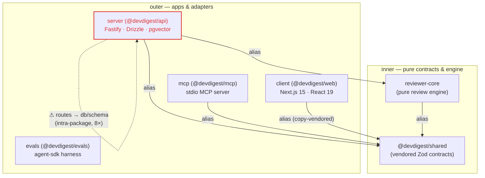

# Dependency Report — DevDigest (2026-08-29)

_Generated by the dependency-checker skill. Data: `collect.mjs` + a real `next build` route table + `depcruise` + per-package `npm audit`/`npm outdated` + registry version lookups._

## 1. At a glance

| Package | Direct | Transitive | Weight | Flags |
|---|---|---:|---|---|
| **client** (`@devdigest/web`) | 11 | 536 | **103 kB** shared First Load JS · **315–360 kB** per route (real build) · 603 MB installed | `recharts` eager-imported on the 350 kB `/skills` route |
| **server** (`@devdigest/api`) | 22 | 557 | source (no bundle) · 213 MB installed | `js-tiktoken` 21 MB on disk; 8 onion `routes-no-db` violations |
| **evals** (`@devdigest/evals`) | 2 | 261 | source (no bundle) · **350 MB installed** | heaviest install after client, for a dev-only harness |
| **mcp** (`@devdigest/mcp`) | 2 | 255 | source (no bundle) · 83 MB installed | `dependency-cruiser` a full major behind server (16 vs 17); `zod` pin drift |
| **reviewer-core** | 2 | 158 | source (no bundle) · 76 MB installed | leanest runtime surface (`openai` + `zod` only) |
| **e2e** (`@devdigest/e2e`) | 0 | 32 | no runtime bundle · ~0 MB (browser is Rust/CDP) | one low-sev dev `esbuild` advisory |
| **shared** (`@devdigest/shared`) | 0 | — | vendored Zod contracts, no deps | copy-vendored into client; single source of truth |

**Verdict:** the repo is architecturally clean at the *package* boundary — all five internal edges flow through the two sanctioned aliases (`@devdigest/reviewer-core`, `@devdigest/shared`), nothing reaches past them. The real debt is *inside* `server`: four route files import the DB layer directly (8 onion violations). Everything security-flagged (including one "critical") lives in the **dev toolchain only** — `vitest`/`vite`/`esbuild`/`postcss` — so there is **no runtime advisory** in any shipped dependency. Freshness is the slow-burn item: several runtime libs are a full major behind (`next` 15→16, `recharts` 2→3, `next-intl` 3→4, `octokit` 4→5, `openai` 4→6, `zod` 3→4).

## 2. Component graph

Internal graph only (a node per npm dep would be unreadable). Edges are real imports through the two aliases, grouped by onion role: inner `shared`/`reviewer-core` → outer `server`/`client`/`mcp`/`evals`. The dashed self-loop on `server` marks the **intra-package** onion violation (routes → DB) — it is *not* a package-boundary edge, so it is annotated on the node rather than drawn as a cross-package red arrow.

Note: `evals` shows no alias edge in the collector's `workspaceEdges` — it consumes the API over its own surface, not through the shared TS aliases. `e2e` (Rust agent-browser) has no TS import edge at all.

## 3. External weight

Bundle contribution is meaningful only for `client` (the sole browser bundle). For the TS-source backends, weight = transitive count + on-disk install footprint.

**client** — real `next build` route table (First Load JS is what ships):

| Route | First Load JS | Note |
|---|---:|---|
| `/repos/[repoId]/pulls/[number]` | **360 kB** | heaviest — the finding-review page (23.5 kB route code) |
| `/skills`, `/skills/[id]` | 350 kB | eager-loads `recharts` via `StatsTab` |
| `/agents/[id]` | 346 kB | |
| most other routes | 315–320 kB | |
| shared baseline (all routes) | 103 kB | two chunks: 54.2 kB + 46.5 kB |

Heaviest *installed* client deps: `next` 141 MB, `mermaid` 76 MB, `lucide-react` 28 MB — but `mermaid` is **already lazy** (`await import("mermaid")` in `MermaidDiagram.tsx`), so its 76 MB never lands in First Load JS. `recharts` (4.8 MB) is the true **eager** heavy import.

**server** — heaviest on disk: `js-tiktoken` **21.4 MB** (single importer: `adapters/tokenizer`), `drizzle-orm` 8.4 MB, `openai` 4.5 MB. 557 transitive is the largest count in the repo (Fastify + Drizzle + octokit + testcontainers dev stack).

**evals** — 350 MB installed / 261 transitive for just two direct deps (`@anthropic-ai/claude-agent-sdk`, `openai`); the agent-sdk pulls a large transitive tree. Dev/CI-only, so runtime cost is zero, but it dominates a fresh `install`.

**reviewer-core / mcp / e2e** — small and appropriate: `reviewer-core` ships only `openai` + `zod`; `e2e` has no runtime deps (browser is a Rust binary).

## 4. Findings

### 4.1 Heaviest — trim candidates
- **`recharts` is eagerly imported (client).** `src/vendor/ui/charts/Donut.tsx` and `LineChart.tsx` do a top-level `import { … } from "recharts"`. They are consumed by `StatsTab` (→ `/skills`, 350 kB), `eval/TrendChart` (→ `/eval`), and the dev `Showcase`. Every visitor to those routes downloads Recharts before any chart renders. **Evidence:** `grep "from \"recharts\""` → 2 files; `next build` route table shows `/skills` at 350 kB. Contrast `mermaid`, which is correctly lazy.
- **`js-tiktoken` 21 MB on disk (server), one importer.** `adapters/tokenizer/index.ts` uses only `getEncoding('cl100k_base')`. It's the single heaviest server dep; the weight is the bundled encoder tables. Not a bundle cost (source backend), but the top install-footprint line. Keep — it's used — but worth knowing it's the outlier.

### 4.2 Unused / duplicated (version drift)
- **No unused direct deps found.** Every suspicious server dep resolves to a real importer: `graphology`(1), `graphology-metrics`(1), `p-queue`(2), `js-tiktoken`(1), `fastify-sse-v2`(1), `simple-git`(1), `@ast-grep/napi`(1), `octokit`(1). `@vscode/ripgrep` has 0 ES-imports but **is** used — `adapters/codeindex/ripgrep.ts` (via the exported `RipgrepCodeIndex`) shells out to its binary. Not a drop candidate.
- **`zod` pin inconsistency (low).** `mcp` pins `^3.25.0`; `server`/`client`/`reviewer-core` pin `^3.24.1`. All currently resolve to `3.25.76`, so there is **no installed drift today** — but since `@devdigest/shared` *is* Zod and is agreed across every package, the divergent floors are a latent contract-drift trap. Align them.
- **`dependency-cruiser` major drift (low, dev-only).** `server` pins `^17.4.3` (installed 17.x), `mcp` pins `^16.0.0` (installed 16.10.4). Both are dev-only lint tooling, but they enforce architecture rules — running two majors risks divergent rule behavior between packages.

### 4.3 Risk & freshness (outdated · advisories)
- **All advisories are dev-toolchain only — zero runtime exposure.** `npm audit` on the npm packages surfaced advisories exclusively in `vitest → vite → esbuild`, `postcss`, `nanoid`, and `form-data` (all dev/test deps). The one **critical** is `vitest` ≤3.2.5 — *"Vitest UI server arbitrary file read/exec"* (GHSA-5xrq-8626-4rwp) — reachable only when the Vitest UI server is running locally, never in a shipped artifact. `e2e` has a single **low** `esbuild` dev-server advisory.
  - _Not measured:_ `server`, `client`, `evals` audits — `pnpm` is unavailable in this env (Node 20; pnpm 11 needs Node ≥22.13), and `npm audit` errors with `ENOLOCK` on pnpm packages. Their runtime deps (`fastify`, `drizzle-orm`, `next`, `octokit`, …) carry no *known* advisory as of this run, but treat their audit status as **not measured**.
- **Freshness — several runtime libs a full major behind** (registry latest vs. pinned; exact `pnpm outdated` not runnable, see above):
  - `next` 15.5.19 → **16.3.3**, `recharts` 2.15 → **3.10**, `next-intl` 3.26 → **4.14**, `octokit` 4 → **5**, `openai` 4.104 → **6.49**, `zod` 3.25 → **4.5**, `vitest` 2.1 → **4.1**, `typescript` 5.9 → **7.0**.
  - Lower drift: `drizzle-orm` 0.38 → 0.45, `fastify` 5.2 → 5.12, `@tanstack/react-query` 5.62 → 5.102, `@anthropic-ai/sdk` 0.33 → 0.122 (0.x, fast-moving), `mermaid`/`postgres`/`@modelcontextprotocol/sdk` within a patch or minor.
  - These are consistent *across* packages, so this is **freshness, not intra-repo drift** — a coordinated bump, not a mismatch to reconcile.

### 4.4 Coupling & boundaries
- **Package boundaries: clean.** All five `workspaceEdges` go through the two sanctioned aliases; no package reaches past `@devdigest/shared` / `@devdigest/reviewer-core`. `mcp`'s own dependency-cruiser config passes with **0 violations** (36 modules).
- **Intra-package onion violation in `server` (the real finding).** The onion ruleset over `server/src` reports **8 errors + 5 warnings**:
  - `routes-no-db` (8): `modules/workspace/routes.ts`, `modules/settings/routes.ts`, `modules/pulls/routes.ts`, `modules/polling/routes.ts` each import `db/schema.ts` **and** `drizzle-orm` directly — routes reaching into the persistence layer, skipping the service/repository seam.
  - `no-circular` (5): cycles through `platform/container.ts` ↔ `modules/repo-intel/service.ts` (+ `pipeline/incremental|full`), and `modules/agents/helpers.ts` ↔ `repository.ts`.
  - This is an **intra-package layer** issue, not a cross-package edge — fix by moving the DB access behind each module's repository/service. See the `onion-architecture` skill for the exact layer rule.

## 5. Prioritized recommendations

Ranked by payoff ÷ effort. User-facing weight and real risk rank above tidy-ups.

| # | Priority | Package | Action | Effort | Payoff |
|---|---|---|---|---|---|
| 1 | High | server | Route the 4 `routes.ts` files through their service/repository instead of importing `db/schema` + `drizzle-orm` directly; break the `container ↔ service` cycles. Clears all 8 onion errors. | M | Architectural debt paid down; keeps the layer rule enforceable |
| 2 | High | client | Lazy-load the Recharts charts (`Donut`/`LineChart`) the way `mermaid` already is (`next/dynamic` or `await import`), so `/skills` (350 kB) and `/eval` stop paying for Recharts up front. | S | −First Load JS on the heaviest chart routes |
| 3 | Medium | all | Coordinated freshness bump of dev tooling first (`vitest` 2→4, which also clears the critical + high dev advisories), then plan the runtime majors (`next` 16, `recharts` 3, `next-intl` 4, `octokit` 5) behind their changelogs. | M | Removes every current advisory; stops drift compounding |
| 4 | Low | server / mcp | Align `zod` pins (`^3.25.0` everywhere) and `dependency-cruiser` major (both on 17) so the shared-contract lib and the architecture linter don't diverge across packages. | S | Removes latent contract/lint drift |
| 5 | Low | evals | Note (don't fix): 350 MB installed for a dev-only harness is expected from `@anthropic-ai/claude-agent-sdk`'s transitive tree; keep it out of any production install path. | — | Awareness — no runtime cost |

---

### Measurement notes (what's solid, what isn't)
- **Client bundle is a *real* number.** The collector's 60 MB / 11-chunk figure came from a **dev** `.next` (no `BUILD_ID`, `static/development/` present) and is meaningless; it is discarded here. The §1/§3 numbers come from an actual `next build` route table run this session.
- **`server`/`client`/`evals` freshness & audit = partially not measured** — `pnpm` is unavailable (Node 20 vs pnpm 11's Node ≥22.13 requirement; `corepack pnpm` and `npm audit`/`ENOLOCK` both fail on pnpm packages). Freshness for those is registry-latest vs. `package.json` range, not an exact `pnpm outdated`.
- **Out of scope:** `domains_wiki/` and store-level duplicate-install scanning are not covered by the collector.
