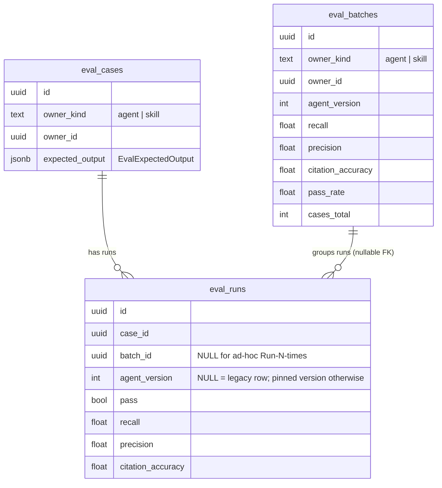
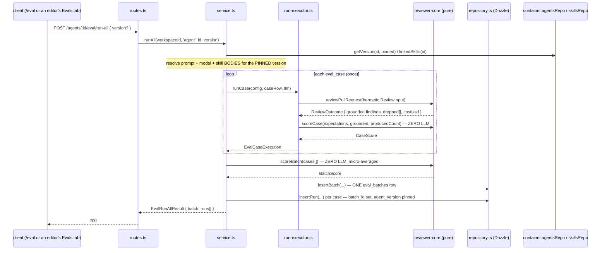
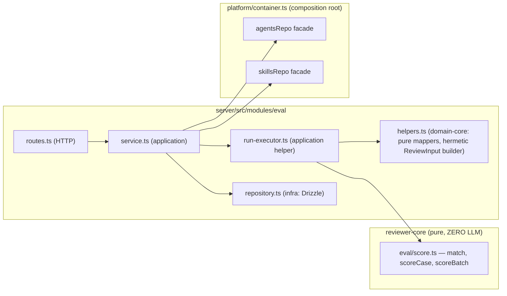

# Eval Pipeline (L06)

Turns an accepted/dismissed review finding into a saved regression test, runs it
repeatedly against a *pinned* agent/skill version, and reports a deterministic
reproduction rate plus recall/precision/citation_accuracy — so editing a system
prompt has a signal, not a vibe.

Full behaviour contract: [`spec/SPEC-03-eval-pipeline.md`](../spec/SPEC-03-eval-pipeline.md)
(AC-1…AC-29). Build record: [`docs/plans/2026-07-19-eval-pipeline.md`](plans/2026-07-19-eval-pipeline.md).
This doc is the *why* and the invariants; it does not restate either.

## Problem

An LLM reviewer is non-deterministic. Before this feature, editing an agent's
`system_prompt` produced no signal beyond "does this one run look okay" — and one
run proves nothing about whether the change is actually better. The pipeline turns
a real, human-judged review outcome (a finding a reviewer accepted or dismissed)
into a saved **eval case**, executes it N times, and reports whether the agent
*reliably* reproduces the expected outcome, using a scorer that never itself calls
a model (spec "Problem and purpose").

## The zero-LLM scorer (`reviewer-core/src/eval/score.ts`)

`match`, `scoreCase`, `scoreBatch` are pure functions — they import no
`LLMProvider` and take none as an argument. That absence is deliberate and
structural: zero-LLM is a property of the function signature, not a runtime
check you could accidentally bypass (`reviewer-core/src/eval/score.ts:9`, and the
comment at the top of `reviewer-core/test/eval-score.test.ts:4` calls out that the
file imports no provider at all — that's the unit-level proof of AC-6). The only
model call anywhere in the eval pipeline is the one review per case executed by
the existing `reviewPullRequest` (`server/src/modules/eval/run-executor.ts:11`).

**`match(f, e)`** (`reviewer-core/src/eval/score.ts:43`) requires `f.file === e.file`,
then either a closed-range `[start_line,end_line]` overlap, or — for the four
"full-file" kinds `secret_leak`/`lethal_trifecta`/`phantom`/`hook` — file identity
alone. This mirrors `FULL_FILE_KINDS` and the closed-range overlap check in
`reviewer-core/src/grounding.ts:16,41` on purpose: the pure eval core cannot import
server code, and it must not import `grounding.ts` either (that would blur the
zero-LLM/no-DB boundary the same way), so the concept is **reproduced locally**
rather than shared. That duplication is a chosen trade-off, not an oversight — the
alternative (share one module) would require lifting grounding logic to a place
both `reviewer-core`'s eval subtree and the engine's core can import without a
circular or cross-cutting dependency, which the plan didn't take on.

- **`recall`** = matched `must_find` expectations / total `must_find`
  expectations, defaulting to `1` when a case has no `must_find` (a pure
  `must_not_flag` case can't fail recall by definition) — AC-8.
- **`precision`** = TP / (TP + FP). A grounded finding is a false positive either
  by landing on a `must_not_flag` region, or — on a `must_find` case — by
  matching no expectation at all. So `must_find` and `must_not_flag` expectations
  drive precision from two different directions: one licenses noise as long as it
  hits the right things, the other treats *any* hit on a forbidden region as a
  miss regardless of what else the case expects — AC-9.
- **`citation_accuracy`** = `grounded / (grounded + dropped)`, i.e.
  `grounded.length / producedCount` where `producedCount` is computed by the
  run-executor as `outcome.review.findings.length + outcome.dropped.length`
  (`server/src/modules/eval/run-executor.ts:53`). This is the same ratio the
  engine's own grounding gate reports as "kept/total" — the eval scorer doesn't
  invent a new notion of citation quality, it just measures the *existing*
  `groundFindings` gate output (`reviewer-core/src/grounding.ts`) per case — AC-10.
- **`pass`** = every `must_find` matched **and** nothing landed on a forbidden
  region — a conjunction, not an average: a case with perfect recall but one
  forbidden-region hit still fails (`reviewer-core/test/eval-score.test.ts:144`
  asserts exactly this) — AC-11.

`scoreBatch` micro-averages the underlying tallies across cases (Σmatched/Σmust_find,
ΣTP/Σgrounded, Σgrounded/Σproduced) rather than averaging each case's ratio —
so a batch's headline numbers weight every expectation/finding equally, not every
case equally (`reviewer-core/src/eval/score.ts:171`).

## Reproducibility: the headline metric

`reproRate` — computed twice, once server-side for `EvalCaseWithRuns.repro`
(`server/src/modules/eval/helpers.ts:139`) and once client-side as a pure
derivation for a caller with an already-fetched runs list
(`client/src/lib/evals/repro.ts:26`) — is `passed / total` over the **last N**
runs, reliable iff `ratio ≥ 0.8` (4/5 or 5/5). There is deliberately **no new
schema column** for it: it's an aggregate over `eval_runs` rows the pipeline
already writes, computed fresh on every read. Persisting it would mean keeping a
derived number in sync with its inputs across every run/edit — the invariant here
is that reproducibility is *never stored*, only computed.

The window is keyed on the **pinned `agent_version`**, not on time or on the case
alone: `EvalRepository.runsForCase` takes an optional `agentVersion` and, when
given, adds `eq(t.evalRuns.agentVersion, opts.agentVersion)` to the query
(`server/src/modules/eval/repository.ts:185`), backed by the composite index
`(case_id, agent_version, ran_at desc)` (`server/src/db/schema/eval.ts:44`). The
service resolves "the pinned version" as the version of the case's **last run**
(`server/src/modules/eval/service.ts:87`) — so a run recorded under a
since-superseded version can never leak into the current rate (spec AC-15; the
edge case list calls this out explicitly as something a naive "last N runs"
window would get wrong).

## Batch / run-set data model

`eval_batches` is a **new** table; `eval_runs` gains two **nullable, additive**
columns (`batch_id`, `agent_version`) — no existing column, index, or migration
is touched (`server/src/db/migrations/0016_uneven_kingpin.sql`,
`0017_thick_bloodaxe.sql`; the schema source is
`server/src/db/schema/eval.ts:22-82`). This is not a style preference — the root
`CLAUDE.md` states the DB schema pre-declares every table and the shared ones are
extended, never migrated, and `eval_runs`/`eval_cases` predate this feature.

The reason a **batch** exists as its own row rather than being derived from
`eval_runs` on read: "run all cases once" (a run-all) is a distinct unit of
measurement from "run one case N times" (a reproducibility check) — a batch has
its own `cases_total`/`traces_total`/`cost_usd`/`duration_ms`, and one run-all
writes **exactly one** batch row, i.e. exactly one point on the trend line
(`server/src/modules/eval/service.ts:176-232`, spec AC-22). If batches were
computed on the fly from `eval_runs.batch_id` groupings, two concurrent run-alls
or a partial failure partway through could produce a ragged, ambiguous trend;
persisting the aggregate at the moment it's computed keeps the trend monotonic —
one call in, one point out.

`owner_kind` (`agent | skill`) is the single discriminator both `eval_cases` and
`eval_batches` carry, but the two owner kinds are **not symmetric** past that
column: skills have no dashboard, no `eval_batches` trend UI, and no Compare —
those are agent-only (spec AC-20, "Non-goals"). A skill's evals live only in its
own editor tab.

## Request / data flow — run-all (one review per case, one batch)

The facades in the diagram are load-bearing: `EvalService` reaches agent data
**only** through `container.agentsRepo` (`getById`, `getVersion`, `linkedSkills`,
`setSkills`, `update`) and skill data only through `container.skillsRepo`
(`server/src/modules/eval/service.ts:435,449-457,391-408`) — never a
`modules/agents` or `modules/skills` import. `skillsRepo` is itself a small
addition this feature made to the container (`server/src/platform/container.ts:117`,
comment at `:111-116`): before this module needed to resolve a skill's body/version,
nothing in the container required a skills facade at all.

## Onion placement

`routes.ts → service.ts → run-executor.ts → repository.ts` is the same layering
every other server module follows (`onion-architecture` skill); what's specific
to eval is that `run-executor.ts` holds no DB handle and reaches no other module
at all — it takes an already-resolved config, a case row, and a provider, and
returns data (`server/src/modules/eval/run-executor.ts:14`). Resolution
(which version, which skill bodies, which provider) is the service's job so the
executor stays a pure "run one case" primitive that's callable identically for
the ad-hoc "Run N×" path and the run-all path.

### The skill-host execution (AC-19)

A **skill** eval case has no agent and no system prompt of its own, so scoring it
in isolation needs a stand-in host. That host is a fixed constant,
`EVAL_SKILL_HOST_PROMPT` (`server/src/modules/eval/constants.ts:22`) — "a minimal
neutral reviewer system prompt, independent of which agents exist" — plus the
workspace-default provider/model (`EVAL_SKILL_HOST_PROVIDER`/`EVAL_SKILL_HOST_MODEL`,
same file), with **only that skill's body** injected as the sole skill, and the
skill's own `version` pinned into the run's `agent_version` column
(`server/src/modules/eval/service.ts:434-446`). The invariant this protects: a
skill's reported recall/precision is a property of the **skill's rubric text**,
not of whichever agent happens to currently reference it — if the host prompt
were derived from some agent instead, a skill's score would silently shift
whenever that agent's prompt changed, for a reason that has nothing to do with
the skill being evaluated.

## Hermetic run inputs (AC-25)

Every eval run — agent or skill, ad-hoc or run-all — reuses `reviewPullRequest`
unchanged, but the `ReviewInput` it's given is built by
`assembleEvalReviewInput` (`server/src/modules/eval/helpers.ts:192`), which sets
only `systemPrompt`, `model`, `diff`, `llm`, `strategy: 'single-pass'`, and the
resolved skill bodies — and **nothing else**: no `callers`, `repoMap`, `intent`,
`prDescription`, `memory`, or `specs`. The comment on that function is explicit
that the *absence* of those fields **is** the repo_intel-OFF guarantee, not a
flag that happens to be set to false somewhere. The reason: this feature's whole
premise is that a recall/precision delta between two runs should be attributable
to the prompt/skill you changed. If repo-intel context (which varies with repo
state, indexing freshness, etc.) were in scope, a metric swing could come from an
unrelated source and the "did my prompt edit help" question the feature exists to
answer would no longer be answerable from the numbers alone.

## Agents-only dashboard, Compare, Promote

The dashboard (`GET /eval/dashboard` → `EvalAgentDashboard`) lists **agents only**
— `EvalService.agentDashboard` iterates `container.agentsRepo.list(workspaceId)`
and never queries a skill owner (`server/src/modules/eval/service.ts:310-334`).
Skill eval cases surface only inside the SkillEditor's own Evals tab, sharing the
same `EvalsPanel` component the AgentEditor uses
(`client/src/components/evals/EvalsPanel/EvalsPanel.tsx:1-3`, mounted with
`allowFromFinding={false}` and no dashboard link in
`client/src/app/skills/_components/SkillEditor/_components/EvalsTab/EvalsTab.tsx`).
One component, parameterized by `owner: {kind, id}`, rather than two near-duplicate
panels — the same component derives its metric cards from the owner's cases'
last runs at render time (`deriveMetrics`, referenced in `EvalsPanel.tsx:31`)
rather than depending on a per-owner dashboard endpoint that skills don't have.

**Compare** (`GET /eval/compare?base&head`) loads two `eval_batches` rows,
computes metric deltas, and resolves each batch's `agent_version` back to that
version's `system_prompt` via `agentsRepo.getVersion` for the prompt diff
(`server/src/modules/eval/service.ts:358-384,480-494`). Version resolution is
allowed to fail softly — a batch whose version's config is missing degrades to
`"prompt unavailable"` rather than throwing, so a stale or skill-owned batch
never breaks the deltas (spec edge case, `accepted`).

**Promote** goes through `container.agentsRepo.update(...)`, the same
version-snapshotting path every other agent-config write uses
(`server/src/modules/eval/service.ts:391-409`) — there is exactly one place an
agent's live config gets written from a version snapshot, and Promote reuses it
rather than writing `agents` directly from the eval module.

## Keyless demo via seeded real scorer output (AC-26, AC-17)

The demo's central constraint: it must run on a fresh DB with **no API key**, and
its seeded numbers must not be hand-typed guesses. `server/src/db/fixtures/eval-goldset.ts`
resolves this by seeding **synthetic `{grounded, producedCount}` fixtures** per
case per agent version (a `VersionProfile`: which cases the agent "finds", which
it's "noisy" on, which `must_not_flag` cases it wrongly flags) and then running
those fixtures through the real `scoreCase`/`scoreBatch` **at seed time** —
so every stored `eval_runs`/`eval_batches` metric is provably identical to what
the pure scorer would compute over that fixture, without ever calling a model
(`goldsetBatchInputs`, `server/src/db/fixtures/eval-goldset.ts:419-438`; wired
into `db/seed.ts` at `seedEvalGoldset`, `server/src/db/seed.ts:481`). Four
versions (v1→v4) with a strictly improving prompt give the seeded trend a real
upward slope and a real prompt diff for Compare to show
(`GOLDSET_VERSIONS`, `eval-goldset.ts:46-70`).

The stable/flaky contrast (spec AC-17) is seeded the same way: `goldsetAdhocInputs`
returns five fixed outcomes for two named cases —
`GOLDSET_STABLE_CASE` always "found" (5/5) and `GOLDSET_FLAKY_CASE` found twice
out of five (`eval-goldset.ts:454-469`) — "modelling LLM non-determinism without a
live run" per the file's own comment. This is what lets "Run 5×" on those two
cases demonstrate the reliability threshold without a provider in scope.

The **live** experiment (`server/src/modules/eval/experiment.it.test.ts`, gated
on `OPENROUTER_API_KEY`) is wired but not part of the demo: it exercises the same
run-all path against a real provider to show recall dropping when a prompt is
silenced and precision dropping when a prompt over-flags (spec AC-12). It
self-skips when no key is present, so its absence from the demo path is a
gating decision, not a gap.

## Not yet implemented

- **CI/gate integration.** This spec explicitly excludes wiring eval results into
  a pass/fail CI gate — that is a separate contract (`eval-ci.ts`), out of scope
  here (spec "Non-goals").
- **Live-provider correctness/latency** as a demo requirement — the live
  experiment path is wired (gated on `OPENROUTER_API_KEY`) but the demo script
  never depends on it (spec "Non-goals", plan §10).

## Could not ground — flagging rather than inventing

- **Why `scoreBatch`'s micro-average was chosen over a per-case macro-average.**
  The code and both docs describe *what* it does (sum tallies, then divide) but
  not why that was preferred over averaging each case's ratio — I did not find a
  recorded rationale in the spec, plan, `reviewer-core/INSIGHTS.md`, or commit
  history for this choice, so I left it as a described behaviour, not a
  justified one.
- **Why `EVAL_SKILL_HOST_MODEL` is pinned to `deepseek/deepseek-v4-flash`
  specifically** (vs. any other workspace-default model) — the constant's
  comment says it "mirrors the seed's `DEFAULT_PROVIDER`/`DEFAULT_MODEL`" but
  doesn't say why that model was chosen as the workspace default in the first
  place; that predates this feature and I did not chase it further.
