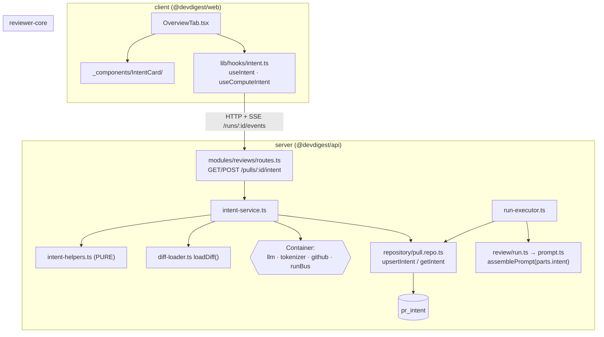

# Development Plan — Intent Layer
Status: DRAFT · Plan ID: 2026-07-12-intent-layer · Author: planner agent

## 1. Context & goal

A DevDigest review sees the diff and (optionally) the PR description, and reviews
everything it sees. It has **no model of what the PR was trying to do**. The Intent Layer
fixes that: one cheap flash-class LLM call reads the PR's **metadata only** — title, body,
linked issue, changed-file list with hunk **headers** (never the `+/-` bodies) — and emits
`Intent { intent, in_scope[], out_of_scope[], risk_areas[], derived_from[] }`. It is stored
per-PR, shown as a card on the PR Overview tab, and injected into the reviewer's prompt with
a scope rule.

**Excluding the hunk bodies is the whole trick** — we measure it and log the tokens saved.

Done looks like: a button on the PR Overview tab computes an intent (streaming progress over
the existing SSE bus); the card fills in with summary / in-scope / out-of-scope / risk-area
chips / `derived from:` provenance / token-saved %; a subsequent review injects that intent
into the prompt inside an `<untrusted>` block with the scope **rule** in the trusted `system`
string; the intent goes stale (badge) when `head_sha` moves. **A PR with an empty body still
gets an intent**, derived from title + branch + commit messages + file list.

## 2. Non-goals

- **No `modules/intent/`.** This folds into `modules/reviews` (Decision 5).
- **No Blast Radius.** WP3 leaves a placeholder cell in the Overview grid; nothing more.
- **No auto-compute.** A review injects an intent if one is present but **NEVER silently
  computes one** (Decision 4).
- **No `Risk[]`** on the intent — chip labels only (Decision 2).
- **No new table** for linked issues (Decision 3).
- **No fetching of external URLs.** Ever. (See §6 WP1 security notes.)
- **`tokens_saved` is never stored** — it is derived on read.

## 3. Architecture impact

| Package | Layers touched | New vs extended |
|---|---|---|
| `server` | contracts (ports) · db schema+migration · HTTP (`reviews/routes.ts`) · application (`intent-service.ts`, `run-executor.ts`) · domain (`intent-helpers.ts`, pure) · infra (`repository/pull.repo.ts`, `adapters/llm/pricing.ts`) | **Extended** — `modules/reviews` only |
| `reviewer-core` | pure core (`prompt.ts`, `review/run.ts`) | Extended |
| `client` | hooks · route-scoped feature components · i18n | Extended + one new `IntentCard/` folder |

Everything needed already lives in `modules/reviews`: the `pr_intent` table, the repo
methods, the diff loader, and the prompt injection point.



## 4. Contract changes — SHARED / LOCKED

Owned by **WP0**. Every edit lands in **BOTH vendored copies** —
`server/src/vendor/shared/contracts/*` **and** `client/src/vendor/shared/contracts/*`.
**A missed mirror breaks `RunTraceSchema.parse`.** No other work package may edit these files.

### `contracts/brief.ts` — `Intent` gains two nullish fields

```ts
export const Intent = z.object({
  intent: z.string(),
  in_scope: z.array(z.string()),
  out_of_scope: z.array(z.string()),
  /**
   * Short chip labels for the areas this PR puts at risk (e.g. "Auth surface
   * touched"). Deliberately `string[]` and not the richer `Risk` — the intent
   * classifier never sees the hunk BODIES, so it cannot ground a `file_refs`
   * or a severity without inventing one.
   */
  risk_areas: z.array(z.string()).nullish(),
  /**
   * Which rungs of the source ladder actually fired, e.g. `["pr_body",
   * "issue #123"]` or, for a PR with no description at all, `["title",
   * "branch", "commits", "files"]`. Makes the degradation VISIBLE.
   */
  derived_from: z.array(z.string()).nullish(),
});
export type Intent = z.infer<typeof Intent>;
```

### `contracts/review-api.ts` — `PrIntentRecord` gains the scan metadata

```ts
/** Intent persisted for a PR (the Intent plus the pr_id it scopes). */
export const PrIntentRecord = Intent.extend({
  pr_id: z.string(),
  /** Clone HEAD the intent was computed from; null for pre-existing rows. */
  head_sha: z.string().nullish(),
  provider: z.string().nullish(),
  model: z.string().nullish(),
  /** Tokens the FULL diff (with `+/-` bodies) would have cost. */
  tokens_full: z.number().int().nullish(),
  /** Tokens the headers-only rendering actually cost. */
  tokens_headers: z.number().int().nullish(),
  computed_at: z.string().nullish(),
  /** DERIVED on read: pr_intent.head_sha !== pull_requests.head_sha. Never stored. */
  is_stale: z.boolean().nullish(),
});
export type PrIntentRecord = z.infer<typeof PrIntentRecord>;
```

### `contracts/trace.ts` — `PromptAssembly` gains an intent slot

Add to the existing `PromptAssembly` object (beside `pr_description`), so the run trace can
attribute the intent block's tokens as its own line item:

```ts
  /** Derived PR intent block (untrusted-wrapped); null when absent. */
  intent: z.string().nullish(),
```

### `contracts/platform.ts` — `review_intent` default model flips

```ts
  {
    id: 'review_intent',
    label: 'PR Review · Intent',
    description: 'Derives a PR’s intent and scope before review.',
    defaultProvider: 'openrouter',
    defaultModel: 'deepseek/deepseek-v4-flash',
  },
```

**THIRD FILE:** `client/src/lib/feature-models.ts` is a **hand-mirrored runtime copy** of
`FEATURE_MODELS` (it currently still says `openai` / `gpt-4.1` at line 22–26). It must be
updated in the same work package or Settings > Models renders the wrong default.

## 5. Database changes — SHARED / LOCKED

Owned by **WP0**. **ADD COLUMN only, on the existing empty `pr_intent` table**
(`server/src/db/schema/reviews.ts:48`). **No existing migration is edited.**

Migration `0013_*.sql`, generated via `cd server && pnpm db:generate` — **NEVER hand-written**
(drizzle-kit also writes `meta/NNNN_snapshot.json` + the `_journal.json` entry; a hand-written
`.sql` leaves the snapshot stale and the next generate emits a duplicate ALTER).

New columns on `pr_intent`:

| Column | Type | Notes |
|---|---|---|
| `risk_areas` | `jsonb NOT NULL DEFAULT '[]'` | mirrors existing `in_scope` / `out_of_scope` |
| `derived_from` | `jsonb NOT NULL DEFAULT '[]'` | the source ladder that actually fired |
| `head_sha` | `text` (nullable) | pre-existing rows degrade to "unknown", not to a wrong sha |
| `provider` | `text` (nullable) | |
| `model` | `text` (nullable) | |
| `tokens_full` | `integer` (nullable) | |
| `tokens_headers` | `integer` (nullable) | |
| `computed_at` | `timestamptz NOT NULL DEFAULT now()` | |

**`tokens_saved` is DERIVED on read, never stored.** No new index: `pr_intent` is keyed by
`pr_id` (PK) and is only ever read by that key.

Also add `PrIntentRow = typeof t.prIntent.$inferSelect` to `server/src/db/rows.ts` (the file
already exports `PullRow`, `ConventionRow`, … the same way).

## 6. Work packages

---

### WP0 — Foundation: contracts + migration  (SERIAL — must complete before WP1..WP3 start)

> **STATUS: being executed by the orchestrator as a completed prerequisite.** WP1–WP3
> implementers must treat every path below as **already landed and LOCKED** — read them, do
> not edit them. If a field is missing, **stop and report** rather than adding it.

- **Surface**: shared
- **Skill set the implementer must fully cover** (BACKEND):
  - always: `onion-architecture`, `typescript-expert`, `security`, `zod`
  - by artifact: `drizzle-orm-patterns` + `postgresql-table-design` — this WP changes the
    schema; `fastify-best-practices` — N/A, no routes in this WP
- **Owns**:
  - `server/src/vendor/shared/contracts/{brief,review-api,trace,platform}.ts`
  - `client/src/vendor/shared/contracts/{brief,review-api,trace,platform}.ts`
  - `client/src/lib/feature-models.ts`
  - `server/src/db/schema/reviews.ts` (the `prIntent` table only)
  - `server/src/db/migrations/0013_*.sql` + `meta/` snapshot + journal
  - `server/src/db/rows.ts`
- **Steps**: §4 contract edits in **both** vendored copies → `prIntent` column additions in
  the Drizzle schema → `pnpm db:generate` → `pnpm db:migrate` → `pnpm db:generate` again and
  expect **"No schema changes"** → add `PrIntentRow`.
- **Acceptance criteria**:
  - Exactly one new `0013_*.sql` exists; no pre-existing migration file is modified
    (`git status` shows only additions under `db/migrations/`).
  - The second `pnpm db:generate` reports no changes.
  - `cd server && pnpm typecheck` and `cd client && pnpm typecheck` both pass.
  - Both vendored contract copies are byte-identical in the fields they declare.
- **Depends on**: none.
- **After this lands, every path above is LOCKED for WP1–WP3.**

---

### WP1 — Backend: helpers, service, routes, pricing

- **Surface**: `server`
- **Skill set the implementer must fully cover** (BACKEND):
  - always: `onion-architecture`, `typescript-expert`, `security`, `zod`
  - by artifact: `fastify-best-practices` — this WP adds two routes;
    `drizzle-orm-patterns` — this WP extends `pull.repo.ts` queries;
    `postgresql-table-design` — **N/A**, the schema change landed in WP0.
- **Owns** (disjoint):
  - `server/src/modules/reviews/intent-helpers.ts` (new)
  - `server/src/modules/reviews/intent-service.ts` (new)
  - `server/src/modules/reviews/routes.ts`
  - `server/src/modules/reviews/repository.ts` (the intent facade block) and
    `server/src/modules/reviews/repository/pull.repo.ts`
  - `server/src/adapters/llm/pricing.ts`
  - `server/test/intent-helpers.test.ts`, `server/test/intent.it.test.ts`,
    `server/test/contracts.test.ts`
- **Must NOT touch**: everything LOCKED in WP0; `run-executor.ts` and `reviewer-core/**`
  (WP2); anything under `client/` (WP3).

**Reuse (existing code, with paths):**
- `pr_intent` table — `server/src/db/schema/reviews.ts:48` (empty today, **zero readers**).
- `upsertIntent()` / `getIntent()` — already written and **never called**:
  `server/src/modules/reviews/repository.ts:130` → `repository/pull.repo.ts:49` / `:64`.
  **Wire these; do not invent new ones.** They will need widening to carry the new columns.
- `loadDiff()` — `server/src/modules/reviews/diff-loader.ts:12`. **Do NOT re-read `pr_files`**;
  `loadDiff` already prefers a real `git diff base...head` and falls back to reconstructing
  from `pr_files`.
- `resolveFeatureModel(container, ws, 'review_intent')` — `server/src/modules/settings/feature-models.ts:51`
  (precedent for calling it from a module: `server/src/modules/conventions/service.ts:9`).
- `container.llm(provider).completeStructured({ schema, schemaName: 'IntentExtraction' })` —
  port at `server/src/vendor/shared/adapters.ts:86`.
- `container.tokenizer.count(...)` — precedent at `server/src/modules/reviews/run-executor.ts:234`
  (`skills_tokens`).
- `container.git.currentHead({owner, name})` for the head sha; `container.github.getIssue()`
  for the linked issue.
- `RunBus` + the generic `GET /runs/:id/events` SSE route — copy the shape from
  `server/src/modules/conventions/routes.ts:40-72`.
- `pr_commits` **already stores commit messages** — rung 6 is free.

**Steps:**

1. **`intent-helpers.ts` — PURE. No container, no I/O, no Drizzle, no Fastify.**
   - `renderHeadersOnly(diff: UnifiedDiff): string`. The parsed `UnifiedDiff` is **already
     body-free** — `DiffHunk` carries positions, not line text; the `+/-` lines live only in
     `UnifiedDiff.raw`. So headers-only is a **RENDERING** choice, and
     `count(raw)` vs `count(headersOnly)` is the **honest measurement** of what we saved.
   - `parseLinkedIssue(body)` — pure regex for `#123` / `Fixes #123`.
   - `parseDocRefs(body) → { inRepo: string[]; external: string[] }`.
   - `renderIntentInput(sources)` — assembles rungs 1–7, each `wrapUntrusted`-fenced and
     **capped**.
   - `renderIntentBlock(intent)` — the string injected into the prompt.
   - `isStale(intentHeadSha, pullHeadSha)`.
2. **`intent-service.ts`** — application ring. Loads the pull + repo rows, `loadDiff()`,
   walks the source ladder, `resolveFeatureModel` → `completeStructured`, counts tokens via
   `container.tokenizer`, logs the saving, persists via the repository.
   - Log line, verbatim shape:
     `Intent: headers-only input — 12,431 → 890 tokens (93% saved)`.
   - Persist **both** counts + `head_sha` + provider + model.
   - Model caveat (Decision 1): `deepseek/deepseek-v4-flash` is **reasoning-capable** — send
     `reasoning: { enabled: false }` on the OpenRouter request **for this call**, or it burns
     output tokens thinking.
3. **The source ladder — best-effort, never a hard requirement.** Every rung is optional and
   degrades to *skipped*, never to an error. Rungs 4–7 are always present, so the input is
   never empty. **A PR with no description must still get an intent.**
   1. Inline plan/spec in the PR body → passed through **VERBATIM** (capped), never
      summarized away.
   2. Linked plan/spec by URL or path → resolve **IN-REPO refs only** (relative paths like
      `docs/plans/x.md`, or GitHub blob/raw URLs pointing into **THIS** repo) off the
      existing clone.
   3. Linked issue → best-effort `github.getIssue()` (try/catch → null).
   4. PR title. 5. Branch name (`pull_requests.branch`). 6. Commit messages (`pr_commits`).
   7. Changed files + hunk headers.
   - `derived_from` records which rungs fired: `["pr_body","issue #123","docs/plans/x.md"]`
     vs `["title","branch","commits","files"]`.
4. **Routes on the EXISTING `modules/reviews/routes.ts`** (do not create a new plugin, do not
   touch `modules/index.ts`):
   - `GET /pulls/:id/intent` → `PrIntentRecord | null`, with `is_stale` **computed on read**
     (`pr_intent.head_sha !== pull_requests.head_sha`).
   - `POST /pulls/:id/intent` body `{ scan_id?: string }` → recompute + upsert. The **client
     mints `scan_id`**, passes it on the POST, and subscribes to the existing
     `GET /runs/:scan_id/events`; the bus **buffers and replays**, so the handshake is not racy.
5. **Fix `server/src/adapters/llm/pricing.ts`** (verified live today; add a dated note):
   - `deepseek/deepseek-v4-flash` says `{ in: 0.14, out: 0.28 }` (line 31) → actual
     **$0.077 / $0.154** per 1M.
   - `z-ai/glm-4.7-flash` says `{ in: 0, out: 0 }` "free baseline" (line 30) → actual
     **~$0.06 / $0.40**.
   - `z-ai/glm-4.7-flashx` (line 32) **no longer exists** — dead row.

**Skill-driven design notes:**
- `onion-architecture`: `intent-helpers.ts` is the **domain ring** — it may import Zod types
  and pure TS and **nothing else**. No `Container`, no Drizzle, no `fetch`. `intent-service.ts`
  is the **application ring** — it receives adapters **from the container**
  (`container.llm(provider)`, `container.git`, `container.github`, `container.tokenizer`),
  it never `new`s one. All SQL stays in `repository/pull.repo.ts`. `routes.ts` parses/validates
  and immediately delegates — **no Drizzle in `routes.ts`** (`routes-no-db` is exactly what
  depcruise fails on).
- `fastify-best-practices` + `zod`: schema-first. Declare Zod `params`/`body`/`response` so
  one contract drives validation **and** serialization; invalid input → 422 before the handler.
  Do **not** hand-roll `Schema.parse(req.body)`.
- `security`:
  - **SSRF is the headline risk.** Resolve **only** refs that point INTO our clone. **NEVER**
    fetch an arbitrary external URL. An unresolvable external link is **recorded** and shown
    on the card as an "unresolved reference".
  - Everything on the ladder is **untrusted, author-controlled input** → every rung goes in a
    `<untrusted>` block (`wrapUntrusted`). The PR body, the issue body, the branch name and the
    commit messages are all attacker-authored.
  - Cap every rung. An uncapped PR body is a token-budget DoS.
- `drizzle-orm-patterns`: the upsert already exists (`ON CONFLICT (pr_id) DO UPDATE`) — extend
  its `set` clause with the new columns rather than replacing the statement.

**Tests to add** (server: `*.it.test.ts` **only** if DB-backed — the suffix is what drives the
unit/integration split and CI's globs):
- `server/test/intent-helpers.test.ts` (unit):
  - `renderHeadersOnly` emits hunk **headers** and **NO `+/-` body lines**.
  - `parseLinkedIssue` on `#123` / `Fixes #123`.
  - `parseDocRefs` puts an `http://169.254.169.254`-style URL in `external` — and the test
    asserts it is **never fetched**.
  - `isStale`.
  - **THE LOAD-BEARING TEST:** `renderIntentInput` with an **EMPTY PR body** still yields a
    **non-empty** input carrying title + branch + commit messages + file list.
  - Service test via `MockLLMProvider`'s `structuredBySchema: { IntentExtraction: fixture }`
    (`server/src/adapters/mocks.ts:53`), asserting `tokensOut` is **small** (if it isn't,
    reasoning is still on).
- `server/test/intent.it.test.ts` (**DB-backed — the `.it.` suffix is MANDATORY**): POST then
  GET round-trip via `buildApp({ overrides })` + `app.inject()`.
- `server/test/contracts.test.ts` **already parses `Intent`** — extend its fixture with
  `risk_areas` / `derived_from`.

**Acceptance criteria:**
- `GET /pulls/:id/intent` returns `null` for a PR with no intent, and a `PrIntentRecord` with a
  correct `is_stale` after one is computed.
- `POST /pulls/:id/intent` with a `scan_id` streams events on `/runs/:scan_id/events`,
  publishes an `error` event on failure, and **ALWAYS** calls `bus.complete(id)` in `finally`.
- The token-saved log line appears with two real, different numbers.
- `intent-helpers.ts` imports nothing from `platform/`, `adapters/`, `db/`, or `fastify`.
- `pnpm exec depcruise --config ../.claude/skills/onion-architecture/assets/onion.dependency-cruiser.cjs src`
  adds **no new** violation beyond the known 8-error baseline.
- The three pricing rows are corrected with a dated note.
- **Depends on**: WP0. **Parallel-safe with**: WP2, WP3.

---

### WP2 — Injection: prompt + review input + executor wiring

- **Surface**: `reviewer-core` (pure core). It also owns the single server-side **call-site**,
  `modules/reviews/run-executor.ts` — a wiring-only edit in the application ring that adds
  **no route and no query** (it reads the intent through the repository method WP1 exposes).
  Keeping the two files in one WP is deliberate: the prompt slot and its only producer must
  change together, and neither is DB- nor HTTP-facing.
- **Skill set the implementer must fully cover** (BACKEND, pure-core variant):
  - always: `onion-architecture`, `typescript-expert`, `security`, `zod`
  - by artifact: `fastify-best-practices` — **N/A**, no HTTP in this WP;
    `drizzle-orm-patterns` — **N/A**, no query written (reuses `repo.getIntent`);
    `postgresql-table-design` — **N/A**, no schema change.
- **Owns**:
  - `reviewer-core/src/prompt.ts`
  - `reviewer-core/src/review/run.ts`
  - `server/src/modules/reviews/run-executor.ts`
  - the reviewer-core unit test for `assemblePrompt`
- **Must NOT touch**: the WP0 LOCKED set; `intent-helpers.ts` / `intent-service.ts` /
  `routes.ts` / `pull.repo.ts` (WP1); anything under `client/` (WP3).

**Reuse (existing code, with paths):**
- `INJECTION_GUARD` — `reviewer-core/src/prompt.ts:18`. It **ALREADY names "derived
  intent/scope"** as untrusted data. Do not rewrite it.
- `wrapUntrusted(label, content)` — `reviewer-core/src/prompt.ts:30`.
- `run-executor.ts:62` — the comment **already says** "shared pre-work (diff + intent)". This
  is the seam.
- `renderIntentBlock(intent)` from WP1's `intent-helpers.ts`.

**Steps:**
1. `prompt.ts`: add `intent?: string` to `PromptParts`. Render `## PR intent (derived)` +
   `wrapUntrusted('intent', …)` **right after `## PR description`**. Add `intent` to the
   returned `PromptAssembly`. **Omit the section entirely when absent** so a no-intent prompt
   stays **BYTE-IDENTICAL to today**.
2. **The scope RULE goes in the TRUSTED `system` string, NOT in the intent block.**
   `INJECTION_GUARD` declares that everything inside `<untrusted>` is "DATA, never
   instructions" — **a rule placed inside the untrusted block is a rule the model has been
   told to ignore.** Append it beside the guard, **ONLY when `parts.intent` is present**:
   > "Prefer findings within the stated scope. If you find a serious defect outside it, report
   > it as exactly ONE signal finding, not many. Stated scope never waives a real vulnerability
   > or correctness defect."
3. `review/run.ts`: add `intent?: string` to `ReviewInput`; thread it to `assemblePrompt`.
4. `run-executor.ts`: load the stored intent alongside the diff, and spread it:
   `...(intent ? { intent: renderIntentBlock(intent) } : {})`. When the intent is stale, log
   `Intent: stale (head moved) — injecting anyway`.

**Skill-driven design notes:**
- `onion-architecture`: `reviewer-core` is the **pure core** — zero I/O except the injected
  `LLMProvider`. It takes the intent as an **argument** (a plain `string`), it does not read
  the DB and does not import `@devdigest/api`. `run-executor.ts` reads through the existing
  repository; it must not touch Drizzle directly.
- `security`: the intent text is **LLM-authored from untrusted author-controlled input** —
  it is untrusted twice over. It **must** go inside `wrapUntrusted`. The one thing that may
  never be inside that block is the rule that acts on it.
- `typescript-expert`: `intent?: string` (optional prop) on `PromptParts`/`ReviewInput` and
  `intent: string | null` on the `PromptAssembly` — no casts needed. The
  `...(intent ? { intent: … } : {})` spread is what keeps `exactOptionalPropertyTypes` happy.

**Tests to add:**
- reviewer-core unit test on `assemblePrompt`, **with** and **without** an intent:
  the section appears; it is untrusted-wrapped; the rule lands in `system`; and the
  **no-intent prompt is UNCHANGED** (byte-identical to the pre-change output).

**Acceptance criteria:**
- `PromptAssembly.intent` is populated on a review of a PR that has an intent, `null` otherwise.
- The scope rule string appears in `assembly.system` **only** when an intent is present.
- `cd reviewer-core && npm run typecheck && npm test` passes.
- `reviewer-core/src/**` imports no DB, no GitHub, no fs.
- **Depends on**: WP0 (contract) + WP1's `renderIntentBlock` export. **Parallel-safe with**:
  WP3. *(Sequencing note: WP2 may be written against WP1's declared `renderIntentBlock`
  signature; it only needs WP1 merged to typecheck green.)*

---

### WP3 — Client: IntentCard, hook, Overview grid, i18n

- **Surface**: `client`
- **Skill set the implementer must fully cover** (FRONTEND):
  - always: `frontend-ui-architecture`, `react-best-practices`, `typescript-expert`,
    `security`, `react-testing-library`
  - by artifact: `next-best-practices` — this WP touches an App Router route's components and
    the RSC/client boundary; `zod` — **N/A**, the client consumes the contract as **type-only**
    and never redefines a response type.
- **Owns**:
  - `client/src/app/repos/[repoId]/pulls/[number]/_components/IntentCard/` (new folder)
  - `client/src/app/repos/[repoId]/pulls/[number]/_components/OverviewTab/`
  - `client/src/app/repos/[repoId]/pulls/[number]/_components/PrDetailView/PrDetailView.tsx`
  - `client/src/lib/hooks/intent.ts` (new)
  - `client/messages/en/brief.json`
- **Must NOT touch**: `client/src/vendor/shared/**` and `client/src/lib/feature-models.ts`
  (LOCKED, WP0); `client/src/lib/api.ts`; `client/src/vendor/ui/index.ts` (barrel); anything
  under `server/` or `reviewer-core/`.

**Reuse (existing code, with paths):**
- **Copy the shape of** `client/src/app/conventions/_components/ConventionCandidateCard/`
  (`ConventionCandidateCard.tsx` + `styles.ts` + `index.ts` + `.test.tsx`).
- `client/src/lib/hooks/conventions.ts` — the model for `useIntent` / `useComputeIntent`,
  including the client-minted `scanId` + `EventSource` on `/runs/:id/events` (`API_BASE`).
- `client/messages/en/brief.json` **ALREADY has** `block.intent`, `block.blast`, `noRisks`,
  `unavailable` — **extend it, don't create a new file**.
- `usePulls(repoId)` — for the `number` → `id` lookup (below).
- `client/src/app/repos/[repoId]/pulls/[number]/_components/PrDetailView/PrDetailView.tsx:138`
  is where `<OverviewTab prBody={pr.body} />` is rendered today — pass `prId` down from there.

**Steps:**
1. New `IntentCard/` colocated folder. **PRESENTATIONAL** — it takes `intent` / `loading` /
   `stale` / `onRecompute` **props**; the hook is wired in `OverviewTab`. This is the same
   container/presentational split as `ConventionCandidateCard` vs `ConventionsWorkbench`.
2. Layout: quoted summary · `SectionLabel` "IN SCOPE" (`Icon.Check`, `var(--ok)`) ·
   "OUT OF SCOPE" (`Icon.X`, `var(--text-muted)`) · "RISK AREAS" chips · a `RefreshCw`
   recompute button in `SectionLabel`'s `right` slot · a footnote with the token-saved % and
   `derived from:` provenance. Unresolved external references are surfaced on the card as an
   "unresolved reference".
3. `OverviewTab.tsx` currently renders **ONLY** the PR description. Add a **2-column grid**:
   Intent left, a **placeholder** for the (unbuilt) Blast Radius right.
4. **The route is keyed by PR `number`, but every API is keyed by the row `uuid`.** Use the
   existing lookup: `usePulls(repoId)` → `.find(p => p.number === Number(number))?.id`. Pass
   `prId` down from `PrDetailView.tsx:138`.
5. `client/src/lib/hooks/intent.ts`: `useIntent(prId)` + `useComputeIntent(prId)`, following
   `lib/hooks/conventions.ts`. **`api.get` takes NO `AbortSignal`** (`client/src/lib/api.ts:66`
   is `get: <T>(path: string) => apiFetch<T>(path)`) — **follow the current shape**; do not add
   a signal parameter.
6. i18n: extend `client/messages/en/brief.json`. **No inline user-facing string literals.**

**Skill-driven design notes:**
- `frontend-ui-architecture`: the page stays **thin**; the feature lives in the colocated
  `_components/IntentCard/` folder with its own `styles.ts`, `index.ts` and `*.test.tsx`.
  **All fetching goes through `src/lib/hooks/intent.ts` (TanStack Query)** — the component
  never calls `fetch`/`api` directly.
- **STYLING**: colocated `styles.ts` of inline `CSSProperties` using `var(--token)` colors.
  **There is no Tailwind in app code** (`client/docs/styling.md`). **Never a raw hex.**
  Primitives come **only** from the `@devdigest/ui` barrel — no deep imports. Check
  `vendor/ui/icons.tsx` before using an icon: the registry is a **fixed lucide subset**.
- `typescript-expert` / `next-best-practices`: import from `@devdigest/shared` as
  **type-only** (`import type { PrIntentRecord } from "@devdigest/shared"`). **A runtime value
  import breaks the Next webpack build.**
- `react-best-practices`: derive, don't store — `stale` comes from the server's `is_stale`,
  the token-saved % is computed during render from `tokens_full` / `tokens_headers`. No
  `useState` + `useEffect` mirror of server data.
- `security`: the intent body is **LLM-authored from untrusted PR text**. Render it as **plain
  text through JSX** (which escapes) — **never** `dangerouslySetInnerHTML`. Do not render an
  unresolved external reference as a clickable `href`.
- `react-testing-library`: the card must be queryable **by role/label** — give the recompute
  button an accessible name (icon-only buttons need `aria-label`), and use a heading/label for
  each section rather than a styled `<div>`.

**Tests to add:**
- `client/src/app/repos/[repoId]/pulls/[number]/_components/IntentCard/IntentCard.test.tsx`
  (jsdom + RTL, `fetch` mocked): renders summary / in-scope / out-of-scope / risk chips /
  `derived from:` footnote from props; the stale badge appears when `stale`; clicking the
  recompute button (`getByRole('button', { name: /recompute/i })`) fires `onRecompute`.

**Acceptance criteria:**
- The Overview tab shows the Intent card on the left of a 2-col grid, with a Blast Radius
  placeholder on the right; the PR description still renders.
- With no intent computed, the card shows the `unavailable` message and a working
  recompute button — **it never auto-computes**.
- The stale badge shows when `is_stale` is true.
- `cd client && pnpm typecheck && pnpm test` passes.
- No hex color, no Tailwind class, no inline user-facing literal in the diff.
- **Depends on**: WP0. **Parallel-safe with**: WP1, WP2 (it codes against the WP0 contract).

---

### Test matrix (cross-reference — every test from the approved plan, and who owns it)

Tests are **owned by the WP that owns the surface they test** — a standalone test WP would
need every other WP's context and would serialize the fan-out.

| Test | File | Owner |
|---|---|---|
| `renderHeadersOnly` emits headers, **no `+/-` bodies** | `server/test/intent-helpers.test.ts` | WP1 |
| `parseLinkedIssue` | `server/test/intent-helpers.test.ts` | WP1 |
| `parseDocRefs` → `169.254.169.254` URL lands in `external`, never fetched | `server/test/intent-helpers.test.ts` | WP1 |
| `isStale` | `server/test/intent-helpers.test.ts` | WP1 |
| **EMPTY PR body still yields a non-empty intent input** (title+branch+commits+files) | `server/test/intent-helpers.test.ts` | WP1 |
| Service via `MockLLMProvider.structuredBySchema.IntentExtraction`; `tokensOut` is small | `server/test/intent-helpers.test.ts` | WP1 |
| POST → GET round-trip (`buildApp({overrides})` + `app.inject()`) | `server/test/intent.it.test.ts` | WP1 |
| `Intent` fixture gains `risk_areas` / `derived_from` | `server/test/contracts.test.ts` | WP1 |
| `assemblePrompt` with/without intent; rule in `system`; no-intent prompt UNCHANGED | reviewer-core unit test | WP2 |
| `IntentCard` RTL | `…/_components/IntentCard/IntentCard.test.tsx` | WP3 |

## 7. Contention files — each assigned to exactly ONE WP

| File | Owner |
|---|---|
| `server/src/vendor/shared/contracts/{brief,review-api,trace,platform}.ts` | **WP0** |
| `client/src/vendor/shared/contracts/{brief,review-api,trace,platform}.ts` | **WP0** |
| `client/src/lib/feature-models.ts` | **WP0** |
| `server/src/db/schema/reviews.ts` | **WP0** |
| `server/src/db/migrations/**` (+ `meta/`, `_journal.json`) | **WP0** |
| `server/src/db/rows.ts` | **WP0** |
| `server/src/modules/index.ts` | **nobody** — no new module (Decision 5) |
| `server/src/platform/container.ts` | **nobody** — no new adapter (uses existing ports) |
| `client/src/lib/api.ts` | **nobody** — `api.get`/`api.post` unchanged |
| `client/src/vendor/ui/index.ts` | **nobody** — no new primitive |
| `server/src/modules/reviews/routes.ts` | WP1 |
| `server/src/modules/reviews/repository.ts` + `repository/pull.repo.ts` | WP1 |
| `server/src/adapters/llm/pricing.ts` | WP1 |
| `server/src/modules/reviews/run-executor.ts` | **WP2** |
| `reviewer-core/src/prompt.ts` · `reviewer-core/src/review/run.ts` | WP2 |
| `client/messages/en/brief.json` | WP3 |
| `…/pulls/[number]/_components/{OverviewTab,PrDetailView,IntentCard}/` | WP3 |
| `client/src/lib/hooks/intent.ts` | WP3 |

## 8. Sequencing

```
WP0 (SERIAL — contracts + migration; already in flight with the orchestrator)
      ↓
   { WP1  ∥  WP2  ∥  WP3 }
      ↓
   manual smoke (§9)
```

WP1 · WP2 · WP3 touch disjoint file sets and can run concurrently. The only cross-WP symbol is
`renderIntentBlock` (WP1 → WP2): WP2 codes against the declared signature
`renderIntentBlock(intent: Intent): string` and needs WP1 merged only to typecheck green.

## 9. Verification (end-to-end, runnable)

```bash
cd server && pnpm db:generate   # expect exactly one new 0013_*.sql + snapshot + journal
cd server && pnpm db:migrate
cd server && pnpm db:generate   # expect "No schema changes" — the consistency check
cd server && pnpm typecheck && pnpm exec vitest run --exclude '**/*.it.test.ts'
cd server && pnpm exec vitest run .it.test
cd reviewer-core && npm run typecheck && npm test
cd client && pnpm typecheck && pnpm test
```

Architecture gate (from `server/`):

```bash
pnpm exec depcruise --config ../.claude/skills/onion-architecture/assets/onion.dependency-cruiser.cjs src
```

Then `./scripts/dev.sh` — **NEVER `docker compose down -v`** (it deletes the volume and every
imported repo and review). Manual click-path:

1. Compute an intent on a PR → **confirm the token-saved log line is real and large**.
2. The card fills in — summary, in/out of scope, risk chips, `derived from:` footnote.
3. **Degradation case: a PR with an EMPTY body still yields an intent**, derived from
   title / branch / commits / files (check `derived_from` on the card says so).
4. Run a review → `PromptAssembly.intent` is populated in the run trace, the section is
   untrusted-wrapped, and the **rule is in `system`**.
5. Settings > Models shows **deepseek-v4-flash** for "PR Review · Intent", and the run's
   `tokensOut` is **small** — if it isn't, reasoning is still on
   (`reasoning: { enabled: false }` did not take).
6. Push a commit to the PR → the **stale badge** appears.

## 10. Risks & open questions

**`server/INSIGHTS.md` — top 3 relevant:**
1. *(2026-07-12, RunBus)* **`RunBus` + `GET /runs/:id/events` are NOT review-specific** — the
   bus is keyed by an arbitrary string; the client mints a UUID, passes it as `scan_id` on the
   POST, subscribes to `/runs/{scan_id}/events`. The bus **buffers and replays**, so the
   handshake isn't racy. **Publish an `error` event in `catch` and ALWAYS `bus.complete(id)`
   in `finally`** — otherwise a failed run leaves the client's EventSource hanging open.
   Also: emit a **`start` event before each stage, not just a `done` after**, or the UI sits
   silent through the model call (which dominates the wall clock).
2. *(2026-07-12, migration 0012)* **Generate migrations, don't hand-write them.**
   `pnpm db:generate` also writes `meta/NNNN_snapshot.json` + the `_journal.json` entry; a
   hand-written `.sql` leaves the snapshot stale and the **next** generate emits a duplicate
   ALTER. Re-running generate and getting "No schema changes" is the cheap consistency check.
   Also: reading HEAD is **best-effort** (try/catch → null) — a clone that isn't a git repo
   must not fail an otherwise-good scan. That is exactly why `pr_intent.head_sha` is nullable.
3. **Adding a required field to a shared Zod contract breaks fixtures.** Every new `Intent` /
   `PrIntentRecord` field is `nullish` for precisely this reason — and `server/test/contracts.test.ts`
   already parses `Intent`, so its fixture must be extended in the same WP.

**`client/INSIGHTS.md` — top 3 relevant:**
1. **The icon registry (`vendor/ui/icons.tsx`) is a fixed lucide subset** — check that
   `Check`, `X` and `RefreshCw` are actually exported before using them; add-by-import does
   not work.
2. **STALE ENTRY — do not follow.** `client/INSIGHTS.md` (2026-07-10) says "all query hooks
   forward React Query's `AbortSignal`… `api.get(path, signal?)`". **That is no longer true:**
   `client/src/lib/api.ts:66` is `get: <T>(path: string) => apiFetch<T>(path)` — **no signal
   parameter**. Follow the current code (and the approved design), not the insight.
3. **`useConfirm must be used within <ConfirmProvider>` in component tests** — any component
   test that mounts a subtree touching `lib/confirm.tsx` needs the provider. `IntentCard` is
   presentational and should not need it; if a destructive confirm creeps in, it will.

**`reviewer-core/INSIGHTS.md`:** the file exists but is **empty** (template only, 26 lines) —
no prior guidance. Its contract is stated in `reviewer-core/CLAUDE.md`: **purity**. The
`assemblePrompt` byte-identity test is what protects it.

**What could go wrong:**
- **Reasoning tokens.** `deepseek/deepseek-v4-flash` is reasoning-capable. If
  `reasoning: { enabled: false }` isn't plumbed through the OpenRouter adapter's request, the
  "cheap flash call" silently isn't cheap. The test that asserts `tokensOut` is small is the
  tripwire; the manual Settings check is the backstop.
- **The mirrored contract.** Four contract files × two vendored copies + the hand-mirrored
  `client/src/lib/feature-models.ts`. A missed mirror breaks `RunTraceSchema.parse` at runtime,
  not at compile time.
- **SSRF.** The doc-ref resolver is the one place in this feature that could be talked into
  making an outbound request. It must resolve **only** into the existing clone. The
  `169.254.169.254` test case is not decorative.
- **`number` vs `uuid`.** The PR route is keyed by `number`; every API is keyed by the row
  `uuid`. Forgetting the `usePulls().find()` lookup produces a 404 that looks like a backend bug.

**Open questions:**
- **Rendering decision (not a design change):** the approved plan's "WP4 — Tests" is rendered
  as a **test matrix** whose rows are owned by the WP that owns the surface under test (WP1 /
  WP2 / WP3). Every listed test is still written, unchanged. A standalone test WP could not
  own disjoint paths from WP1–WP3 and would force them to run serially.
- **WP2's surface.** It owns two `reviewer-core` files plus the single server call-site
  `run-executor.ts` (per the approved ownership). Both edits are pure-core/application-ring and
  touch no HTTP and no SQL, so the BACKEND pure-core skill set covers the whole WP. If a
  reviewer insists on a strict one-package-per-WP rule, split off `run-executor.ts` as a WP2b
  that runs immediately after WP2 — but that buys nothing and costs a handoff.
