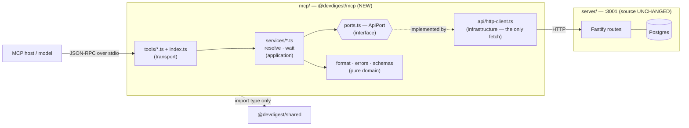

# Development Plan — Local MCP server for DevDigest (`@devdigest/mcp`)

Status: APPROVED · 2026-07-13 · Execution: WP0 (serial) → WP1 ∥ WP2 ∥ WP3 ∥ WP4

## 1. Context

DevDigest's reviewer is only reachable from its own web UI. A coding agent working inside a repo
cannot ask *"what did the reviewer flag on PR 482?"* or *"run the security agent over this PR"*
without a human tabbing to `localhost:3000`. The knowledge lives in the product; the agent is
outside it.

This adds a **fifth top-level package, `mcp/` (`@devdigest/mcp`)** — a local **MCP server over
stdio** exposing five tools to any MCP host (Claude Code, Claude Desktop). It reaches DevDigest
**only over the existing HTTP API** (`http://localhost:3001`): no server-service imports, no
Drizzle, no DB connection, and **no changes to any existing package's source**.

**Done looks like:** with `./scripts/dev.sh` running and one entry in `.mcp.json`, an agent can call
`list_agents` → `run_agent_on_pr` and get a finished verdict + findings back **in one tool call**;
`get_findings` / `get_conventions` for reads; and `get_blast_radius` registers with its real name
and schema but returns an "errors lead onward" message — deliberately left as the homework exercise.

### Decisions already locked (do not re-litigate)

| | Decision |
|---|---|
| Packaging | New `mcp/` package, own `package.json` + lockfile (this is **not** a monorepo) |
| Transport | **stdio only.** No HTTP, no SSE, no auth — the spec recommends stdio for local servers precisely because it needs none |
| Data path | The **existing HTTP API**. No server source changes |
| Identifiers | **Accept both** — `"owner/name"` or uuid; PR number or uuid; agent id or name |
| `get_findings` | `run_id` optional, falling back to the latest completed review for the PR |
| `get_blast_radius` | **True stub** |
| Zod | `mcp` pins `^3.25` (SDK v1 peer dep). **Server stays on `^3.24.1`** — separate lockfiles make this free |

---

## 2. The four design principles (from the slides — acceptance criteria, not advice)

1. **Outcome, not operation.** `run_agent_on_pr` = create + **wait** + collect, in one call.
2. **Flat arguments.** Every argument is a scalar. No nested objects — models (especially
   non-Anthropic ones) make more mistakes on them.
3. **Concise structured response.** `{verdict, findings[]}` with only actionable fields. Never a raw
   dump — one full response can eat tens of thousands of tokens.
4. **Errors lead onward.** Never a bare "404". *"Agent not found — call `list_agents`."* Every error
   names the next tool to call.

Plus three mechanical rules that will otherwise be rediscovered painfully:

- **`registerTool`, not `tool()`** — the latter is `@deprecated` in the SDK.
- **`inputSchema` is a RAW ZOD SHAPE** (`{ repo: z.string() }`), **not** `z.object({...})`. This is
  *the* classic SDK-v1 bug: it produces a broken JSON Schema and fails at *call* time, not at
  registration.
- **stdout belongs to JSON-RPC.** A single `console.log` anywhere in this package corrupts the
  protocol frame. All logging goes to `stderr`.

---

## 3. Two findings from the codebase that shape the design

**Blast radius has no HTTP route — verified.** `container.repoIntel.getBlastRadius()` exists
(`server/src/modules/repo-intel/service.ts:220`, declared `types.ts:147`) and so does the
`BlastRadius` contract (`vendor/shared/contracts/brief.ts`). But `repo-intel/routes.ts` exposes only
`GET /repos/:id/index-state` and `POST /repos/:id/resync`. **A separate package physically cannot
reach the engine** without a new server route — which we are not adding. This is the *reason* the
stub is a stub, and the stub's message says exactly this, turning it into a well-specified exercise.

**A 500-class landmine in agent resolution — verified.** `POST /pulls/:id/review` parses
`RunRequest` where `agentId` is a bare `z.string()` (no uuid check), and `AgentsRepository.getById`
does `eq(t.agents.id, id)` against a **`uuid` column** (`db/schema/agents.ts:9`). Passing an agent
*name* reaches Postgres as `invalid input syntax for type uuid` → a **500, not a clean 404**. The MCP
resolver must therefore **always resolve to a uuid before the POST**. Same for repo/pr:
`IdParams = z.object({ id: z.string().uuid() })`, so a non-uuid path param is a 422.

---

## 4. Architecture — the onion, applied to `mcp/`

An MCP server is a **transport**. But "it's all transport" is the trap: the naive design has the
tool handlers call the HTTP client directly, which collapses four rings into one and reproduces
*exactly* the deviation the onion skill flags as this repo's existing backlog — the 8 `routes-no-db`
errors where `pulls`/`settings`/`workspace` query Drizzle straight from `routes.ts`. We are not
opening a new package with a fresh copy of the repo's known sin.

So `mcp/` gets the same rings the server has, one-to-one:

| Ring (inner→outer) | `mcp/` | server analogue | May import |
|---|---|---|---|
| **Domain** (pure) | `format.ts`, `errors.ts`, `schemas.ts` | `helpers.ts`, `constants.ts` | Zod, pure TS |
| **Ports** | `ports.ts` (`ApiPort` interface) + `@devdigest/shared` **types** | `@devdigest/shared` | Zod |
| **Application** | `services/*.ts`, `resolve.ts`, `wait.ts` | `modules/*/service.ts` | ports + domain; the port, never the impl |
| **Infrastructure** | `api/http-client.ts` (the **only** `fetch`) | `adapters/**`, `repository.ts` | `fetch`, `process.env` |
| **Transport** (outermost) | `index.ts`, `tools/*.ts` | `server.ts`, `app.ts`, `routes.ts` | the MCP SDK; delegates immediately |

**The two invariants this buys:**

1. **A tool handler is thin.** It declares its schema, calls one service method, formats the result.
   All orchestration — resolve → POST → wait → fetch → filter — lives in a **service**, exactly as
   `routes.ts` delegates to `service.ts`. This is also what makes the orchestration unit-testable
   **without the MCP SDK in the loop**.
2. **Depend on interfaces, not implementations.** `ports.ts` declares `ApiPort`; `api/http-client.ts`
   implements it; `index.ts` is the **composition root** (the `Container` analogue) and is the only
   place that `new`s it. Services receive the port. Tests inject a mock object — no `fetch` stubbing,
   no HTTP.



**Every endpoint the four live tools need already exists** (each verified this session):
`GET /health` · `GET /repos` · `GET /repos/:id/pulls` · `GET /agents` · `POST /pulls/:id/review` ·
`GET /pulls/:id/runs` · `GET /pulls/:id/reviews` · `GET /repos/:id/conventions`. There is no auth —
`LocalNoAuthProvider` returns one seeded workspace, so no headers are needed.

**The type-only boundary.** `mcp` borrows `@devdigest/shared` as **types only** (`import type`
through a tsconfig path alias). That's what lets `mcp` pin `zod@^3.25` while the server stays on
`^3.24.1`. A *value* import would load two zod instances and break `instanceof` — §11 has the grep
that guards it. And we do **not** re-`parse` API responses at runtime: the API already validated
them through `fastify-type-provider-zod`. Type them; don't re-parse them.

---

## 5. The five tools — the LOCKED contract

### 5.0 The description strings, and the rule each clause buys

Descriptions are **not documentation** — they are loaded into the host's context at chat start
(every token is rent) and they are how the model **chooses between** tools. They are as load-bearing
as the code, so they are frozen here verbatim. WP1–WP3 copy these strings exactly; they may not
reword them.

```
list_agents
  "List the reviewer agents configured in DevDigest.
   Call this first to get a valid `agent` id for run_agent_on_pr."

run_agent_on_pr
  "Run a DevDigest reviewer agent on a pull request, wait for it to finish,
   and return the verdict and findings. This makes a paid model call — never
   call it twice for the same PR and agent. Get `agent` from list_agents."

get_findings
  "Get the verdict and findings of a completed review on a pull request.
   Defaults to the latest completed review. Read-only — it never starts a
   review and costs nothing."

get_conventions
  "Get the house-style coding conventions DevDigest extracted from a
   repository, each with the file and snippet it was grounded in. Read-only."

get_blast_radius
  "Which symbols a pull request changes and what downstream code calls them.
   NOT IMPLEMENTED YET — calling it returns instructions, not data."
```

Rules referenced below: the four from the slides — **P1** outcome-not-operation · **P2** flat
arguments · **P3** concise structured response · **P4** errors lead onward — plus four from the
research: **R1** definitions cost context at chat start · **R2** the description is the tool-selection
signal · **R3** annotations/cost must be honest · **R4** errors must be actionable, not opaque.

| Clause | Rule | Why it's there |
|---|---|---|
| `"…wait for it to finish, and return the verdict and findings"` | **P1** | The description *states the three steps*. Without it the model assumes MCP tools are thin RPC, starts the run, then hunts for a polling tool that does not exist. This sentence is what makes outcome-not-operation legible. |
| `"This makes a paid model call — never call it twice for the same PR and agent."` | **R3** | The most expensive mistake this server can cause. `idempotentHint: false` says it in metadata; this says it in language the model actually reads. Belt and braces, because the failure mode is a **double charge**. |
| `"Get \`agent\` from list_agents."` | **P4** | Errors-lead-onward, pre-emptively — the pointer is in the description, not only in the failure. |
| `"Call this first to get a valid \`agent\` id for run_agent_on_pr."` | **P4, R2** | Makes `list_agents` the anchor of the recovery graph: every "not found" error in §7 points back here, and this confirms it is the right destination. |
| `"Read-only — it never starts a review and costs nothing."` | **R2, R3** | **The disambiguator.** `get_findings` and `run_agent_on_pr` both "get findings for a PR". Without an explicit cost contrast, a model that only wants to *read* a review may reach for the tool that *runs* one. This clause exists to lose that coin-flip on purpose. |
| `"Defaults to the latest completed review."` | **R2** | Tells the model it may omit `run_id` — otherwise it invents one or refuses. |
| `"…each with the file and snippet it was grounded in."` | **P3, R2** | Signals the conventions are evidence-backed, so the model cites them instead of restating them as its own opinion. |
| `"NOT IMPLEMENTED YET — calling it returns instructions, not data."` | **P4, R4** | Errors-lead-onward starts **at the schema**. An honest description avoids the wasted call entirely, which beats failing gracefully. |

**The argument descriptions are part of the same budget** — they ride in the JSON Schema and load at
chat start exactly like the tool descriptions. They are also where **P2** is enforced: each is one
scalar, and the "or a uuid" clause is what makes "accept both" legible rather than a guessing game.
The concrete examples are deliberate — they cost less than a failed call plus a retry.

**Token budget:** five tools ≈ **700–900 tokens** of definitions all-in — `SQLite`/`Gmail` MCP
territory, and ~2% of what the GitHub MCP server costs. Definition bloat was never the risk here;
**response** bloat is, which is why `system_prompt` is stripped (§5.1), `evidence_snippet` is
truncated to 200 chars (§5.4), and every list carries a `limit` plus an explicit "N more available"
hint (§5.6).

**Two tensions, named rather than hidden:**

- **`run_agent_on_pr`'s description is the longest (~40 words vs ~20).** Deliberate: it is the only
  tool that spends money and the only one whose misuse is irreversible, so it buys ~20 extra tokens
  of context rent with a guardrail against a double charge. A trade, and worth it.
- **`get_blast_radius` costs ~30 tokens of context for zero capability.** A tool that announces its
  own uselessness is, strictly, negative value in the window. Registering it is still right — the
  frozen contract *is* the deliverable, and it is what makes the homework a one-function change
  rather than a design exercise. If we'd rather not pay the rent until it works, not registering it
  at all is the defensible alternative and the server shrinks to four tools.

### Shared argument fragments (`src/schemas.ts`)

```ts
export const repoArg = z.string().min(1)
  .describe('Repository as "owner/name" (e.g. "acme/payments-api") or a repo uuid.');
export const prArg = z.union([z.number().int().positive(), z.string().min(1)])
  .describe('Pull request number (e.g. 482) or a PR uuid.');
export const agentArg = z.string().min(1)
  .describe('Agent id from list_agents. An agent name also works (case-insensitive).');

// get_findings only:
//   run_id → 'A specific run (from run_agent_on_pr). Omit for the latest completed review.'
//   detail → 'concise = severity/title/file/line. full = adds rationale and suggestion.'
```

`prArg` is a union of two **scalars** — still one flat argument, resolved by shape in code. Not a
nested schema.

### 5.1 `list_agents`

```ts
inputSchema: {}                                    // zero arguments
annotations: { readOnlyHint: true, openWorldHint: true }
description: 'List the reviewer agents configured in DevDigest. Call this first to get a valid `agent` id for run_agent_on_pr.'
```

Via `CatalogService.listAgents()` → `GET /agents`. **Strips `system_prompt`** — multi-KB, the single
biggest response-bloat source in the whole surface — plus `output_schema`, `version`, `strategy`,
`ci_fail_on`, `repo_intel`, `provider`. Keeps `id`, `name`, `description`, `model`, `enabled`. No
`limit`, no `detail`: a workspace has a handful of agents, so the enum would cost schema tokens on
every listing and buy nothing.

*Empty →* `"No reviewer agents are configured. Seed them with `cd server && pnpm db:seed`, or create one in the DevDigest UI (Agents → New), then call list_agents again."`

### 5.2 `run_agent_on_pr` — the single WRITE tool

```ts
inputSchema: { repo: repoArg, pr: prArg, agent: agentArg }
annotations: { readOnlyHint: false, destructiveHint: false, idempotentHint: false, openWorldHint: true }
description: 'Run a DevDigest reviewer agent on a pull request, wait for it to finish, and return the verdict and findings. This makes a paid model call — never call it twice for the same PR and agent. Get `agent` from list_agents.'
```

Output: `{status, run_id, agent, verdict, score, summary, findings[], total_findings, cost_usd, next}`.

**The annotations are load-bearing.** `idempotentHint: false` is the honest signal — a host that
believed this tool idempotent would retry it and **charge the user twice**
(`server/INSIGHTS.md`: *"check-then-act on a billable job is a recurring bill"*).

**`ReviewService.runOnPr()` owns the whole flow:** resolve `repo`→repoId, `pr`→prId,
`agent`→**agentId uuid** → `POST /pulls/:id/review {agentId}` → take `runs[0].run_id` → `waitForRun`
→ `GET /pulls/:id/reviews`, filter `kind === 'review' && run_id === runId`. The tool handler calls
this one method and formats the result.

> ⚠️ `POST /pulls/:id/review` is **fire-and-forget**: `ReviewRunResponse.reviews` is **always `[]`**
> (the executor runs un-awaited). Reading findings from the POST response is the obvious bug here,
> and it fails *silently* with an empty review. Findings come **only** from `GET /pulls/:id/reviews`
> after the run leaves `running`.

### 5.3 `get_findings`

```ts
inputSchema: {
  repo: repoArg,
  pr: prArg,
  run_id: z.string().uuid().optional().describe('A specific run (from run_agent_on_pr). Omit for the latest completed review.'),
  detail: z.enum(['concise','full']).default('concise').describe('concise = severity/title/file/line. full = adds rationale and suggestion.'),
  limit: z.number().int().min(1).max(50).default(20),
}
annotations: { readOnlyHint: true, openWorldHint: true }
```

Via `ReviewService.getFindings()` → `GET /pulls/:id/reviews` (already newest-first). **`detail` lives
here and nowhere else**: `Finding.rationale` and `suggestion` are markdown blobs — the only unbounded
fields in the surface — so this is the only place the enum's schema-token cost is earned. `run_id` is
optional *because* a run_id-only lookup would need a new server endpoint; taking `repo`+`pr` keeps it
composable from what exists.

*No review →* `"PR #482 in acme/payments-api has no completed review yet. Call run_agent_on_pr (repo, pr, agent) to run one — pick an agent with list_agents."`
*Truncated →* `"Showing 20 of 47 findings. Call get_findings again with limit=47 for the rest."`

### 5.4 `get_conventions`

```ts
inputSchema: { repo: repoArg, accepted_only: z.boolean().default(false), limit: z.number().int().min(1).max(50).default(20) }
annotations: { readOnlyHint: true, openWorldHint: true }
```

Via `CatalogService.getConventions()` → `GET /repos/:id/conventions`. Strips `id` and `evidence_sha`;
**truncates `evidence_snippet` to 200 chars** (raw file blob). **Read-only on purpose** — extraction
(`POST /repos/:id/conventions/extract`) is a paid model call and is *not* exposed. One write tool,
and one only.

### 5.5 `get_blast_radius` — TRUE STUB

```ts
inputSchema: { repo: repoArg, pr: prArg }   // the REAL schema — frozen now, unchanged when wired
annotations: { readOnlyHint: true, openWorldHint: true }
description: 'Which symbols a pull request changes and what downstream code calls them. NOT IMPLEMENTED YET — calling it returns instructions, not data.'
handler: async () => ({ isError: true, content: [{ type: 'text', text: NOT_IMPLEMENTED_BLAST }] })
```

**No `outputSchema`** — declaring one would force a `structuredContent` the handler cannot produce.
The *input* contract is the part that must stay stable, and it does. **No service, no port** — it
makes no call. `isError: true` is correct *here* (unlike the run timeout): there's no spend to
protect and no retry that could cost money.

The message names the exercise precisely: the engine exists (`repoIntel.getBlastRadius`,
`service.ts:220`) and so does the contract (`contracts/brief.ts`) — **what's missing is an HTTP
route**. To finish it: (1) add a route in `server`, (2) add `getBlastRadius()` to `ApiPort` +
`http-client.ts`, (3) add a service method and swap this handler's body. Name, description and input
schema do not change. Meanwhile: *"call `get_findings` for what the reviewer already flagged."*

### 5.6 Response projections & the token rule

```ts
export const ConciseFinding = z.object({
  severity: z.enum(['CRITICAL','WARNING','SUGGESTION']),
  category: z.string(), title: z.string(), file: z.string(),
  lines: z.string(),                 // "42" or "42-58" — one field instead of two
});
export const FullFinding = ConciseFinding.extend({
  confidence: z.number(), rationale: z.string(), suggestion: z.string().nullable(),
});
```

Dropped from `FindingRecord`: `id`, `review_id`, `accepted_at`, `dismissed_at`, `kind`,
`trifecta_components`, `evidence`, and `start_line`/`end_line` (folded into `lines`).

**The `content` + `structuredContent` rule.** Every tool with an `outputSchema` returns
`structuredContent` **plus one `content` text block that is a concise markdown summary — never
`JSON.stringify` of the same payload.** The spec says a structured tool SHOULD also emit text;
emitting the JSON twice **doubles the token cost for zero gain**.

---

## 6. The wait: POLL, not SSE

`ReviewService.runOnPr` blocks via `waitForRun()`, polling `GET /pulls/:id/runs` until the target
`run_id` leaves `status: 'running'`.

| | Poll `GET /pulls/:id/runs` | SSE `GET /runs/:id/events` |
|---|---|---|
| Terminal state | **Explicit** — `status ∈ running\|done\|failed\|cancelled` | Implicit — a *log line*; you must infer completion |
| Source of truth | The **DB row** | An **in-memory** bus, per-process |
| API restarts mid-run | Row reaped to `failed` on boot; the poller sees it | Stream dies silently; the client hangs |
| Deps | none | an SSE parser |

**Decision: poll.** An MCP call has no streaming UX — the host sees one result — so SSE's only
advantage (latency) buys nothing, while its downsides are all real for a separate process.

Knobs (env-overridable): first delay 1500ms · interval 2000ms (`DEVDIGEST_MCP_POLL_MS`) · timeout
180000ms (`DEVDIGEST_MCP_RUN_TIMEOUT_MS`). `waitForRun` takes `sleep` as an **injected argument** so
tests don't actually wait three minutes.

**On timeout — the money rule.** The run is **NOT cancelled** (the model call is already in flight
and already billed; cancelling burns the spend and returns nothing). Return **`isError: false`**,
`status: 'running'`:

> Review `<run_id>` is still running after 180s. It has **not** been cancelled and the model call is
> already paid for. **Do NOT call `run_agent_on_pr` again — that starts a second billable review.**
> Wait a minute, then call `get_findings(repo:"…", pr:482, run_id:"<run_id>")`.

`isError: false` is deliberate: an error result invites a retry, and a retry here is a second bill.

---

## 7. Identifier resolution (`src/resolve.ts` — application ring, over `ApiPort`)

| Arg | Shape test | Resolution |
|---|---|---|
| `repo` | uuid → as-is; else `owner/name` | `GET /repos` → match `full_name` (case-insensitive) |
| `pr` | number / all-digits → PR number; uuid → PR id | `GET /repos/:id/pulls` → match `number` or `id` |
| `agent` | uuid → as-is **but still verify**; else match `name` case-insensitively | `GET /agents` |

**A non-uuid `agentId` must never be forwarded to the API** (§3 — it 500s).

**`GET /repos/:id/pulls` is heavyweight** — it syncs from GitHub *and* enqueues a **billable intent
job** for any PR with no `pr_intent` row. So the **HTTP adapter** (not the service) carries a **60s
in-process TTL cache** on `listRepos`/`listPulls`: one tool call resolves the PR **once**, not once
per step. Caching is an infrastructure concern; the service stays pure orchestration.

**Error catalogue** (all "errors lead onward" — every string names a next tool or command):

| Case | Message |
|---|---|
| API down | `The DevDigest API is not running at http://localhost:3001. Start it with ./scripts/dev.sh from the repo root, then retry.` |
| repo not found | `Repository "acme/x" is not imported into DevDigest. Imported repos: … Import it in the UI (Repos → Add), then retry.` |
| PR not found | `Pull request 999 was not found in acme/payments-api. Open PRs: #482, #479, #471. Check the number, or refresh the repo in the UI.` |
| PR not synced | `PR #482 has not been synced into DevDigest yet (no local id). Open the repo in the UI once to sync it, then retry.` (`PrMeta.id` is `nullish`) |
| agent not found | `Agent "secuirty" not found — call list_agents to see the available agents.` |
| rate limited (429) | `Reviews are rate-limited to 10/minute. Wait a minute and retry — or call get_findings to read a review you already paid for.` |

---

## 8. Package scaffold

`e2e/` is the template for a non-server package (`private`, `type: module`, tsx, own tsconfig, own
`CLAUDE.md`/`INSIGHTS.md`/`docs/`/`specs/`). **npm + `package-lock.json`**, matching `e2e` and
`reviewer-core` (only `server`/`client` use pnpm).

```
mcp/
├── package.json · package-lock.json · tsconfig.json · vitest.config.ts
├── .dependency-cruiser.cjs          # the onion ruleset, mcp's rings (see §11)
├── AGENTS.md · CLAUDE.md (symlink) · INSIGHTS.md · README.md
├── docs/design.md · specs/tools.md
└── src/
    ├── index.ts                     # TRANSPORT — stdio + composition root (the only `new`)
    ├── tools/                       # TRANSPORT — thin: schema, one service call, format
    │   └── {list-agents,run-agent-on-pr,get-findings,get-conventions,blast-radius}.ts
    ├── services/                    # APPLICATION — all orchestration
    │   ├── review.service.ts        #   runOnPr() · getFindings()
    │   └── catalog.service.ts       #   listAgents() · getConventions()
    ├── resolve.ts · wait.ts         # APPLICATION — over ApiPort
    ├── ports.ts                     # PORTS — the ApiPort interface
    ├── types.ts                     # PORTS — the ONLY `import type` from @devdigest/shared
    ├── api/http-client.ts           # INFRA — the ONLY fetch(); TTL cache lives here
    ├── config.ts                    # INFRA — zod-validated env
    └── schemas.ts · format.ts · errors.ts   # DOMAIN — pure, no I/O
```

Deps: `@modelcontextprotocol/sdk@^1.29.0`, `zod@^3.25`. Dev: `tsx`, `typescript`, `@types/node`,
`vitest`, `dependency-cruiser`. `tsconfig` adds one path:
`"@devdigest/shared": ["../server/src/vendor/shared/index.ts"]`.

---

## 9. Changes OUTSIDE `mcp/` — the repo-level integration

No existing package's **source** changes. But a fifth package is not free: five repo-level files
know how many packages there are.

| File | Change | Why |
|---|---|---|
| **`.mcp.json`** (root, **new**) | Register the server: `{"mcpServers":{"devdigest":{"command":"npx","args":["-y","tsx","mcp/src/index.ts"],"env":{"DEVDIGEST_API_URL":"http://localhost:3001"}}}}` | This is how the feature is actually *used*. Checked in, so every contributor gets it. |
| **`AGENTS.md`** (root; `CLAUDE.md` is a symlink to it) | Add `mcp` to the **Stack** table, to the *"Module conventions live in the module's own CLAUDE.md"* list, and to the **Session Protocol** module list | It's the map loaded every session. A package it doesn't name is a package agents won't find. Keep it **≤100 lines** — this is ~3 lines, not a section. |
| **`README.md`** | Add the `mcp/` row to the package table (currently 4 rows, lines 14–17), a node to the architecture diagram, a docs link (line 63), and the CI row (line 145) | It's the architecture SoT. |
| **`TESTING.md`** | *"DevDigest is four independent packages"* → **five**; add an `mcp` row to the **Suite map**; add a short "what it covers" paragraph | It states the count explicitly and maps every suite to a workflow. |
| **`.github/workflows/mcp.yml`** (**new**) | typecheck + vitest, npm, `cache-dependency-path: mcp/package-lock.json`. Path filter: **`mcp/**` AND `server/src/vendor/shared/**`** | Model it on `reviewer-core.yml` — which carries that same second filter, and says why in its line-5 comment: it type-checks against the vendored contracts. `mcp` does exactly the same, so a shared-contract edit must trigger its typecheck. |

**And one file that does *not* change:** `.gitignore`. Line 1 is `node_modules/` with no leading
slash, which git matches at **any** depth — so `mcp/node_modules` is already ignored. (An earlier
draft of this plan added a redundant entry. It doesn't need one.)

`scripts/dev.sh` also stays untouched: the MCP server is spawned by the *host* (Claude Code), not by
the dev stack.

---

## 10. Work packages (disjoint file ownership)

```
WP0 (serial — scaffold, ports, http-client, resolve, domain layer, 5 placeholders)
        ↓
{ WP1 ∥ WP2 ∥ WP3 ∥ WP4 }
        ↓
manual smoke → /engineering-insights → mcp/INSIGHTS.md
```

**WP0 — scaffold + the inner rings (SERIAL, blocks the rest).** Owns `package.json`, `tsconfig`,
`vitest.config`, `.dependency-cruiser.cjs`, the four `.md` files, and `src/{index,config,types,ports,
schemas,errors,format,resolve}.ts` + `src/api/http-client.ts`. Also lands **five compiling
placeholder tool files** registering the LOCKED name/description/inputSchema with a
not-yet-implemented handler — so `index.ts` type-checks the moment WP0 lands and WP1–WP3 own their
files outright with zero contention. Tests: `resolve.test.ts` (a non-uuid agent name is never
forwarded), `errors.test.ts` (every message matches
`/list_agents|get_findings|run_agent_on_pr|get_conventions|dev\.sh|DevDigest UI/`), `format.test.ts`
(the text block is **not** `JSON.stringify` — assert it contains no `{"`), `http-client.test.ts` (the
TTL cache issues **one** fetch for two calls).

**WP1 — `catalog.service.ts` + `list_agents` + `get_conventions`.** Owns those three + tests. Must
strip `system_prompt`; must never issue a POST (in particular, never `POST /conventions/extract` — a
paid call).

**WP2 — `review.service.ts` + `wait.ts` + `run_agent_on_pr` + `get_findings`.** Owns those four +
tests. The `kind === 'review'` filter is not optional (`ReviewRecord.kind` is `'summary' | 'review'`)
— and the fixture **must seed a `'summary'` row**, or deleting the filter leaves the suite green.
Assert `startReview` is called **exactly once** per invocation; assert the timeout path is
`isError: false` and issues no cancel. Services are tested against a **mock `ApiPort` object** — no
`fetch` stubbing, no MCP SDK.

**WP3 — `get_blast_radius` stub + `mcp/docs/design.md` + `mcp/specs/tools.md`.** The temptation here
is to add the missing server route — **don't**. Its regression test asserts the registered
`inputSchema` keys are exactly `['repo','pr']` (contract stability).

**WP4 — repo integration (§9).** Owns root `.mcp.json`, `AGENTS.md`, `README.md`, `TESTING.md`,
`.github/workflows/mcp.yml`. Touches **no** `mcp/src` file, so it is fully parallel-safe. It is the
only WP allowed to edit a file outside `mcp/`, and it may not touch `server/`, `client/`,
`reviewer-core/`, or `e2e/` source.

---

## 11. Verification

**Static (every WP):**
```bash
cd mcp && npx tsc --noEmit -p tsconfig.json && npx vitest run

# the onion, mechanically — the ruleset forbids the inward-rule violations:
#   tools/** → api/**          (transport reaching infra, skipping the service)
#   services/** → api/**       (application depending on the impl, not the port)
#   {format,errors,schemas}.ts → anything with I/O   (domain purity)
cd mcp && npx depcruise --config .dependency-cruiser.cjs src

grep -rE "from '(drizzle-orm|postgres)'|server/src/(modules|db|adapters|platform)" mcp/src  # empty
grep -rn "console\.log" mcp/src                                                             # empty
grep -rn "@devdigest/shared" mcp/src        # ONLY src/types.ts, on an `import type` line
grep -rn "fetch(" mcp/src                   # ONLY src/api/http-client.ts
cd server && npx tsc --noEmit               # proves the type-only alias dragged nothing in
```

Note the depcruise ruleset is a **new file scoped to `mcp`'s rings**, not the server's — the skill's
shipped ruleset encodes `routes/service/repository`, which are not `mcp`'s folder names. And per
`server/INSIGHTS.md`: *"a dependency-cruiser baseline is an alibi, not evidence"* — it reasons at
module-edge granularity. It is a floor, not the review.

**Protocol smoke (no DevDigest running):**
```bash
cd mcp && npx @modelcontextprotocol/inspector npx tsx src/index.ts
# tools/list → exactly 5 tools, LOCKED names, flat schemas
# get_blast_radius → the not-implemented message
# list_agents with the API down → "start it with ./scripts/dev.sh"
```

**End-to-end.** `./scripts/dev.sh`, then (with the root `.mcp.json` from WP4 in place) in a Claude
Code session: `list_agents` (no `system_prompt` in the output) → `get_conventions` →
`run_agent_on_pr` (**blocks**, returns `{verdict, findings}`; cross-check the run in the UI — one run
row, one review, matching cost) → `get_findings detail="full"` → `get_blast_radius` (the message) →
negative paths (bad agent → *"call list_agents"*; bad PR number → *"Open PRs: …"*; API stopped →
*"./scripts/dev.sh"*).

> **The `run_agent_on_pr` step costs real money** — a live model call. Run it once, on the seeded
> demo repo.

---

## 12. Risks

- **`inputSchema` wrapped in `z.object({...})`** produces a broken JSON Schema that fails at *call*
  time, not registration. Caught by the inspector smoke.
- **A value import from `@devdigest/shared`** would load two zod instances (3.24 + 3.25) and break
  `instanceof`. The §11 grep is the guard.
- **`PrMeta.id` is `nullish`** — a PR listed from GitHub but not yet persisted has no local uuid and
  cannot be reviewed. Message, not crash.
- **The billable-job trap** (`server/INSIGHTS.md`): one `POST /review` per invocation, no retry loop,
  no cancel-and-restart, and `GET /repos/:id/pulls` called once (it enqueues a billable intent job) —
  hence the TTL cache in the adapter.

## 13. Judgment calls (say the word and I'll flip any of them)

- **npm, not pnpm, inside `mcp/`** — following the `e2e` template you pointed me at.
- **Timeout = 180s.** A single-pass review on a mid-size PR lands well inside it; a map-reduce
  strategy on a large diff may not. The timeout path is safe (points at `get_findings`, doesn't
  cancel, doesn't re-bill), so this is a UX knob, not a correctness one — and it's env-overridable.
- **`detail` on `get_findings` only** — the other tools' payloads are bounded scalars, so the enum
  would cost schema tokens and save none.
- **Two services, not five.** `catalog` (agents + conventions) and `review` (run + findings) split
  cleanly along the WP boundary and along the read/write boundary. One service per tool would be
  ceremony; one service for all four would be a god-object.
