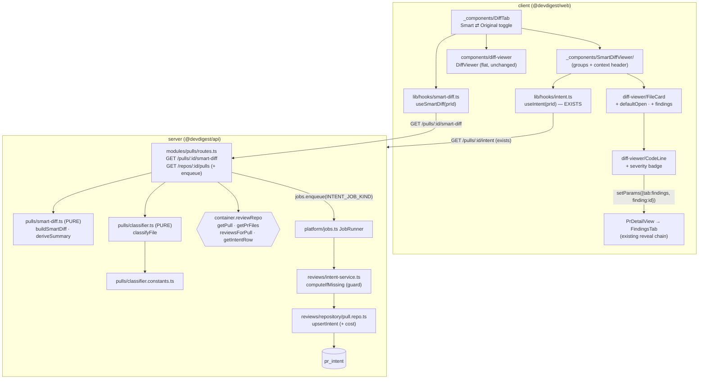

# Development Plan — Smart Diff (L03) + Intent auto-fill
Status: DRAFT · Plan ID: 2026-07-13-smart-diff · Author: planner agent

## 1. Context & goal

"Files changed" today renders `pr.files` in GitHub's order, so a lock-file churn sits between
two business-logic files (`DiffTab.tsx` → `DiffViewer` → `FileCard` per file, in array order).
**Smart Diff** regroups the *same* diff by role — **core → wiring → boilerplate** — collapses
the boilerplate group, and puts a **severity badge** on every line the AI reviewer flagged;
clicking the badge jumps to that finding on the Findings tab.

Smart Diff introduces **NO LLM call**. It deterministically composes data we already have:
`pr_files` (written by `GET /pulls/:id`, `pulls/routes.ts:265-276`) and the findings of the
**latest** review (`reviews` + `findings`, newest-first via `ReviewRepository.reviewsForPull`).
The `SmartDiff` Zod contract is **already scaffolded** at
`server/src/vendor/shared/contracts/brief.ts:95-128` and exported as `SmartDiffResponse` at
`server/src/vendor/shared/contracts/review-api.ts:93`. **Nothing implements it. Do not change it.**

Separately: **Intent auto-fill.** Intent today only exists when a human clicks the recompute
button (`useComputeIntent`, `client/src/lib/hooks/intent.ts:31-36`). We auto-fill it — as a
background **job**, enqueued from the PR-list read, **for PRs that have no `pr_intent` row at
all**. A stored intent is then a free DB read (PK = `pr_id`), which is what lets the Smart Diff
screen show an intent context header **without a model call**.

**Done looks like:** open a PR → *Files changed* → files are grouped core / wiring /
boilerplate, boilerplate is collapsed, the intent sentence + risk chips sit above the groups,
a CRITICAL badge sits on the flagged line, and clicking it lands on that finding **expanded and
scrolled into view, with no page reload**. And: opening the PR list on a repo whose PRs have no
intent quietly fills them in.

## 2. Non-goals

- **No LLM call in Smart Diff.** `pseudocode_summary` is derived from the patch by a pure
  function. The smart-diff route **MUST NOT** call `container.llm()`.
- **No change to the `SmartDiff` / `SmartDiffResponse` contract.** It is already correct.
- **No persistence of the smart diff.** It is computed per request. The `pr_brief` table stays
  unused (it is scaffolding for a later lesson — see root `CLAUDE.md`).
- **No new module.** Smart Diff extends `modules/pulls`; the intent job extends `modules/reviews`.
  `modules/index.ts` and `platform/container.ts` are **not touched by anybody**.
- **No "skip if fresh" on the button.** `POST /pulls/:id/intent` keeps its unconditional
  recompute — that is what the button is for. The freshness guard is for the *job*.
- **No stale-intent auto-recompute.** Stale keeps today's behaviour: stale badge + manual button.
- **No fuzzy-matching of intent prose to file paths.** `in_scope`/`out_of_scope` are prose
  (`brief.ts:9-28`), not paths.
- **No per-file "What this does" from the intent model.** It never sees hunk bodies
  (`renderHeadersOnly`; system prompt at `server/src/modules/reviews/intent-service.ts:57`:
  *"You deliberately do NOT get the diff bodies"*).

### Reversal of a prior non-goal — recorded deliberately

`docs/plans/2026-07-12-intent-layer.md` §2 lists **"No auto-compute"** as an explicit non-goal:
*"A review injects an intent if one is present but NEVER silently computes one."* **This plan
reverses that**, narrowly and on purpose:

- The reversal is scoped to **MISSING** intents only (no `pr_intent` row). A **stale** intent is
  still never silently recomputed.
- It does **not** happen inside a review run — the review path is untouched. It happens as a
  **background job** enqueued from the PR-list read, capped per request.
- The rationale: Smart Diff's context header, and the reviewer prompt injection built in the
  Intent Layer, are both worthless on the ~100% of PRs nobody ever clicked the button on. The
  original non-goal existed to stop a *review* from silently paying for a model call inside the
  user's latency budget; a capped background job does not.
- The cost is now **visible**: WP2 persists `tokens_in` / `tokens_out` / `cost_usd` per intent
  (`classify()` currently discards them — `intent-service.ts:243-264`) and logs it on the job
  logger. That receipt is the price of the reversal.

This is a **recorded reversal, not drift.**

## 3. Architecture impact

| Package | Onion layers touched | New vs extended |
|---|---|---|
| `server` | HTTP (`pulls/routes.ts`) · domain/pure (`pulls/classifier*.ts`, `pulls/smart-diff.ts`) · application (`reviews/intent-service.ts`) · infra (`reviews/repository/pull.repo.ts`) | **Extended** — `modules/pulls` + `modules/reviews`. **No new module.** |
| `client` | hooks · shared component (`components/diff-viewer`) · route-scoped features · i18n | Extended + one new `SmartDiffViewer/` folder |
| `reviewer-core` | — | **untouched** |
| DB | `pr_intent` + 3 nullable columns (**already landed — WP0 is DONE**) | additive |



## 4. Contract changes — SHARED / LOCKED

**None for Smart Diff.** `SmartDiff` / `SmartDiffResponse` are already correct and are **LOCKED
for every WP**:

- `server/src/vendor/shared/contracts/brief.ts:95-128` — `SmartDiffRole`, `SmartDiffFile`,
  `SmartDiffGroup`, `ProposedSplit`, `SmartDiff`.
- `server/src/vendor/shared/contracts/review-api.ts:93-94` — `SmartDiffResponse = SmartDiff`.
- Both are byte-identical in `client/src/vendor/shared/contracts/` (verified this run), and
  `SmartDiff` is already re-exported to the client app at `client/src/lib/types.ts:35`.

The exact locked shape (verbatim, `brief.ts:95-128`):

```ts
export const SmartDiffRole = z.enum(['core', 'wiring', 'boilerplate']);
export const SmartDiffFile = z.object({
  path: z.string(),
  pseudocode_summary: z.string().nullish(),
  additions: z.number().int(),
  deletions: z.number().int(),
  finding_lines: z.array(z.number().int()),
});
export const SmartDiffGroup = z.object({ role: SmartDiffRole, files: z.array(SmartDiffFile) });
export const ProposedSplit = z.object({ name: z.string(), files: z.array(z.string()) });
export const SmartDiff = z.object({
  groups: z.array(SmartDiffGroup),
  split_suggestion: z.object({
    too_big: z.boolean(),
    total_lines: z.number().int(),
    proposed_splits: z.array(ProposedSplit),
  }),
});
```

> ### ⚠️ CORRECTION — the intent context header CANNOT ride the smart-diff response
>
> The approved design tells WP1's route to *"also read the stored `pr_intent` row for the
> context header"*. **`SmartDiff` has no field to carry it** (`groups` + `split_suggestion`,
> nothing else) and Decision 4 forbids changing the contract. Returning it would require
> either a contract change (forbidden) or a field the serializer would strip
> (`fastify-type-provider-zod` serializes through the response schema — the extra key is
> silently dropped, which is a silent-bug factory).
>
> **Resolution (minimal, no redesign, no contract change):** the context header is composed
> **on the client** from the **already-shipped** `useIntent(prId)` hook
> (`client/src/lib/hooks/intent.ts:14-21` → `GET /pulls/:id/intent` → `PrIntentRecord | null`,
> which already carries `intent`, `risk_areas`, `is_stale`). WP3 renders it above the groups.
> **WP1's smart-diff handler therefore does NOT read `pr_intent` at all.** Every other part of
> the design (no model call, no persistence, free DB read of a stored intent) is preserved —
> the read just happens through the endpoint that already exists.

## 5. Database changes — SHARED / LOCKED — **WP0 IS ALREADY DONE**

> **STATUS: LANDED. WP1–WP3 must treat every path below as already in the tree and LOCKED —
> read it, do not edit it. If a column or field is missing, STOP and report; do not add it.**

Landed by the orchestrator as WP0:

- `server/src/db/schema/reviews.ts:86-94` — `pr_intent` gained three **nullable** columns
  (existing rows have no receipt), typed to mirror `agent_runs` exactly:
  `tokensIn: integer('tokens_in')` · `tokensOut: integer('tokens_out')` · `costUsd: real('cost_usd')`.
- `server/src/db/migrations/0014_lame_sunset_bain.sql` — three `ALTER TABLE "pr_intent" ADD
  COLUMN` statements, **generated via `pnpm db:generate` (drizzle-kit)**, with its
  `meta/0014_snapshot.json` + `_journal.json` entry. **No existing migration was edited.**
  Re-running `pnpm db:generate` reports *"No schema changes"*.
- `server/src/vendor/shared/contracts/review-api.ts:83-85` — `PrIntentRecord` gained
  `tokens_in: z.number().int().nullish()`, `tokens_out: z.number().int().nullish()`,
  `cost_usd: z.number().nullish()`. **Byte-identical in `client/src/vendor/shared/contracts/
  review-api.ts` (verified with `diff` this run).**
- `server/src/db/rows.ts:20` already exports `PrIntentRow = typeof t.prIntent.$inferSelect` —
  it picks the new columns up automatically. No edit needed.

**Note the path correction:** migrations live at **`server/src/db/migrations/`** (see
`server/drizzle.config.ts` → `out: './src/db/migrations'`). There is **no `server/drizzle/`
directory** — the approved design's `server/drizzle/**` glob does not exist.

**No index is added.** `pr_intent` is keyed by `pr_id` (PK) and is read only by that key (or by
`IN (prIds)` in WP1's enqueue check, which uses the PK's B-tree).

## 6. Resolved mechanical questions (read this before starting any WP)

### (a) `INDEX_JOB_KIND` — where it is declared, and how its handler is registered

| Fact | Location |
|---|---|
| Constant declared | `server/src/modules/repo-intel/constants.ts:7` — `export const INDEX_JOB_KIND = 'repo-intel-index';` |
| Handler registered | `server/src/modules/repo-intel/service.ts:172-182` — `registerIndexJobHandlers()` calls `this.container.jobs.register(INDEX_JOB_KIND, async (payload) => …)` at `:173` |
| Registration **called** | `server/src/modules/repo-intel/routes.ts:29-30` — the Fastify plugin constructs `new RepoIntelService(container)` and calls `service.registerIndexJobHandlers()` once at plugin load |
| Enqueued from another module | `server/src/modules/repos/service.ts:65-78` — `await this.container.jobs.enqueue(workspaceId, INDEX_JOB_KIND, { repoId, owner, name })` at `:68`, **wrapped in try/catch** (`:67-77`) |
| Cross-module import of the constant | `server/src/modules/repos/service.ts:11-14` — `import { INDEX_JOB_KIND, REFRESH_JOB_KIND } from '../repo-intel/constants.js';` |

> **CORRECTION to the approved design.** It says *"`server/src/modules` has ZERO module→module
> imports and that must stay true."* **That is factually false today** — `repos/service.ts:11-14`
> imports a constant from `repo-intel/constants.ts`. A **constants-only** cross-module import is
> the **established precedent**. (Importing another module's *service* or *repository* is what is
> actually forbidden — that is what `container.reviewRepo` / `container.repoIntel` exist for; see
> `platform/container.ts:70-72`.)

**Therefore:**

- **WP2** declares `export const INTENT_JOB_KIND = 'pr-intent';` in the **existing**
  `server/src/modules/reviews/constants.ts` (12 lines today), and adds
  `IntentService.registerIntentJobHandler()` (mirroring `registerIndexJobHandlers`), invoked from
  `server/src/modules/reviews/routes.ts` immediately after
  `const intentService = new IntentService(container);` (`reviews/routes.ts:36`).
- **WP1** writes, in `server/src/modules/pulls/routes.ts`:
  `import { INTENT_JOB_KIND } from '../reviews/constants.js';`
  — constant only. **No import of `IntentService`, `ReviewRepository`, or anything else under
  `modules/reviews/`.** This mirrors `repos → repo-intel` exactly.
- **No new module.** `server/src/modules/index.ts` is **not touched**.
- **No new adapter.** `server/src/platform/container.ts` is **not touched**.

### (b) Does `container.reviewRepo` expose what WP1 needs? — **YES, all of it. No new accessor.**

`container.reviewRepo` is a `ReviewRepository` constructed at the composition root
(`platform/container.ts:99-101`), and its docblock says exactly why (`container.ts:70-72`):
*"Constructed here, in the composition root, so consuming modules use `container.reviewRepo`
instead of reaching into another module's folder."* WP1 uses:

| Need | Method | Path |
|---|---|---|
| Workspace-scoped PR row | `getPull(workspaceId, prId): Promise<PullRow \| undefined>` | `modules/reviews/repository.ts:30` → `repository/pull.repo.ts:9-19` |
| The PR's files + patches | `getPrFiles(prId)` | `repository.ts:38` → `pull.repo.ts:29-34` |
| Reviews **newest-first**, each with its findings | `reviewsForPull(prId): Promise<{ review: ReviewRow; findings: FindingRow[] }[]>` | `repository.ts:63` → `repository/review.repo.ts:58-74` |
| The stored intent row (WP2 only) | `getIntentRow(prId): Promise<PrIntentRow \| undefined>` | `repository.ts:149` → `pull.repo.ts:109-112` |
| Upsert the intent (WP2 only) | `upsertIntent(prId, intent, provenance)` | `repository.ts:136-142` → `pull.repo.ts:76-106` |

**Two behaviours WP1 must handle in the route (they are not bugs — do not "fix" the repo):**

1. `reviewsForPull` does **not** filter by `kind` (`review.repo.ts:62-66` selects all reviews for
   the PR, ordered `desc(createdAt)`). → WP1 filters `r.review.kind === 'review'` and takes the
   **first** element. That IS the latest review, because the rows are already newest-first (the
   same trick `pulls/routes.ts:133-136` uses).
2. `reviewsForPull` does **not** filter dismissed findings (`review.repo.ts:69`). → WP1 filters
   `f.dismissedAt == null` before mapping to `finding_lines`, mirroring
   `pulls/routes.ts:169` (`isNull(t.findings.dismissedAt)`).

`FindingRow` (`db/rows.ts:16` → `db/schema/reviews.ts:28-46`) carries `id`, `file`,
`startLine`, `endLine`, `severity`, `dismissedAt` — everything the badge needs. Findings anchor on
`startLine`, which is a **new-file (RIGHT-side) line number**.

**Nothing new must be added to `ReviewRepository`.** WP1 does not touch `modules/reviews/`.

### (c) The `jobs` table + `JobRunner` — confirmed

`server/src/platform/jobs.ts`:

- `register(kind: string, handler: JobHandler): void` — **line 45**. `JobHandler = (payload:
  unknown, ctx: { jobId: string }) => Promise<void>` (line 16).
- `async enqueue(workspaceId: string, kind: string, payload: unknown): Promise<EnqueuedJob>` —
  **line 49**. Inserts a `jobs` row (`status: 'queued'`, line 53-57), schedules the handler,
  flips `running` → `done`/`failed` with `attempts`/`error`.
- Defaults (line 40-42): **concurrency 3 · timeout 120 000 ms · retries 2**.
- **🔴 CRITICAL — `enqueue` THROWS** `No job handler registered for kind '<kind>'` at **line 51**
  when the handler is missing. WP1's enqueue **MUST** be wrapped in `try/catch` and degrade
  (log + continue), exactly as `repos/service.ts:67-77` does. **A PR-list read must never 500
  because an intent job could not be queued.**

### (d) Vitest invocation + test-file placement — `verify:l03` works exactly as specified

`server/vitest.config.ts` → `include: ['test/**/*.test.ts', 'src/**/*.test.ts']`.

- **A colocated `src/modules/pulls/classifier.test.ts` IS collected.** The design's
  `"verify:l03": "vitest run src/modules/pulls/classifier.test.ts"` works literally (vitest
  treats the positional arg as a path filter). Note it will be the **first** colocated `src/**`
  test in this package — every existing server test lives in `server/test/`. That is fine and
  intentional (the script names the path).
- **The DB-backed test goes in `server/test/`**, not colocated: every `*.it.test.ts` in the repo
  lives there and imports `test/helpers/pg.ts`. → **`server/test/smart-diff.it.test.ts`**, added
  to WP1's `Owns`.
- The unit/integration split is filename-driven: `pnpm exec vitest run --exclude
  '**/*.it.test.ts'` (unit, no Docker) and `pnpm exec vitest run .it.test` (integration, real
  Postgres). **A DB-backed test that is not named `*.it.test.ts` breaks the split** and will run
  in the no-Docker CI lane.
- Client: `client/vitest.config.ts` → `include: ["src/**/*.test.{ts,tsx}"]`, jsdom, `fetch`
  mocked. Tests are colocated in the component folder.

## 7. Work packages

---

### WP0 — Foundation  ✅ **DONE — LANDED — LOCKED**

- **Surface**: shared
- **Owns**: `server/src/db/schema/reviews.ts` (the `prIntent` table) ·
  `server/src/db/migrations/0014_lame_sunset_bain.sql` + `meta/` + `_journal.json` ·
  `server/src/vendor/shared/contracts/review-api.ts` ·
  `client/src/vendor/shared/contracts/review-api.ts`
- **Status**: complete (see §5). Server typecheck green; both vendored copies verified
  byte-identical; `pnpm db:generate` re-run reports no changes.
- **Every path above is LOCKED for WP1–WP3.** An implementer that needs one of them reports
  `BLOCKED` rather than editing it.

---

### WP1 — Server: Smart Diff route + classifier + intent enqueue

- **Surface**: `server`
- **Skill set the implementer must fully cover** (BACKEND — every one gets a row in the Skill
  coverage table, APPLIED or N/A-with-reason):
  - always: `onion-architecture`, `typescript-expert`, `security`, `zod`
  - by artifact: `fastify-best-practices` — **APPLIED**, this WP adds a route;
    `drizzle-orm-patterns` — **APPLIED**, this WP adds one `pr_intent` existence query;
    `postgresql-table-design` — **N/A**, no schema change (it landed in WP0).
- **Owns** (disjoint):
  - `server/src/modules/pulls/classifier.constants.ts` (new)
  - `server/src/modules/pulls/classifier.ts` (new)
  - `server/src/modules/pulls/classifier.test.ts` (new, colocated — see §6d)
  - `server/src/modules/pulls/smart-diff.ts` (new)
  - `server/src/modules/pulls/routes.ts` (extend) ← **the contention file, WP1 alone**
  - `server/test/smart-diff.it.test.ts` (new)
  - `server/package.json` (one script)
- **Must NOT touch**: everything LOCKED in WP0; anything under `server/src/modules/reviews/`
  (WP2) — **except** `import { INTENT_JOB_KIND } from '../reviews/constants.js'`, a constant-only
  import; `server/src/modules/index.ts`; `server/src/platform/container.ts`; anything under
  `client/`.

**Reuse (existing code, with paths — do not reinvent):**
- `getContext(container, req)` → `{ workspaceId }` — `server/src/modules/_shared/context.ts`,
  used at `pulls/routes.ts:27`, `:244`.
- `IdParams` (uuid-validating `:id` params) — `server/src/modules/_shared/schemas.ts`, used at
  `pulls/routes.ts:26`.
- `NotFoundError` — `server/src/platform/errors.ts`, used at `pulls/routes.ts:32`.
- The PR + `pr_files` reads already in this file: `pulls/routes.ts:245-256` (PR + repo, workspace
  scoped) and `:304` (`select().from(t.prFiles).where(eq(t.prFiles.prId, pr.id))`).
- `container.reviewRepo.reviewsForPull(prId)` for the findings — see §6b.
- The existing capped-loop precedent for the enqueue: `BACKFILL_LIMIT = 10` at
  `pulls/routes.ts:89-93`, and the `prIds` `IN`-query rollup block at `:119-210`.
- `container.jobs.enqueue(...)` inside try/catch — `repos/service.ts:67-77`.
- `HUNK_HEADER_RE` on the client (`client/src/components/diff-viewer/constants.ts:7`) shows the
  hunk-header shape the server-side patch parser must handle: `@@ -1,2 +1,3 @@`.

**Steps:**

1. **`classifier.constants.ts` (new) — the ONLY file in this WP that may hold a regex or a
   threshold.** Everything from the approved classification table, exported as
   `as const` arrays / `RegExp`s:
   - `boilerplate`: lock files (`pnpm-lock.yaml`, `package-lock.json`, `yarn.lock`, `go.sum`,
     `Cargo.lock`) · build output (`dist/`, `build/`, `out/`, `.next/`) · migrations (`*.sql`,
     `drizzle/meta/`) · snapshots (`__snapshots__/`, `*.snap`) · generated (`*.d.ts`, `*.gen.*`,
     `*.min.js`) · `vendor/` · tests (`*.test.*`, `*.spec.*`)
   - `wiring`: configs (`*.config.*`, `tsconfig*.json`, `package.json`, `.env*`, `Dockerfile`,
     CI yml) · barrels/entrypoints (`index.ts`, `server.ts`, `main.ts`, `app.ts`) · i18n message
     files
   - `core`: default
   - `SPLIT_TOO_BIG_LINES = 400` · `SPLIT_TOO_BIG_FILES = 20`
   - **Deliberate deviation from the design screenshot, keep it:** `package.json` → **wiring**
     (the spec says wiring = "configs, index files"); `package-lock.json` → **boilerplate**.
2. **`classifier.ts` (new) — PURE.** `export function classifyFile(path: string): SmartDiffRole`.
   **First match wins**, in the order **boilerplate → wiring → core**. No I/O, no container, no
   Drizzle, no Fastify. Imports only `classifier.constants.js` and the `SmartDiffRole` **type**
   from `@devdigest/shared`.
3. **`smart-diff.ts` (new) — PURE.** Two exports, no I/O:
   - `deriveSummary(patch: string | null): string | null` — parses the **added** (`+`) lines of
     the patch for changed/exported **symbol names** and renders
     `"Changed: rateLimit(), bucketKey()"`. Returns `null` when it finds nothing (the contract
     field is `nullish`). **No LLM.**
   - `buildSmartDiff(files, findings): SmartDiff` where `files` is
     `{ path; additions; deletions; patch: string | null }[]` and `findings` is
     `{ file: string; startLine: number }[]` (a plain shape — **not** a `FindingRow`; keeping the
     signature row-free is what keeps this file pure and unit-testable):
     - `finding_lines` = the `startLine`s of findings whose `file` matches the path (RIGHT side).
     - Group order: **core → wiring → boilerplate**. Within a group: **files WITH findings
       first**, then `additions + deletions` **descending**. Ties broken by `path` ascending so
       the output is deterministic.
     - `split_suggestion` is **ALWAYS emitted** (the contract object is non-nullable):
       `total_lines` = Σ(additions+deletions); `too_big` = `total_lines > SPLIT_TOO_BIG_LINES ||
       files.length > SPLIT_TOO_BIG_FILES`; `proposed_splits` = one `ProposedSplit` per **non-empty**
       role group (`{ name: role, files: [...paths] }`).
     - **Empty groups are omitted from `groups`** (a group with zero files renders as noise).
4. **`routes.ts` — add `GET /pulls/:id/smart-diff`**, schema-first:
   ```ts
   app.get('/pulls/:id/smart-diff',
     { schema: { params: IdParams, response: { 200: SmartDiffResponse } } },
     async (req): Promise<SmartDiff> => { … });
   ```
   - `getContext(container, req)` → `workspaceId`.
   - `container.reviewRepo.getPull(workspaceId, req.params.id)` → falsy ⇒
     `throw new NotFoundError('Pull request not found')`.
   - `container.reviewRepo.getPrFiles(pr.id)`.
   - `container.reviewRepo.reviewsForPull(pr.id)` → `.filter(r => r.review.kind === 'review')[0]`
     → its `findings.filter(f => f.dismissedAt == null)` → map to `{ file, startLine }`.
     **No review yet ⇒ `[]` ⇒ every `finding_lines: []` and the layout still works.**
   - `buildSmartDiff(...)` → return.
   - **MUST NOT call `container.llm()`. MUST NOT read `pr_intent`** (see §4 correction — the
     contract has nowhere to put it; the client reads it via the existing `useIntent` hook).
5. **`routes.ts` — intent auto-fill enqueue on the EXISTING `GET /repos/:id/pulls` handler.**
   Insert after the `rows` read (`:80-83`) and alongside the existing `prIds` rollup block
   (`:119-210`) — reuse the same `prIds` array:
   ```ts
   const INTENT_ENQUEUE_LIMIT = 10;   // mirrors BACKFILL_LIMIT (:89)
   ```
   - One query for the PRs that **already** have an intent:
     `select({ prId: t.prIntent.prId }).from(t.prIntent).where(inArray(t.prIntent.prId, prIds))`
     (guard `prIds.length > 0` — `inArray` with `[]` is invalid SQL).
   - `missing = prIds.filter(id => !have.has(id)).slice(0, INTENT_ENQUEUE_LIMIT)`.
   - For each: `await container.jobs.enqueue(workspaceId, INTENT_JOB_KIND, { prId })` **inside a
     `try/catch`** that `app.log.warn`s and continues (see §6c — `enqueue` throws when WP2's
     handler is not registered).
   - **The enqueue must never change the response and never fail the read.** The list still
     returns today's `PrMeta[]`; the intents show up on the next visit.
6. **`server/package.json`** — add one script:
   `"verify:l03": "vitest run src/modules/pulls/classifier.test.ts"`.
   **⚠️ `server/package.json` is git `skip-worktree` — this edit will NOT appear in
   `git status`, and CI invokes vitest with explicit globs rather than this script.** Make the
   edit anyway (it is the named acceptance criterion), and state in the WP report that it is
   invisible to `git status` by design.

**Skill-driven design notes (constraints from the skills that will judge this diff):**
- `onion-architecture`: `classifier.ts`, `classifier.constants.ts` and `smart-diff.ts` are the
  **domain ring** — Zod **types** and pure TS only. **No `Container`, no Drizzle, no Fastify, no
  fs.** The route is the HTTP ring: it validates, pulls data **through `container.reviewRepo`**
  (an interface handed to it by the composition root — it must **not** `new ReviewRepository()`),
  calls the pure builder, returns.
  `pulls/routes.ts` already queries Drizzle directly (`t.pullRequests`, `t.prFiles`, `t.reviews`,
  `t.findings`, `t.agentRuns`) and is one of the **four modules in the known 8-error
  `routes-no-db` depcruise baseline** named in the `onion-architecture` skill. The one new query
  in step 5 (`t.prIntent` existence check) sits in that same file and adds **no new rule
  violation class** — but every *new* read the smart-diff handler needs goes through
  `container.reviewRepo`, not raw Drizzle. Acceptance criterion: **no NEW depcruise error beyond
  the 8-error baseline.**
- `fastify-best-practices` + `zod`: schema-first. **One contract drives validation AND
  serialization** — declare `response: { 200: SmartDiffResponse }` so the route cannot silently
  return a shape the client can't parse. Never hand-roll `Schema.parse(...)` in the handler.
  Invalid `:id` → 422 before the handler runs (that is what `IdParams` buys).
- `security`: `pseudocode_summary` is **derived from attacker-authored source code** (a PR author
  controls every byte of the patch). It is a **string in a JSON response**, never HTML, and WP3
  renders it as text through JSX. **Cap it** (a single line, hard length cap in
  `classifier.constants.ts`) — an uncapped derived summary from a minified 5 MB line is a
  response-size DoS. The symbol-name regex must be **anchored and bounded** (no unbounded `.*`
  with nested quantifiers) — a ReDoS on a hostile patch would hang the event loop.
  The smart-diff route is workspace-scoped through `getPull(workspaceId, prId)` — **an id from
  another workspace must 404, not leak.** Do not skip that check just because `getPrFiles` takes
  a bare `prId`.
- `drizzle-orm-patterns`: the intent-existence check is **one `inArray` query for all PRs**, not
  N queries in the loop (the file's existing rollups at `:127-210` are the pattern). Guard
  `prIds.length > 0`.
- `typescript-expert`: `buildSmartDiff`'s params are structural (`{ path; additions; deletions;
  patch: string | null }`), so the route can pass Drizzle rows **without a cast**. Return
  `SmartDiff` (the inferred type) — **no `as SmartDiff`**. `pseudocode_summary` is `nullish`, so
  return `null`, never `undefined`, from `deriveSummary`.

**Tests to add:**
- `server/src/modules/pulls/classifier.test.ts` (unit, colocated — the path `verify:l03` names).
  **≥15 cases, ≥5 per role**, and it **MUST** include these four verbatim:
  - `classifyFile('pnpm-lock.yaml')` → `'boilerplate'`
  - `classifyFile('0001_migration.sql')` → `'boilerplate'`
  - `classifyFile('src/modules/reviews/service.ts')` → `'core'`
  - `classifyFile('src/index.ts')` → `'wiring'`
  Plus first-match-wins coverage: `package.json` → `wiring` **and** `package-lock.json` →
  `boilerplate` (the deliberate deviation), and `src/foo.test.ts` → `boilerplate` (tests beat
  core).
- `server/test/smart-diff.it.test.ts` (**DB-backed — the `.it.` suffix is MANDATORY**): seed a
  workspace + repo + PR + `pr_files` (mixed roles) + one `review` (kind `'review'`) with two
  findings → `buildApp({ overrides })` + `app.inject({ method: 'GET', url: '/pulls/<id>/smart-diff' })`
  → assert **group order is core → wiring → boilerplate**, that a file with a finding sorts first
  in its group, that `finding_lines` carries the findings' `start_line`s, that a **dismissed**
  finding is excluded, and that `split_suggestion` is present. Second case: a PR with **no
  review** → 200, groups still built, every `finding_lines` is `[]`.
- Pure `buildSmartDiff` / `deriveSummary` cases may live in `classifier.test.ts` or a sibling
  `smart-diff.test.ts` (also WP1's; also collected by `src/**/*.test.ts`).

**Acceptance criteria (each independently checkable):**
- `GET /pulls/:id/smart-diff` returns a `SmartDiffResponse`-valid body; groups are ordered
  core → wiring → boilerplate; empty groups are absent; `split_suggestion` is always present.
- A PR with **no review** returns 200 with all `finding_lines: []`.
- A PR id from another workspace returns **404**.
- The route makes **zero** LLM calls (grep the diff: no `container.llm`).
- `GET /repos/:id/pulls` enqueues at most 10 `INTENT_JOB_KIND` jobs per request, only for PRs
  with **no** `pr_intent` row, and **still returns 200 when `enqueue` throws**.
- `cd server && pnpm run verify:l03` passes (≥15 classifier cases).
- `pnpm exec depcruise --config ../.claude/skills/onion-architecture/assets/onion.dependency-cruiser.cjs src`
  adds **no new violation** beyond the known 8-error baseline.
- `classifier.ts` / `classifier.constants.ts` / `smart-diff.ts` import nothing from `platform/`,
  `adapters/`, `db/`, or `fastify`.
- **Depends on**: WP0 (done). **Parallel-safe with**: WP2, WP3. *(WP1 imports `INTENT_JOB_KIND`
  from WP2's `reviews/constants.ts`; see §9.)*

---

### WP2 — Server: Intent auto-fill job + freshness guard + cost persistence

- **Surface**: `server`
- **Skill set the implementer must fully cover** (BACKEND):
  - always: `onion-architecture`, `typescript-expert`, `security`, `zod`
  - by artifact: `fastify-best-practices` — **APPLIED**, it edits `reviews/routes.ts` (the
    handler-registration line; no new route);
    `drizzle-orm-patterns` — **APPLIED**, it widens the `upsertIntent` `set` clause;
    `postgresql-table-design` — **N/A**, the schema change landed in WP0.
- **Owns** (disjoint):
  - `server/src/modules/reviews/constants.ts` (extend — `INTENT_JOB_KIND`)
  - `server/src/modules/reviews/intent-service.ts` (extend)
  - `server/src/modules/reviews/repository.ts` + `server/src/modules/reviews/repository/pull.repo.ts` (extend)
  - `server/src/modules/reviews/routes.ts` (extend — the registration call only)
  - `server/test/intent-autofill.it.test.ts` (new) and the existing
    `server/test/intent-helpers.test.ts` / `server/test/intent.it.test.ts` (extend)
- **Must NOT touch**: everything LOCKED in WP0; anything under `server/src/modules/pulls/` (WP1);
  `server/src/modules/index.ts`; `server/src/platform/container.ts`; `server/src/platform/jobs.ts`;
  anything under `client/` or `reviewer-core/`.

**Reuse (existing code, with paths — do not reinvent):**
- The **job precedent, followed EXACTLY**: `RepoIntelService.registerIndexJobHandlers()`
  (`repo-intel/service.ts:172-182`) + its call site (`repo-intel/routes.ts:29-30`), and
  `RepoService.registerCloneJobHandler()` (`repos/service.ts:45-49`).
- `IntentService` already exists: `intent-service.ts:87` (class), `:113-140` (`compute(workspaceId,
  prId, onProgress?, logger?)` → `PrIntentRecord | undefined`), `:243-264` (`classify`),
  `:220-240`-ish (`countTokens`), and the exported `toRecord(row, prHeadSha)` mapper.
- `IntentProvenance` — `repository/pull.repo.ts:68-74` (`headSha`, `provider`, `model`,
  `tokensFull`, `tokensHeaders`).
- `upsertIntent` — `pull.repo.ts:76-106`. It is already an `ON CONFLICT (pr_id) DO UPDATE` upsert;
  **extend its `values`/`set` object, do not replace the statement.**
- `getIntentRow` — `pull.repo.ts:109-112`; `getIntent` — `pull.repo.ts:114-124`.
- `StructuredResult<T>` already carries the receipt: `tokensIn`, `tokensOut`, `costUsd` —
  `server/src/vendor/shared/adapters.ts:81-89`. `classify()` currently returns only `res.data`
  (`intent-service.ts:263`) and **throws the receipt away**.
- `container.jobs.register/enqueue` — `platform/jobs.ts:45` / `:49` (see §6c).

**Steps:**

1. **`constants.ts`** — add, beside `REVIEW_STRATEGY`:
   ```ts
   /** Job kind for the background intent auto-fill (registered in reviews/routes.ts,
    *  enqueued from pulls/routes.ts — the same constants-only cross-module shape as
    *  repos → repo-intel). */
   export const INTENT_JOB_KIND = 'pr-intent';
   ```
   **This literal is WP1's import target. Do not rename it.**
2. **Freshness guard — `IntentService.computeIfMissing(workspaceId, prId, logger?)` (new).**
   - `const row = await this.repo.getIntentRow(prId);`
   - **If a row exists: return it (mapped via `toRecord`) and make NO model call.** Log
     `Intent: already present — skipping (pr=<id>)`.
   - Otherwise delegate to the existing `compute(...)`.
   - **The guard lives in the service, not in the job handler**, so the job and any future caller
     share it.
   - **`POST /pulls/:id/intent` (the button) KEEPS its unconditional `compute()`** — do not route
     it through the guard. That endpoint is `reviews/routes.ts:158-183`; its behaviour must not
     change.
3. **Job handler.** Add `registerIntentJobHandler(): void` to `IntentService`, mirroring
   `registerIndexJobHandlers` (`repo-intel/service.ts:172-182`):
   ```ts
   registerIntentJobHandler(): void {
     this.container.jobs.register(INTENT_JOB_KIND, async (payload) => {
       const { prId } = payload as { prId: string };
       // resolve the workspace from the PR row — the payload carries only prId
       …
       await this.computeIfMissing(workspaceId, prId, logger);
     });
   }
   ```
   Call it once from `reviews/routes.ts`, immediately after
   `const intentService = new IntentService(container);` (`reviews/routes.ts:36`). **No new route.**
   JobRunner then gives it concurrency 3 / 120 s timeout / 2 retries / a visible `jobs` row for free.
4. **Cost persistence.**
   - `classify()` (`intent-service.ts:243-264`) currently `return res.data;`. Change it to return
     the receipt with the data: `{ data, tokensIn, tokensOut, costUsd }` off the
     `StructuredResult` (`adapters.ts:81-89`) — it is already on the object.
   - Widen `IntentProvenance` (`pull.repo.ts:68-74`) with
     `tokensIn: number | null; tokensOut: number | null; costUsd: number | null;` and add the three
     keys to `upsertIntent`'s `values` object (`pull.repo.ts:84-99`) — the `set` clause reuses the
     same object, so the upsert path is covered automatically.
   - Thread them from `compute()` into the `upsertIntent` call.
   - Log the receipt on the job logger, e.g.
     `Intent: 1,204 in / 96 out — $0.00021 (deepseek/deepseek-v4-flash)`.
   - `toRecord` (`intent-service.ts`, the row→contract mapper) gains
     `tokens_in: row.tokensIn`, `tokens_out: row.tokensOut`, `cost_usd: row.costUsd`
     (WP0 already added all three to `PrIntentRecord`, `review-api.ts:83-85`).

**Skill-driven design notes:**
- `onion-architecture`: the job handler is the **application ring** — it takes its adapters from
  the container (`this.container.jobs`, `this.container.llm(...)`), it never `new`s one. **All SQL
  stays in `repository/pull.repo.ts`.** `reviews/routes.ts` gains **one line** (the registration
  call) — no query, no logic. The `INTENT_JOB_KIND` constant is a **domain-ring** literal, which is
  exactly why a constants-only cross-module import is safe (§6a).
- `drizzle-orm-patterns`: extend the existing `ON CONFLICT (pr_id) DO UPDATE` `values`/`set` object
  — **do not write a second upsert**. The three new columns are nullable, so a row written before
  WP0 still round-trips.
- `security`: the job payload (`{ prId }`) comes from **our own** PR-list handler, not from a
  request body — but the handler must still **workspace-scope** the PR lookup
  (`getPull(workspaceId, prId)`) rather than trusting the payload. Everything the intent model
  reads is already `wrapUntrusted`-fenced by the existing `renderIntentInput` — **do not add a new
  source rung** in this WP. The auto-fill makes the intent path fire **without a human in the
  loop**: that is precisely why the cost receipt is persisted and logged.
- `typescript-expert`: `classify()`'s new return type is a plain object literal, not a cast off
  `StructuredResult`. `costUsd` is `number | null` end to end (the port already declares
  `costUsd: number | null` at `adapters.ts:86`) — no `!` and no `as`.
- `zod`: nothing new to declare. `PrIntentRecord` already carries the three fields (WP0).

**Tests to add** (all in `server/test/`):
- `server/test/intent-autofill.it.test.ts` (**DB-backed — `.it.` suffix MANDATORY**):
  - **The guard:** seed a PR **with** a `pr_intent` row → run `computeIfMissing` → the row is
    returned **and the mock LLM adapter was NOT called** (assert the mock's call count is 0).
    This is the load-bearing assertion of this WP.
  - **The cost:** seed a PR with **no** intent → `computeIfMissing` → `pr_intent.tokens_in`,
    `tokens_out`, `cost_usd` are non-null.
  - **The enqueue cap** (integration with WP1's handler, once both land): a repo with >10
    intent-less PRs → `GET /repos/:id/pulls` → at most 10 `jobs` rows of kind `pr-intent`, and
    **none** for a PR that already has an intent.
- Extend `server/test/intent.it.test.ts`: `POST /pulls/:id/intent` on a PR that **already has** an
  intent still **recomputes** (the button's unconditional path is not regressed).
- **🔴 Two mock-injection landmines (from `server/INSIGHTS.md` — they will burn you):**
  1. `review_intent` resolves to the **`openrouter`** provider. A test that injects
     `MockLLMProvider` on the `openai` key **silently falls through to a real provider** and dies
     on a missing key. Inject on **`llm: { openrouter: … }`**.
  2. A `Fixes #NNN` in a test PR body makes `container.github()` resolve a **real** token and hit
     the **network**. Inject **`github: new MockGitHubClient()`** in the overrides.

**Acceptance criteria:**
- `computeIfMissing` on a PR that already has an intent makes **zero** LLM calls (asserted).
- `POST /pulls/:id/intent` still recomputes unconditionally (asserted).
- After an auto-fill, `pr_intent.tokens_in` / `tokens_out` / `cost_usd` are populated, and the
  cost line appears in the job log.
- `INTENT_JOB_KIND` is exported from `server/src/modules/reviews/constants.ts` and registered on
  `container.jobs` at plugin load — `container.jobs.enqueue(ws, 'pr-intent', { prId })` does **not**
  throw `No job handler registered`.
- `server/src/modules/reviews/**` imports nothing from `server/src/modules/pulls/`.
- `pnpm exec depcruise …` adds no new violation beyond baseline.
- **Depends on**: WP0 (done). **Parallel-safe with**: WP1, WP3.

---

### WP3 — Client: SmartDiffViewer, badges, deep-link, hook, i18n

- **Surface**: `client`
- **Skill set the implementer must fully cover** (FRONTEND):
  - always: `frontend-ui-architecture`, `react-best-practices`, `typescript-expert`, `security`,
    `react-testing-library`
  - by artifact: `next-best-practices` — **APPLIED**, this WP touches App Router route components
    and the `"use client"` boundary; `zod` — **N/A**, the client consumes the contract
    **type-only** and never redefines a response type.
- **Owns** (disjoint):
  - `client/src/lib/hooks/smart-diff.ts` (new)
  - `client/src/components/diff-viewer/**` (extend — incl. its local barrel `index.ts`)
  - `client/src/app/repos/[repoId]/pulls/[number]/_components/SmartDiffViewer/**` (new folder)
  - `client/src/app/repos/[repoId]/pulls/[number]/_components/DiffTab/**` (extend)
  - `client/src/app/repos/[repoId]/pulls/[number]/_components/PrDetailView/PrDetailView.tsx` (extend)
  - `client/messages/en/*.json`
- **Must NOT touch**: `client/src/vendor/shared/**` (LOCKED, WP0) · `client/src/lib/api.ts` ·
  `client/src/vendor/ui/index.ts` (the `@devdigest/ui` barrel — **no new primitive**) ·
  `client/src/lib/hooks/intent.ts` (exists as-is; **consume it, don't edit it**) · anything under
  `server/` or `reviewer-core/`.

**Reuse (existing code, with paths — verified this run):**
- `client/src/lib/hooks/intent.ts` (36 lines) — the model for the new hook, **and** the source of
  the intent context header: `useIntent(prId)` → `PrIntentRecord | null` with `intent`,
  `risk_areas`, `is_stale` already on it (`:14-21`). **This is how the header gets its data — see
  the §4 correction.**
- `client/src/components/diff-viewer/FileCard/FileCard.tsx` — the file to extend.
  Open state is internal today (`:35-37`), seeded from `AUTO_EXPAND_MAX_LINES = 200`
  (`diff-viewer/constants.ts:4`). The **exact per-line lookup shape to copy** is
  `matched: Map<string, CommentThread[]>` built by `partitionThreads` (`:43-49`) and read per line
  by the local `threadsForLine(ln, matched)` helper (**`FileCard.tsx:23-31` — NOT in `comments.ts`;
  the design's citation drifted**), keyed by `keysForLine` (`diff-viewer/comments.ts:63-75`), which
  produces `"RIGHT:<newNo>"` / `"LEFT:<oldNo>"` via `lineKey`.
- `client/src/components/diff-viewer/CodeLine/CodeLine.tsx` — renders `ln.newNo ?? ln.oldNo` in the
  gutter (`:57`) and already takes a `threads` array prop (`:15,20`). The findings prop follows the
  **same shape**.
- `client/src/components/diff-viewer/index.ts` — the module's local barrel, today
  `export { DiffViewer }` + `export type { DiffCommentApi }`. **`SmartDiffViewer` needs `FileCard`,
  so add it here** (this barrel is inside WP3's `Owns`; it is **not** the `@devdigest/ui` barrel).
- **The reveal chain — it already exists end to end. Do not build a new mechanism:**
  `?finding=<id>` → `PrDetailView.tsx:65` reads it → `FindingsTab` nonce channel
  (`FindingsTab.tsx:117-127`) → `ReviewRunAccordion` opens the owning run
  (`ReviewRunAccordion.tsx:66-72`, `ownsRevealed`) → `FindingsPanel` un-filters it so a
  hide-low/severity filter can't hide the target (`FindingsPanel.tsx:40-48`) → `FindingCard`
  expands + smooth-scrolls on the nonce (`FindingCard.tsx:50-56`). Driven today **only** by the
  PR-list popover (`PRRow.tsx:66-68`, `router.push(...?tab=findings&finding=${id})`).
- `SEV_COLOR` / `SEV_COLOR_FALLBACK` — `…/_components/FindingCard/constants.ts:4,12`. **Reuse the
  token map; do not re-derive severity colors.** (`RunTraceDrawer/…/FindingsSection.tsx:12` has a
  duplicate — don't add a third.)
- `Badge`, `SectionLabel`, `Button`, `Icon` — from `@devdigest/ui`. **The icon registry is a fixed
  lucide subset** (`src/vendor/ui/icons.tsx`): `Code`, `Wrench`, `Boxes`, `Layers`, `FileText`,
  `ChevronRight`, `AlertTriangle`, `Check`, `X`, `RefreshCw` **are** exported — verified. Anything
  else, check first; add-by-import does not work.

**Steps:**

1. **`client/src/lib/hooks/smart-diff.ts` (new)** — modeled on `lib/hooks/intent.ts`:
   ```ts
   "use client";
   import { useQuery } from "@tanstack/react-query";
   import { api } from "../api";
   import type { SmartDiff } from "@devdigest/shared";

   export function useSmartDiff(prId: string | null | undefined) {
     return useQuery({
       queryKey: ["smart-diff", prId],
       queryFn: () => api.get<SmartDiff>(`/pulls/${prId}/smart-diff`),
       enabled: !!prId,
     });
   }
   ```
   **`api.get` takes NO `AbortSignal`** (`client/src/lib/api.ts` — `get: <T>(path: string) =>
   apiFetch<T>(path)`). Follow the current shape; `client/INSIGHTS.md`'s older signal advice is
   stale and was already superseded.
2. **`components/diff-viewer/` — two surgical seams. EXTEND; do not rewrite.**
   - **(a) `FileCard` gains `defaultOpen?: boolean`.** Seed the existing `useState` from it,
     falling back to today's `AUTO_EXPAND_MAX_LINES` rule when the prop is absent — so the flat
     `DiffViewer` path is **byte-for-byte unchanged in behaviour**. A group can then force the
     boilerplate group's files closed.
   - **(b) `CodeLine` gains an optional per-line `findings?: {id: string; severity: string}[]`
     prop** and renders a small severity `Badge` in the row when it is non-empty, with an
     `onFindingClick?: (id: string) => void`. `FileCard` builds the lookup **exactly like the
     comments one**: a `Map<string, Finding[]>` keyed `"RIGHT:<line>"`, and reads it per line
     alongside `threadsForLine`. **Findings anchor on `newNo` (RIGHT side) via `start_line`** — a
     finding on a deleted line has no RIGHT anchor and is simply not badged (it is still reachable
     on the Findings tab). Both props are **optional**, so `DiffViewer` keeps working untouched.
   - Keep `CodeLine` under ~200 lines (it is 84 today).
3. **`_components/SmartDiffViewer/` (new folder)** — `SmartDiffViewer.tsx`, `index.ts`,
   `styles.ts`, `constants.ts`, `helpers.ts`, `SmartDiffViewer.test.tsx`. **Presentational**: it
   takes `groups`, `files` (the raw `PrFile[]`, for the patches), `findings`, `intent`,
   `onFindingClick` as **props**. The hooks are wired in `DiffTab`.
   - Renders: the **intent context header** (the intent sentence + `risk_areas` chips + the stale
     badge, from `useIntent` in `DiffTab`; **omit the header entirely when there is no intent** —
     never render an empty box), then one section per group: header = **label · description · file
     count** (i18n), then the **existing `FileCard`** per file, in the server's order.
   - `defaultOpen={false}` for every file in the **boilerplate** group; the other groups keep the
     `AUTO_EXPAND_MAX_LINES` default.
   - `split_suggestion.too_big` → a single advisory line. Do not build a splitting UI.
   - Group label/description/icon lookup lives in `constants.ts`; the
     `SmartDiffFile → PrFile` (patch) join lives in `helpers.ts` as a **pure** function.
4. **`DiffTab.tsx` (extend)** — calls `useSmartDiff(prId)` and `useIntent(prId)`; adds a
   **Smart order / Original order** toggle in the existing `SectionLabel` `right` slot (beside the
   comments toggle). **Original → today's flat `DiffViewer`, unchanged — that is the fallback when
   the smart-diff query is loading or errors.** New props: `findings` and `onOpenFinding`.
5. **`PrDetailView.tsx` (extend)** — two changes:
   - **(a)** Pass the **latest** review's findings to `DiffTab`: `reviews[0]` where
     `kind === 'review'` (the repo already returns newest-first — see the comment at
     `PrDetailView.tsx:76-77`, "Reviews come newest-first"). Each badge therefore carries a **real
     `finding.id`**.
   - **(b) Add a multi-key `setParams(patch: Record<string, string | null>)` beside today's
     single-key `setParam` (`PrDetailView.tsx:67-73`). THIS IS REQUIRED, NOT COSMETIC:** `setParam`
     closes over `search` and calls `router.replace`; **two sequential `setParam` calls both read
     the SAME stale `search`, so the second clobbers the first** and `?tab=findings` or
     `?finding=<id>` is silently lost. `setParams` builds one `URLSearchParams` and replaces once.
     `setParam` stays (it has other callers) — implement it in terms of `setParams`.
   - The badge's `onClick` calls `setParams({ tab: "findings", finding: f.id })`. **That is all.**
     The existing `router.replace` → `FindingsTab` reveal chain does the rest — **no reload, no new
     mechanism.** *This is the acceptance criterion most implementations miss.*
6. **i18n** — `client/messages/en/*.json` (extend `prReview.json`; add a `smartDiff` block).
   Group labels + descriptions, the toggle labels, the context-header label, the split advisory.
   **No inline user-facing string literals** (next-intl).

**Skill-driven design notes:**
- `frontend-ui-architecture`: `page.tsx` stays **thin** — it already renders only `PrDetailView`.
  The feature lives in the colocated `_components/SmartDiffViewer/` folder with its own
  `styles.ts` / `constants.ts` / `helpers.ts` / `index.ts` / `*.test.tsx`. **All fetching goes
  through `src/lib/hooks/*` (TanStack Query)** — `SmartDiffViewer` never calls `api`/`fetch`.
  `diff-viewer/` is the **shared** ring: it must **not** import from any route's `_components/`
  (the findings prop is passed **down**, never imported sideways).
- `react-best-practices`: **derive, don't store.** The grouped view is server-computed; there is no
  `useState` mirror of it and no `useEffect` syncing it. The `smart | original` toggle is the only
  new state — a `useState<"smart"|"original">` in `DiffTab`. **No `renderGroup()` factory** — a
  group is a component. Keys are `file.path`, never the array index. Components stay ≤ ~200 lines
  (split a `SmartDiffGroup` sub-component out if `SmartDiffViewer.tsx` grows past it).
- **STYLING**: colocated `styles.ts` exporting `const s = { … } as const` of inline
  `CSSProperties`, using **CSS-var tokens** (`var(--crit)`, `var(--warn)`, `var(--text-muted)`).
  **There is no Tailwind in app code** (`client/docs/styling.md`). **Never a raw hex.** Reuse
  `SEV_COLOR` rather than inventing a severity palette.
- `security`: `pseudocode_summary` is **derived from attacker-authored source code** and the intent
  sentence + risk chips are **LLM-authored from untrusted PR text**. Render both as **plain text
  through JSX** (which escapes). **Never `dangerouslySetInnerHTML`.** No `href` is built from any
  of it.
- `typescript-expert` / `next-best-practices`: import contracts **type-only** —
  `import type { SmartDiff, PrIntentRecord } from "@devdigest/shared"`. **A runtime value import of
  a Zod contract breaks the Next webpack build.** `DiffTab`/`SmartDiffViewer`/`CodeLine` are
  `"use client"` (state + handlers).
- `react-testing-library`: the UI must be queryable **by role/label**. The severity badge is a
  **`<button>` with an accessible name** (an icon/color-only badge is invisible to a screen reader
  **and** untestable) — e.g. `aria-label` = "Open finding: {title}" (the key **already exists**:
  `messages/en/prReview.json` → `counts.openFinding`). Group headers are **headings**, not styled
  `<div>`s.

**Tests to add** (colocated, jsdom + RTL, `fetch` mocked):
- `…/_components/SmartDiffViewer/SmartDiffViewer.test.tsx`:
  - renders groups **in order** core → wiring → boilerplate from props, with the file counts;
  - the **boilerplate group is collapsed** (its file bodies are not in the DOM) while a core file
    with ≤200 changed lines is expanded;
  - the **intent context header** renders the intent sentence + risk chips, and is **absent** when
    `intent` is `null`;
  - **the deep-link:** clicking the severity badge
    (`getByRole("button", { name: /open finding/i })`) fires `onFindingClick` with the finding's
    **id**. (Assert the callback — the router is `PrDetailView`'s job.)
- `…/_components/DiffTab/DiffTab.test.tsx`: the **Smart / Original toggle** switches between the
  grouped view and the flat `DiffViewer`; the flat view still renders when `useSmartDiff` errors.
- `…/_components/PrDetailView/helpers.test.ts` (or colocated): **`setParams` sets BOTH keys in one
  replace** — the regression test for the stale-`search` clobber.

**Acceptance criteria:**
- The *Files changed* tab defaults to **Smart order**: groups core → wiring → boilerplate, group
  headers show label · description · count, boilerplate is collapsed.
- **Original order** renders today's flat `DiffViewer`, unchanged.
- A flagged line shows a severity badge; **clicking it lands on the Findings tab with that finding
  expanded and scrolled into view, with NO page reload** (URL becomes
  `?tab=findings&finding=<id>` in **one** `router.replace`).
- A PR with **no review** renders the grouped diff with no badges (no crash, no empty findings box).
- `cd client && pnpm typecheck && pnpm test` pass.
- **No hex color, no Tailwind class, no inline user-facing literal, no
  `dangerouslySetInnerHTML`** in the diff.
- **Depends on**: WP0 (done) + WP1's route **at runtime only** — WP3 codes against the LOCKED
  `SmartDiff` contract and its tests mock `fetch`, so it compiles and tests green independently.
- **Parallel-safe with**: WP1, WP2.

---

## 8. Test matrix

| Test | File | Owner |
|---|---|---|
| `classifyFile('pnpm-lock.yaml')` → `boilerplate` | `server/src/modules/pulls/classifier.test.ts` | WP1 |
| `classifyFile('0001_migration.sql')` → `boilerplate` | `server/src/modules/pulls/classifier.test.ts` | WP1 |
| `classifyFile('src/modules/reviews/service.ts')` → `core` | `server/src/modules/pulls/classifier.test.ts` | WP1 |
| `classifyFile('src/index.ts')` → `wiring` | `server/src/modules/pulls/classifier.test.ts` | WP1 |
| First-match-wins: `package.json`→wiring, `package-lock.json`→boilerplate, `x.test.ts`→boilerplate | `server/src/modules/pulls/classifier.test.ts` | WP1 |
| ≥15 cases, ≥5 per role | `server/src/modules/pulls/classifier.test.ts` | WP1 |
| `deriveSummary` on a patch → `"Changed: fn(), fn2()"`; `null` when nothing found | `server/src/modules/pulls/classifier.test.ts` (or `smart-diff.test.ts`) | WP1 |
| `buildSmartDiff` group order + findings-first + size-desc + `split_suggestion` always present | `server/src/modules/pulls/smart-diff.test.ts` | WP1 |
| Route: seed PR + review → GET → group order + `finding_lines` populated; dismissed excluded | `server/test/smart-diff.it.test.ts` | WP1 |
| Route: PR with **no review** → 200, all `finding_lines: []` | `server/test/smart-diff.it.test.ts` | WP1 |
| Route: PR in another workspace → 404 | `server/test/smart-diff.it.test.ts` | WP1 |
| **Guard: intent row exists → mock LLM adapter NOT called** | `server/test/intent-autofill.it.test.ts` | WP2 |
| Cost persisted: `tokens_in`/`tokens_out`/`cost_usd` non-null after auto-fill | `server/test/intent-autofill.it.test.ts` | WP2 |
| Enqueue capped at 10, and only for PRs with no intent | `server/test/intent-autofill.it.test.ts` | WP2 |
| `POST /pulls/:id/intent` still recomputes unconditionally | `server/test/intent.it.test.ts` (extend) | WP2 |
| SmartDiffViewer: group order, counts, boilerplate collapsed | `…/_components/SmartDiffViewer/SmartDiffViewer.test.tsx` | WP3 |
| SmartDiffViewer: intent header renders / is absent when `null` | `…/_components/SmartDiffViewer/SmartDiffViewer.test.tsx` | WP3 |
| **Badge click → `onFindingClick(f.id)`** | `…/_components/SmartDiffViewer/SmartDiffViewer.test.tsx` | WP3 |
| Smart / Original toggle; flat fallback on error | `…/_components/DiffTab/DiffTab.test.tsx` | WP3 |
| **`setParams` sets BOTH keys in one `router.replace`** | `…/_components/PrDetailView/helpers.test.ts` | WP3 |

## 9. Contention files — each assigned to exactly ONE WP

| File | Owner |
|---|---|
| `server/src/db/schema/reviews.ts` | **WP0 (DONE — LOCKED)** |
| `server/src/db/migrations/**` (+ `meta/`, `_journal.json`) | **WP0 (DONE — LOCKED)** |
| `server/src/vendor/shared/contracts/review-api.ts` | **WP0 (DONE — LOCKED)** |
| `client/src/vendor/shared/contracts/review-api.ts` | **WP0 (DONE — LOCKED)** |
| `server/src/vendor/shared/contracts/brief.ts` (+ client copy) | **nobody** — the `SmartDiff` contract is correct as-is |
| `server/src/db/rows.ts` | **nobody** — `PrIntentRow` is inferred; picks the new columns up free |
| `server/src/modules/index.ts` | **nobody** — no new module |
| `server/src/platform/container.ts` | **nobody** — no new adapter; `reviewRepo` already wired |
| `server/src/platform/jobs.ts` | **nobody** — `JobRunner` is used as-is |
| `client/src/lib/api.ts` | **nobody** — `api.get` unchanged |
| `client/src/vendor/ui/index.ts` | **nobody** — no new primitive |
| `client/src/lib/hooks/intent.ts` | **nobody** — consumed as-is by WP3 |
| `server/src/modules/pulls/routes.ts` | **WP1** |
| `server/src/modules/pulls/{classifier,classifier.constants,smart-diff}.ts` | WP1 |
| `server/package.json` | WP1 |
| `server/test/smart-diff.it.test.ts` | WP1 |
| `server/src/modules/reviews/constants.ts` (`INTENT_JOB_KIND`) | **WP2** |
| `server/src/modules/reviews/{intent-service,routes,repository}.ts` + `repository/pull.repo.ts` | WP2 |
| `server/test/intent-autofill.it.test.ts`, `server/test/intent.it.test.ts` | WP2 |
| `client/src/components/diff-viewer/**` (incl. its local `index.ts` barrel) | **WP3** |
| `client/src/lib/hooks/smart-diff.ts` | WP3 |
| `…/pulls/[number]/_components/{SmartDiffViewer,DiffTab,PrDetailView}/**` | WP3 |
| `client/messages/en/*.json` | WP3 |

## 10. Sequencing

```
WP0 (contracts + migration)  ✅ ALREADY LANDED — LOCKED
      ↓
   { WP1  ∥  WP2  ∥  WP3 }
      ↓
   manual smoke (§11)
```

WP1 · WP2 · WP3 touch **disjoint** file sets and run concurrently.

**The one cross-WP symbol: `INTENT_JOB_KIND` (WP2 → WP1).** WP1's `pulls/routes.ts` imports it
from `../reviews/constants.js`. WP1 codes against the declared literal
(`export const INTENT_JOB_KIND = 'pr-intent';`) and needs WP2 merged only to **typecheck green** —
the same shape the Intent Layer plan used for `renderIntentBlock`. *(If you want a hard guarantee
of an independently-green WP1, land WP2's one-line constant first; it buys a handoff and nothing
else.)*

## 11. Verification (end-to-end, runnable)

```bash
# WP0 is already applied — this is the consistency check, not new work
cd server && pnpm db:migrate
cd server && pnpm db:generate           # expect "No schema changes"

cd server && pnpm typecheck
cd server && pnpm run verify:l03        # the classifier suite (WP1's named AC)
cd server && pnpm exec vitest run --exclude '**/*.it.test.ts'
cd server && pnpm exec vitest run .it.test
cd server && pnpm exec depcruise --config ../.claude/skills/onion-architecture/assets/onion.dependency-cruiser.cjs src
#   ^ expect the KNOWN 8-error routes-no-db baseline, and NOT ONE MORE

cd client && pnpm typecheck && pnpm test
```

Then `./scripts/dev.sh` — **NEVER `docker compose down -v`** (it deletes the volume and every
imported repo and review). Manual click-path:

1. Open a repo's **Pull Requests** list → check the server log for enqueued `pr-intent` jobs, and
   the `jobs` table for `kind='pr-intent'` rows (**at most 10 per request**). Reload → **no new
   jobs for the PRs that just got one** (the guard).
2. Open a PR → **Files changed** → files are grouped **core → wiring → boilerplate**, group headers
   show label · description · count, **boilerplate is collapsed**.
3. The **intent context header** shows the intent sentence + risk chips above the groups.
4. Toggle to **Original order** → today's flat diff, unchanged.
5. Run a review, come back to *Files changed* → a **severity badge** sits on the flagged line.
   **Click it → the Findings tab opens with that finding expanded and scrolled to, with NO page
   reload** (URL: `?tab=findings&finding=<uuid>`). ← the criterion most implementations miss.
6. A PR with **no review** → grouped diff, no badges, no crash.
7. `select tokens_in, tokens_out, cost_usd from pr_intent;` → populated for auto-filled rows.

## 12. Risks & open questions

### `server/INSIGHTS.md` — top 3 relevant

1. **Generate migrations; never hand-write them.** `pnpm db:generate` also writes
   `meta/NNNN_snapshot.json` + the `_journal.json` entry; a hand-written `.sql` leaves the snapshot
   stale and the **next** generate emits a duplicate ALTER. Re-running generate and getting *"No
   schema changes"* is the cheap consistency check. **(WP0 followed this — 0014 is generated.
   Nobody re-opens it.)**
2. **A new field on a shared Zod contract must land in BOTH vendored copies** or a runtime
   `*.parse` fails at request time, not compile time. Every new field is `nullish` so pre-existing
   rows/fixtures still parse. **(WP0's three fields are verified byte-identical.)**
3. **Mock injection is provider-keyed and network-live by default.** `review_intent` resolves to
   **`openrouter`** — a test injecting `MockLLMProvider` under the `openai` key silently falls
   through to a real provider and dies on a missing key. And a `Fixes #NNN` in a test PR body makes
   `container.github()` resolve a **real** token and hit the network — inject
   `github: new MockGitHubClient()`. **This will burn WP2.**

### `client/INSIGHTS.md` — top 3 relevant

1. **`api.get` takes NO `AbortSignal`.** The 2026-07-10 insight saying "all query hooks forward
   React Query's `AbortSignal`" is **STALE and was already reverted** (2026-07-11: *"Reconciled the
   query hooks back to `() => api.get(path)`"*). Follow the current code.
2. **The icon registry (`vendor/ui/icons.tsx`) is a fixed lucide subset** — add-by-import does not
   work. `Code`, `Wrench`, `Boxes`, `Layers`, `AlertTriangle`, `ChevronRight` are all present
   (checked this run); anything else, check before you use it.
3. **Every feature component is ≤ 200 lines** and the split discipline is enforced
   (`FindingsTab` 255→191, `PrDetailView` 203→195). `SmartDiffViewer` must be born inside that
   budget — split a `SmartDiffGroup` sub-component out rather than letting it grow.

### What could go wrong

- **The deep-link is the whole feature and it is the easiest thing to get subtly wrong.** Two
  sequential `setParam` calls both read a **stale `search`** and the second clobbers the first —
  the badge then lands on the Findings **tab** with no finding revealed, or reveals a finding on
  the wrong tab. `setParams` (one `URLSearchParams`, one `router.replace`) is **required**, and the
  helper test is its tripwire.
- **`enqueue` throws when no handler is registered** (`jobs.ts:51`). An unwrapped enqueue in the
  PR-list handler turns a read into a **500** whenever WP2 isn't loaded. `repos/service.ts:67-77`
  is the pattern; copy it.
- **The classifier's regexes run on attacker-authored paths and patches.** A backtracking-prone
  pattern is a **ReDoS on the event loop**. Anchor them, bound them, and cap the derived summary.
- **`reviewsForPull` returns summaries and dismissed findings too.** Forgetting either filter puts
  a badge on a dismissed finding (which the Findings tab then hides → a badge that reveals
  nothing).
- **Auto-fill now spends money without a human click.** The cap (10/request), the
  missing-only guard, and the persisted `cost_usd` receipt are the three things that keep that
  honest. If any one is dropped, the reversal in §2 is no longer defensible.

### Open questions (judgment calls made, and what would change them)

- **The intent context header does not ride the smart-diff response** (§4) — it **cannot**, under
  the locked contract. It is composed client-side from the existing `useIntent(prId)` hook. This
  costs one extra HTTP GET on the Files-changed tab (a PK lookup) and preserves Decision 4 exactly.
  *What would change it:* an explicit decision to extend the `SmartDiff` contract with an
  `intent` slot — which Decision 4 forbids.
- **`server/drizzle/**` in the approved WP0 `Owns` does not exist**; the real path is
  `server/src/db/migrations/**` (per `server/drizzle.config.ts`). Corrected in §5. No behaviour
  change.
- **`server/src/modules` DOES have a module→module import** (`repos/service.ts:11-14` →
  `repo-intel/constants.ts`), contrary to the design's premise. The constants-only shape is
  therefore the **precedent**, not a violation — WP1 → WP2's `INTENT_JOB_KIND` follows it (§6a).
  *What would change it:* a decision to hoist job kinds into `platform/` or `modules/_shared/`,
  which would be a repo-wide refactor and is out of scope here.
- **`classifier.test.ts` is colocated in `src/`** (the first such test in `server/`), because
  `verify:l03` literally names that path and `vitest.config.ts` already collects
  `src/**/*.test.ts`. The DB-backed test stays in `server/test/` with every other `*.it.test.ts`.
