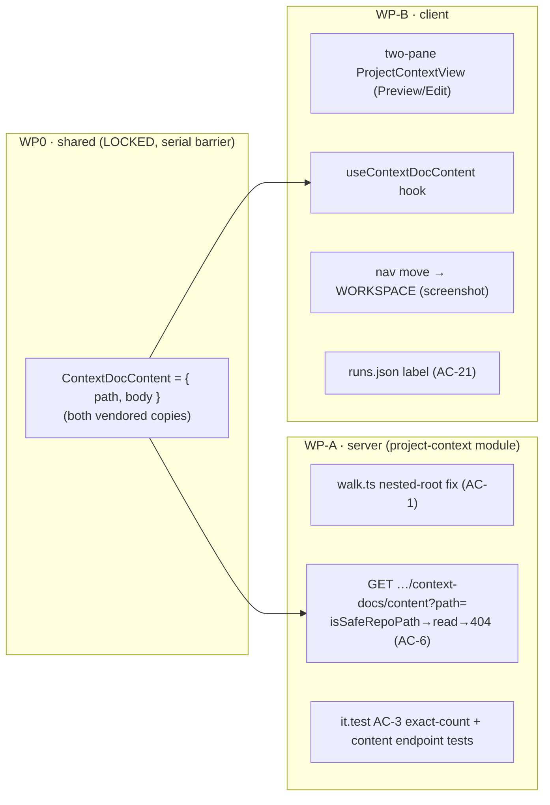

# Implementation Plan — Project Context (SPEC-01) · ADDENDUM
Status: DRAFT · Mode: multi-agent · Plan ID: 2026-07-17-project-context-addendum · Author: implementation-planner agent

> **This is an addendum.** The base plan `docs/plans/2026-07-17-project-context.md` (SPEC-01,
> AC-1..AC-21) is **BUILT and mostly verified**. This document plans **only the deltas** a
> spec-Accept run and a design review surfaced; it does **not** re-plan or re-implement anything
> that already landed (§"What is NOT changing" below is the guardrail). It writes **no spec** —
> SPEC-01 stays the source of truth.

## 1. Context & goal
Four accepted changes to the already-shipped Project Context feature:
1. **AC-1 nested-root discovery fix** — `walkContextDocs` currently only finds a configured root
   directory (`specs`/`docs`/`insights`) **directly at the clone root**; AC-1's observable requires
   finding a directory *named* a configured root **at any depth** (`a/specs/x.md`, `b/c/docs/y.md`),
   labelled by that root segment, with `notes/other.md` excluded.
2. **Full document body preview — completes AC-6** (was deferred). A new lazy content endpoint +
   a new shared `ContextDocContent` contract + a client **two-pane master–detail** redesign that
   renders the real markdown body (Preview) and its raw source read-only (Edit).
3. **Nav placement** — move "Project Context" from SKILLS LAB into WORKSPACE, right after
   "Pull Requests" (per the screenshot).
4. **Two cosmetic nits** — AC-3 exact-token assertion; AC-21 literal trace label.

"Done" = deltas 1–4 implemented and traceable to a named test; no shared-table migration rewritten;
the `isSafeRepoPath`-before-read seam intact; no weakening of `wrapUntrusted()`/`INJECTION_GUARD`.

## 1a. Spec coverage (this addendum only)
| Spec AC / source | Covered by | Note |
|---|---|---|
| AC-1 (discovery at any depth) | WP-A | `walk.ts` full-tree scan + `walk.test.ts` AC-1 example |
| AC-3 (exact tokenizer count) | WP-A | it.test assertion `tokens === tokenizer.count(body)` (was `> 0`) |
| AC-6 (full body preview) | WP0 (contract) + WP-A (content endpoint) + WP-B (two-pane Preview/Edit) | the deferred half of AC-6 |
| AC-21 (literal trace label) | WP-B | `runs.json` value → "Project context — attached specs (untrusted)" + its test |
| **Screenshot** (two-pane master–detail; Preview/Edit tabs; nav under WORKSPACE) | WP-B | visual layout + nav placement only; **not** the prototype area-badges (see below) |
| AC-2, AC-4, AC-5, AC-7..AC-20 | — | already built & verified in the base plan — **untouched** |

**Authoritative-model note (do not drift):** the screenshot's `CLIENT`/`SERVER`/`E2E`/`ROOT`
area-badges are **prototype data only**. The real badge stays the **configured root label**
(`specs|docs|insights`, per the `ContextDoc.root` contract and AC-1). Take *layout* from the
screenshot; take *the badge model* from the spec.

## 2. Non-goals — what is NOT changing (already landed in the base plan)
Do not touch, re-plan, or "improve" any of these; they are accepted and verified:
- **Review-time injection** — `reviews/run-executor.ts`, `reviews/helpers.ts` (dedup/order/budget,
  `isSafeRepoPath`-gated cross-repo reads), and the `## Project context` injection (AC-12..AC-19).
- **reviewer-core** — the `PromptParts.specs: {path,body}[]` slot + untrusted-fenced rendering
  (`reviewer-core/src/prompt.ts`, `review/run.ts`) (AC-16..AC-18). No I/O added; purity intact.
- **Attachment persistence** — the additive `context_docs` jsonb columns on `agents`/`skills`, the
  `PUT /agents|skills/:id/context-docs` endpoints, and the agent/skill **Context tabs** (AC-7..AC-11).
- **Trace fields** — `RunTrace.specs_read`, `RunStats.specs_tokens`, `specs_skipped`, and the trace
  drawer's specs-read list / skipped-docs / prompt-assembly block (AC-20/AC-21 *rendering*; only the
  **label string** changes here).
- **Discovery listing** — `GET /repos/:repoId/context-docs` and the **paths-only** `ContextDoc` /
  `ContextDocList` contract are **unchanged** (this addendum ADDS a separate content endpoint; it does
  not put bodies on the listing).
- **Config** — `projectContextRoots` / `projectContextTokenBudget` and their env overrides.
- **This addendum writes no spec** and touches nothing under `spec/**` or any `specs/**`.

## 3. Architecture impact
- **Packages:** `shared` (one additive contract, both vendored copies), `server` (walk fix + one new
  lazy route in the *existing* `project-context` module), `client` (two-pane redesign + one new hook +
  nav move + one label string). **reviewer-core: untouched.**
- **Onion (server):** the new content read stays in-ring — `routes.ts` (HTTP) → `service.ts` (app ring;
  holds the `isSafeRepoPath` guard) → `repository.ts`/`walk.ts` (infra; the only fs I/O). The security
  seam is deliberately in the app ring **before** the infra read.
- **New vs extended:** no new module, no new route file — a **second route** is added to the existing
  `project-context/routes.ts` plugin, so `modules/index.ts` is **not** touched (module already
  registered at `modules/index.ts:12,38`). No schema/migration change. No DI/container change.



## 4. Contract changes — SHARED / LOCKED  (owned by WP0; no other WP may edit these files)
Apply the **additive delta** to **BOTH** copies (they differ only in comment wording — do not
wholesale-copy one over the other):
`server/src/vendor/shared/contracts/project-context.ts` **and**
`client/src/vendor/shared/contracts/project-context.ts`.

Append (leaving the existing `ContextDoc` / `ContextDocList` — paths-only — exactly as they are):
```ts
/**
 * One document's full content, returned by the LAZY content endpoint
 * (GET /repos/:repoId/context-docs/content?path=…). Separate from the paths-only
 * discovery contract on purpose: bodies are fetched on demand for preview, never as
 * part of the listing. `body` is UNTRUSTED author-controlled markdown — the client
 * renders it through the safe `Markdown` primitive (Preview) or read-only raw source
 * (Edit), never via dangerouslySetInnerHTML.
 */
export const ContextDocContent = z.object({
  path: z.string(), // echoes the requested repo-relative path
  body: z.string(),
});
export type ContextDocContent = z.infer<typeof ContextDocContent>;
```
- **Barrel:** no change needed — both `vendor/shared/index.ts` already `export * from
  './contracts/project-context.js';` (line 21 in each). WP0 edits **only** the two contract files.
- **Skill notes (`zod`):** export both schema and inferred type (`type-export-schemas-and-types`);
  `z.string()` for `body` (no length cap here — the server bounds reads by file, and the wire type
  should not reject a legitimately large doc). **`security`:** this is the ONLY place a body crosses a
  contract; the listing stays paths-only.

## 5. Database changes
**None.** No schema, migration, `db:generate`, or `db:migrate` in this addendum.

## 6. Work packages

### WP0 — Foundation: `ContextDocContent` contract  (SERIAL — must land before WP-A/WP-B start)
- **Surface:** shared · **Skill set (BACKEND):** always — `onion-architecture`, `typescript-expert`,
  `security`, `zod`; by artifact — `fastify-best-practices`/`drizzle-orm-patterns`/
  `postgresql-table-design` **N/A** (no routes, no DB).
- **Owns (LOCKED):** `server/src/vendor/shared/contracts/project-context.ts` **and**
  `client/src/vendor/shared/contracts/project-context.ts`.
- **Must NOT touch:** anything else; the two `index.ts` barrels (already `export *`).
- **Steps:** apply §4 to both copies, byte-equivalent except pre-existing comment differences.
- **Tests:** none new. Acceptance = `cd server && pnpm typecheck` and `cd client && pnpm typecheck`
  both green with `ContextDocContent` importable from `@devdigest/shared`.
- **Acceptance criteria:** `ContextDocContent` schema + type importable in both packages (enables AC-6).
- **Depends on:** none. Serial barrier.

### WP-A — Server: walk nested-root fix · lazy content endpoint · AC-3 nit  (parallel-safe with WP-B)
- **Surface:** server · **Skill set (BACKEND):** always — `onion-architecture`, `typescript-expert`,
  `security`, `zod`; by artifact — `fastify-best-practices` (new route on the existing plugin),
  `drizzle-orm-patterns` (reuses the existing `getClonePath` query; **no new column/query** — N/A for
  schema), `postgresql-table-design` **N/A**.
- **Owns (disjoint):**
  - `server/src/modules/project-context/walk.ts` (+ `walk.test.ts`)
  - `server/src/modules/project-context/routes.ts`, `service.ts`, `repository.ts` (+ `service.test.ts`)
  - `server/src/modules/project-context/constants.ts` (if a shared ext check is factored)
  - `server/test/project-context.it.test.ts`
- **Must NOT touch:** LOCKED `vendor/shared/**`; any `client/**`; `reviewer-core/**`;
  `reviews/**`; `modules/index.ts`; any schema/migration.
- **Reuse (with paths):**
  - `isSafeRepoPath` — `modules/reviews/intent-helpers.ts:108` (pure; rejects absolute/`..`/backslash/
    NUL/control-chars). Import into `service.ts` and gate **before** any read.
  - `ProjectContextRepository.getClonePath(workspaceId, repoId)` — `project-context/repository.ts:22`
    (already workspace-scoped) — reuse for the content endpoint so it reads THAT repo's clone and never
    leaks cross-tenant.
  - `NotFoundError` — `platform/errors.js` (idiom, e.g. `skills/routes.ts:102`) for the 404 path.
  - `getContext(app.container, req)` — `modules/_shared/context.ts` (workspace scope, as the existing
    listing route uses).
  - `container.tokenizer.count` — for the AC-3 exact assertion in the it.test.
  - fs read idiom — `walk.ts`'s `readFile(join(clonePath, rel), 'utf-8')` (infra ring).

- **Step A1 — walk nested-root fix (AC-1).** Replace the top-level-only loop in `walkContextDocs`
  (currently `join(clonePath, root)` then `walkDir` per root, `walk.ts:39-42`) with a **single
  full-tree scan** from `clonePath`: descend every directory (skipping symlinks, as today); when a
  directory's **basename equals a configured root**, treat its entire subtree as that root and collect
  every `.md` beneath it at any depth, tagged with that root label; files not under any matched root are
  excluded. Keep: posix-normalized repo-relative `path`, symlink skip, clean skip of unreadable dirs,
  body read. Emit a deterministic order (sort the final `WalkedDoc[]` by `path` ascending).
  - **Nested-root decision (flagged in §10):** once inside a matched root, the label **sticks** — a
    `docs/` nested inside a `specs/` does not re-label; the outermost matched root wins, and each file
    is emitted once. The spec/AC-1 only gives non-nested examples; this is a plan judgment call.
  - **`walk.test.ts` — add the AC-1 example verbatim:** a clone with `a/specs/x.md`, `b/c/docs/y.md`,
    `insights/z.md`, `notes/other.md` → `walkContextDocs(clone, ['specs','docs','insights'])` returns
    exactly `a/specs/x.md` (root `specs`), `b/c/docs/y.md` (root `docs`), `insights/z.md` (root
    `insights`); `notes/other.md` is absent. The existing cases (top-level roots, `specs/sub/deep.md`,
    wrong-ext, symlink, missing-root) must still pass unchanged.

- **Step A2 — lazy content endpoint (AC-6, server half).** Add a **second** route to the existing
  `project-context/routes.ts` plugin: `GET /repos/:repoId/context-docs/content`, schema-first —
  `params: { repoId: uuid }`, `querystring: z.object({ path: z.string() })`,
  `response: { 200: ContextDocContent }`. Handler: `getContext` → `workspaceId`; delegate to the
  service. **Service (`service.ts`) new method** `getContextDocContent(workspaceId, repoId, path)`:
  1. `clonePath = getClonePath(workspaceId, repoId)`; null → throw `NotFoundError`.
  2. `isSafeRepoPath(path)` **false → throw `NotFoundError`** (the load-bearing seam — see security
     notes). Recommended defense-in-depth: also reject when `extname(path).toLowerCase() !==
     CONTEXT_DOC_EXT` (only `.md`, consistent with the spec's only-`.md` boundary) — flagged in §10.
  3. `body = repository.readDocBody(clonePath, path)` (new infra method: plain
     `readFile(join(clonePath, path), 'utf-8')`, catch → `null`); `null` → throw `NotFoundError`.
  4. return `{ path, body }`.
  The route lets `NotFoundError` propagate (existing error plugin serializes it as 404). **Never read
  before the guard passes.**

- **Step A3 — AC-3 exact-token nit.** In `server/test/project-context.it.test.ts`, hoist the clone body
  into a `const` and replace `expect(doc.tokens).toBeGreaterThan(0)` (`:124`) with
  `expect(doc.tokens).toBe(app.container.tokenizer.count(body))` (exact), so the assertion pins AC-3's
  observable, not merely non-zero.

- **Skill-driven design notes:**
  - `onion-architecture` — the `isSafeRepoPath` guard lives in `service.ts` (app ring) **before** the
    `repository.readDocBody` infra read; routes stay thin (avoids the `routes-no-db` violation class).
    No new adapter/DI wiring.
  - `security` (A05/path-traversal) — `readDocBody` does a plain `join` with **no confinement of its
    own**; `isSafeRepoPath` is the ONLY thing between an attacker-authored `../../etc/passwd` path and
    the filesystem. Workspace-scoped `getClonePath` prevents cross-tenant reads. Unsafe/absent → 404,
    **never** 500 and never a read outside the clone root. Bodies remain untrusted (rendered safe on
    the client).
  - `fastify-best-practices` + `zod` — one Zod contract drives validation AND serialization; a missing
    `path` or non-uuid `repoId` → 422 before the handler; `ContextDocContent` response-strips any stray
    key.
  - INSIGHT (server) — a route may live in a module distinct from its data (blast-radius route in
    `pulls/` reads repo-intel); the content read living in `project-context` is consistent.
- **Tests to add:** `walk.test.ts` AC-1 example (above); `project-context.it.test.ts` — content
  endpoint returns the body for a safe `.md` path; `path=../../etc/passwd` → **404, reads nothing**
  (AC-14-style confinement); an absent `.md` path → 404. Plus the AC-3 exact assertion.
- **Acceptance criteria:** AC-1 observable (nested roots listed, `notes/` excluded, correct labels)
  holds at `walkContextDocs`; the content endpoint returns `{path, body}` for a safe doc and 404s for
  unsafe/absent paths without reading outside the clone; AC-3 asserts exact tokenizer count.
- **Depends on:** WP0 (`ContextDocContent`).

### WP-B — Client: two-pane redesign · content hook · nav move · AC-21 label  (parallel-safe with WP-A)
- **Surface:** client · **Skill set (FRONTEND):** always — `frontend-ui-architecture`,
  `react-best-practices`, `typescript-expert`, `security`, `react-testing-library`; by artifact —
  `next-best-practices` (existing route, no new file-convention), `zod` (consumes `@devdigest/shared`,
  never redefines).
- **Owns (disjoint):**
  - `client/src/app/project-context/**` (ProjectContextView, its `styles.ts`/`helpers.ts`/tests, and the
    `DocPreviewDrawer` folder — retired/repurposed into an inline preview pane)
  - `client/src/lib/hooks/context-docs.ts` (add `useContextDocContent`)
  - `client/src/vendor/ui/nav.ts` (nav move — delta #3)
  - `client/messages/en/projectContext.json` (new Preview/Edit strings)
  - `client/messages/en/runs.json` (AC-21 label — delta #4b)
  - `client/src/app/repos/[repoId]/pulls/[number]/_components/RunTraceDrawer/_components/TraceBody/TraceBody.test.tsx`
    (its assertion asserts the old literal label — must track the new string)
- **Must NOT touch:** LOCKED `vendor/shared/**`; any server/reviewer-core file; `TraceBody.tsx`
  itself (it renders the label via the i18n **key**, so only the JSON value + the test's literal
  change); `app-shell/helpers.ts` (**already correct** — `activeKeyFor` returns `project-context`
  for `/project-context` at `helpers.ts:30`; no tweak needed).
- **Reuse (with paths):** `useActiveRepo()` (`lib/repo-context`); hook idiom in `context-docs.ts`;
  `@devdigest/ui` barrel — `Markdown` (`primitives/Markdown.tsx`, react-markdown, **no rehype-raw →
  HTML-escaping/safe**), `CodeEditor` (`kit/CodeEditor.tsx`, textarea-like `value`/`onChange`), `Tabs`
  (`kit/Tabs.tsx`), `Badge`, `EmptyState`, `ErrorState`, `Skeleton`, `Button`; existing `filterDocs`
  (`ProjectContextView/helpers.ts`).

- **Step B1 — `useContextDocContent(repoId, path)` hook.** In `context-docs.ts`, add a query →
  `api.get<ContextDocContent>(`/repos/${repoId}/context-docs/content?path=${encodeURIComponent(path)}`)`,
  `enabled: !!repoId && !!path`, `queryKey: ["context-doc-content", repoId, path]`. Keep the existing
  `useContextDocs` / attach mutations unchanged.

- **Step B2 — two-pane master–detail redesign (AC-6, screenshot).** Restructure `ProjectContextView`
  from the current list-+-slide-in-drawer into a two-pane layout:
  - **Left (master):** the scrollable document list + the existing filter box (derived filter, no
    refetch — AC-5 stays). Each **row**: file icon · **bold filename** (basename) · folder-path
    subtitle (the directory portion) · **uppercase configured-root badge** (`doc.root`, e.g. `SPECS` —
    NOT the prototype area-badges). Selecting a row sets `selectedPath` (replaces the old
    `previewPath`); selection is single local state, the selected doc is derived from the list.
  - **Right (detail / preview pane, inline — retire the `Drawer`):** header with the filename +
    "Used by N agents" (from the already-in-memory list row — no extra fetch) + **`Preview` / `Edit`
    tabs** (`Tabs`):
    - **Preview** → `<Markdown>{content.body}</Markdown>` where `content` is `useContextDocContent`;
      show `Skeleton` while loading and an inline error/empty state on failure.
    - **Edit** → the **raw** markdown source, **read-only** — render `content.body` in `CodeEditor`
      with **no `onChange`** (edits are ephemeral and never persisted) or a read-only `pre.mono`; there
      is **no Save** and no write-back mutation (the spec's no-authoring Non-goal — flagged in §10 for
      the exact read-only mechanism).
  - Preserve the existing `!repoId` / loading / error / `docs.length === 0` empty states (AC-2). When
    the list is non-empty but no row is selected, show a neutral "select a document" placeholder in the
    right pane.
  - **Retire `DocPreviewDrawer`** (delete or convert its folder into the inline `PreviewPane`
    component under `ProjectContextView/_components/`). Update `styles.ts` for the two-column grid.

- **Step B3 — nav move (screenshot, delta #3).** In `nav.ts`, move the `project-context` item out of
  the `SKILLS LAB` group and into the `WORKSPACE` group, positioned **immediately after** the `pulls`
  item. Keep its `key`, `label`, `icon`, `href` unchanged. (No `helpers.ts`/`activeKeyFor` change — it
  already resolves `project-context`. Optionally add a `g`-nav `gKey`/shortcut, but not required.)

- **Step B4 — AC-21 label nit (delta #4b).** In `runs.json`, change `prompt.specs` (`:53`) from
  `"Project context (dynamic)"` to the spec's literal **`"Project context — attached specs
  (untrusted)"`**. Update the single test that asserts the old literal
  (`TraceBody.test.tsx:67`, `getByText("Project context (dynamic)")`) to the new string. (`TraceBody.tsx`
  itself uses the i18n key, so no component change.)

- **Skill-driven design notes:**
  - `frontend-ui-architecture` — page stays thin; the two panes are colocated `_components/` under
    `ProjectContextView`; the body fetch goes through the `lib/hooks/*` hook (never a direct `api`
    call in a component); all strings in `projectContext.json`.
  - `react-best-practices` — selection is single local state; the selected doc's metadata is **derived**
    from the already-fetched list (no second copy); the body is a **separate, lazy** query keyed by
    path (fetch-on-select), not eagerly loaded for every row.
  - `security` (A05/XSS) — the body is **untrusted** author markdown: Preview renders via the safe
    `Markdown` primitive (react-markdown, no `rehype-raw` → HTML is escaped), Edit shows raw source in a
    read-only field; **never** `dangerouslySetInnerHTML`. Filenames/paths render as text nodes.
  - `react-testing-library` — build panes queryable by role/label: the row (`button`/`option` by
    filename), the `Preview`/`Edit` tabs (by name), "Used by N agents", the rendered heading, and the
    empty/error states.
  - INSIGHT (client) — the trace drawer has mis-mapped strings before; assert the new AC-21 label
    explicitly. Retire the drawer cleanly (the base `DocPreviewDrawer` used the `Drawer` `onClose` ref
    pattern; the inline pane needs no modal ref).
- **Tests to add / update (colocated `*.test.tsx`, jsdom + RTL, `fetch` mocked):** `ProjectContextView`
  — selecting a row shows the preview pane; `Preview` tab renders the fetched body (mock
  `useContextDocContent`'s endpoint), `Edit` tab shows the raw source read-only; filter still narrows
  rows without touching selection (AC-5); empty state on `docs:[]` (AC-2); `TraceBody.test.tsx` — assert
  the new AC-21 label.
- **Acceptance criteria:** two-pane layout with Preview (rendered md) + Edit (raw, read-only, no save);
  body fetched lazily via `useContextDocContent`; nav item under WORKSPACE right after Pull Requests;
  trace label reads the AC-21 literal; AC-2/AC-5 unchanged.
- **Depends on:** WP0 (`ContextDocContent` type). Consumes WP-A's content endpoint for live use; its
  `*.test.tsx` mocks `fetch`, so WP-B can be authored against the contract in parallel with WP-A.

## 7. Contention files — each assigned to exactly ONE WP
| File | Owner |
|---|---|
| `server/src/vendor/shared/contracts/project-context.ts` + `client/src/vendor/shared/contracts/project-context.ts` | WP0 (LOCKED) |
| `server/src/modules/project-context/**` (walk, routes, service, repository, constants, unit tests) | WP-A |
| `server/test/project-context.it.test.ts` | WP-A |
| `client/src/app/project-context/**` | WP-B |
| `client/src/lib/hooks/context-docs.ts` | WP-B |
| `client/src/vendor/ui/nav.ts` | WP-B |
| `client/messages/en/projectContext.json`, `client/messages/en/runs.json` | WP-B |
| `client/.../RunTraceDrawer/_components/TraceBody/TraceBody.test.tsx` | WP-B |
| `modules/index.ts`, `platform/container.ts`, `db/schema.ts`, migrations, `TraceBody.tsx`, `app-shell/helpers.ts` | **untouched by design** |

## 8. Sequencing
`WP0 (serial barrier — LOCKED contract)` → `{ WP-A (server) ∥ WP-B (client) }` → manual smoke.
- WP0 is tiny and blocks both fan-out WPs (each imports `ContextDocContent`).
- WP-A and WP-B share no files (server vs client) and run fully in parallel.

## 9. Verification (end-to-end, runnable)
```
# WP0 gate
cd server && node_modules/.bin/tsc --noEmit
cd client && node_modules/.bin/tsc --noEmit

# WP-A (server)
cd server && node_modules/.bin/vitest run modules/project-context/walk.test.ts   # AC-1 nested roots
cd server && node_modules/.bin/vitest run --exclude '**/*.it.test.ts'             # unit
cd server && node_modules/.bin/vitest run project-context.it.test                 # AC-3 + content endpoint (real PG)
cd server && pnpm exec depcruise --config ../.claude/skills/onion-architecture/assets/onion.dependency-cruiser.cjs src  # expect NO new violations

# WP-B (client)
cd client && node_modules/.bin/vitest run project-context                         # two-pane + Preview/Edit
cd client && node_modules/.bin/vitest run TraceBody                               # AC-21 label

# manual click-path
./scripts/dev.sh
#  1. /project-context is under WORKSPACE, right after Pull Requests (nav)
#  2. a clone with a/specs/x.md, b/c/docs/y.md, insights/z.md, notes/other.md → list shows the
#     first three with root badges SPECS/DOCS/INSIGHTS; notes/other.md absent (AC-1)
#  3. select a doc → right pane: Preview renders the markdown body; Edit shows raw source read-only,
#     no Save (AC-6); "Used by N agents" in the header
#  4. request …/context-docs/content?path=../../etc/passwd → 404, nothing read (security seam)
#  5. run a review, open the trace → Prompt-assembly entry reads
#     "Project context — attached specs (untrusted)" (AC-21)
```

## 10. Risks & open questions

**Top INSIGHTS per touched module (high-confidence guidance):**
- **server** — (1) `getFileContent`/`readClone` do a **plain `join` with no confinement**; the
  `isSafeRepoPath` guard is the only path-traversal defense — never read before it passes. (2) A route
  may live in a module distinct from its data (blast-radius in `pulls/` reads repo-intel) — a content
  read in `project-context` is consistent. (3) Workspace scoping goes through the module's own
  `getClonePath(workspaceId, …)`; do not swap in the unscoped `repoIntel.getFileContent` for a
  user-supplied `repoId` (cross-tenant read).
- **client** — (1) the trace drawer has mis-mapped strings before → assert the AC-21 label explicitly.
  (2) Derive-don't-store — selected doc metadata comes from the list already in cache; only the body is
  a lazy query. (3) Untrusted bodies render via the safe `Markdown` primitive / read-only raw source —
  never `dangerouslySetInnerHTML`.

**What could go wrong:** the content endpoint is a **new** attacker-reachable `path` sink — an
implementer who reads before `isSafeRepoPath`, or who uses the unscoped `repoIntel.getFileContent`,
reintroduces traversal or cross-tenant reads. The walk rewrite must stay backward-compatible (top-level
roots + `specs/sub/deep.md` + symlink-skip cases still pass).

**Open questions / judgment calls (flagged, not silently resolved):**
1. **Nested configured-root-within-a-root** (e.g. a `docs/` inside a `specs/`, or `specs/docs/y.md`):
   the plan makes the **outermost** matched root win and emits each file once (label sticks). The spec
   and the task example only show non-nested roots, so this is a genuine judgment call — confirm if the
   inner root should instead re-label or produce a duplicate row.
2. **Content-endpoint scope.** The mandated seam is `isSafeRepoPath` + clone-root confinement + 404. The
   plan **recommends** additionally rejecting non-`.md` extensions (matches the spec's "only `.md`, only
   under configured roots" boundary) as cheap defense-in-depth. If the intent is "any safe path in the
   clone is previewable," drop the extension check. Not blocking — an explicit choice for the human.
3. **Edit-tab read-only mechanism.** `CodeEditor` (`kit/CodeEditor.tsx`) is a controlled textarea-like
   with no explicit `readOnly` prop; the plan renders raw source with **no `onChange`** (ephemeral, never
   persisted) to honor the no-authoring Non-goal. If a hard read-only affordance is wanted, use a
   read-only `pre.mono` instead. Cosmetic; no write-back either way.
4. **"Used by N agents" in the preview header** is composed from the already-fetched `ContextDoc` list
   row (used_by tally), not the content endpoint (which returns only `{path, body}`). Intentional — the
   content endpoint stays minimal.
```
