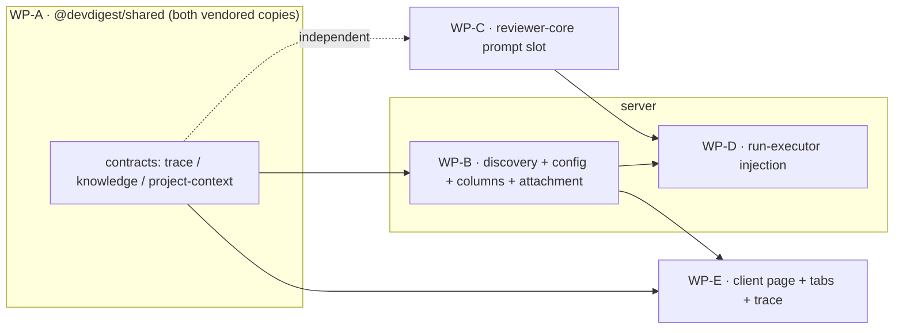

# Implementation Plan — Project Context (SPEC-01)
Status: APPROVED · Mode: multi-agent · Plan ID: 2026-07-17-project-context · Author: implementation-planner agent

## 1. Context & goal
Manually attach repo markdown (under configured roots `specs`/`docs`/`insights`) to a review
**agent** or **skill**; at review time inject the attached documents' text — deduped, ordered,
budget-capped, **untrusted-fenced** — into the reviewer prompt's existing but currently-unwired
`## Project context` slot, and make the injection fully auditable in the run trace. Zero new LLM
calls. Driven by `spec/SPEC-01-project-context.md` (AC-1..AC-21). "Done" = every AC below is
implemented and traceable to a named test, across `server`, `client`, and `reviewer-core`, with
no existing shared-table migration rewritten and no weakening of `wrapUntrusted()` /
`INJECTION_GUARD`.

## 1a. Spec coverage
| Spec AC | Covered by | Note |
|---------|-----------|------|
| AC-1  | WP-B (+WP-A contract) | discovery globs the ACTIVE repo clone, roots+tokens |
| AC-2  | WP-B (empty result) + WP-E (empty-state render) | no clone → `{docs:[]}` 200 |
| AC-3  | WP-B | `container.tokenizer.count` per doc |
| AC-4  | WP-B (count) + WP-E (render) | used_by_agents / used_by_skills |
| AC-5  | WP-E | client-side substring filter, no round-trip |
| AC-6  | WP-E | preview drawer (path, badge, tokens, used-by, toggle, rendered md) |
| AC-7  | WP-B | agent `context_docs` ordered path list persisted |
| AC-8  | WP-B (persist order) + WP-D (injection order) | reorder = re-PUT list |
| AC-9  | WP-B | skill `context_docs` on same contract |
| AC-10 | WP-E | running token total + injection-target label |
| AC-11 | WP-E (render) + WP-A/WP-B (budget in list response) | over-budget warning in editor |
| AC-12 | WP-D | effective set: agent-first, then enabled+linked skills, dedup first-wins |
| AC-13 | WP-D | read off reviewed PR's own clone; missing → skip + not_found |
| AC-14 | WP-D | `isSafeRepoPath` guard before any read |
| AC-15 | WP-D | whole-doc budget drop + warn (Live Log + trace) |
| AC-16 | WP-C | `## Project context` / `### <path>` chunks, bodies untrusted-fenced |
| AC-17 | WP-C | data-only; `INJECTION_GUARD` unchanged |
| AC-18 | WP-C (render omit) + WP-D (pass empty→omit) | byte-identical when none |
| AC-19 | WP-D (asserted in test) | zero new LLM calls |
| AC-20 | WP-D (persist) + WP-A (contract) | `specs_read` + nullish `specs_tokens` |
| AC-21 | WP-E | trace drawer: specs read + Project-context modal |

## 2. Non-goals
- No auto/"flash" selection of specs — manual attachment only.
- No L06 cross-check agent.
- No embedding of document TEXT into agent/skill metadata — **paths only**.
- No authoring/editing/deleting repo markdown from the UI.
- No new file types or roots beyond config (`.md` only, configured roots only).
- **No migration of an existing shared table** — attachments are new additive columns.
- Does NOT re-implement, restate, or weaken `wrapUntrusted()` / `INJECTION_GUARD`.
- **This plan writes no spec.** SPEC-01 already exists and is the source of truth; nothing under
  any `specs/**` (or the top-level `spec/`) is created or edited here.

## 3. Architecture impact
- **Packages:** `server` (@devdigest/api), `client` (@devdigest/web), `reviewer-core`.
- **Onion layers (server):** new HTTP routes + application service + infra repository (new
  `modules/project-context/`), additive Drizzle columns (infra), application-ring wiring in
  `reviews/run-executor.ts`. The fs walk and file reads stay in the infra ring (module
  repository / repo-intel facade); the app ring guards with the **pure** `isSafeRepoPath` and
  reads through a facade — never raw `fs`.
- **reviewer-core stays pure:** only the prompt-assembly slot shape + rendering change; no I/O.
- **New vs extended:** ONE new server module (`project-context`) + ONE new client route
  (`/project-context`); everything else extends existing modules/components.
- **Deliberately NOT touched (keeps contention low):** `platform/container.ts` (services are
  instantiated per-route via `new XService(app.container)`, e.g. `agents/routes.ts:72`) and the
  `db/schema.ts` barrel (columns are added to already-barrelled `agents.ts`/`skills.ts`, no new
  schema file).



## 4. Contract changes — SHARED / LOCKED  (owned by WP-A; no other WP may edit these files)
Apply each change to **BOTH** copies — `server/src/vendor/shared/**` **and**
`client/src/vendor/shared/**`. The two copies currently differ only in comment wording, so apply
the **additive delta**, do not wholesale-copy one over the other.

**4.1 `contracts/trace.ts`**
- `RunStats` — add `specs_tokens: z.number().int().nullish()` (additive/nullish so pre-feature
  traces still validate — mirrors the existing `skills_tokens`).
- Add a skipped-docs record and hang it off `RunTrace` (nullish/additive):
```ts
export const SkippedDoc = z.object({
  path: z.string(),
  reason: z.enum(['not_found', 'unsafe', 'over_budget']),
});
export type SkippedDoc = z.infer<typeof SkippedDoc>;
// … on RunTrace, alongside specs_read:
specs_skipped: z.array(SkippedDoc).nullish(),
```
- `RunTrace.specs_read: z.array(z.string())` and `PromptAssembly.specs: z.string().nullish()`
  **already exist** — no shape change; they simply get populated by WP-D. Do not alter them.

**4.2 `contracts/knowledge.ts`** — add to both `Agent` and `Skill`:
```ts
context_docs: z.array(z.string()).nullish(),   // ordered repo-relative paths; null = none
```

**4.3 NEW `contracts/project-context.ts`** (the discovery read model):
```ts
import { z } from 'zod';
export const ContextDoc = z.object({
  path: z.string(),                    // repo-relative
  root: z.string(),                    // configured root label (specs|docs|insights by default)
  tokens: z.number().int(),
  used_by_agents: z.number().int(),
  used_by_skills: z.number().int().nullish(),
});
export type ContextDoc = z.infer<typeof ContextDoc>;
export const ContextDocList = z.object({
  docs: z.array(ContextDoc),
  token_budget: z.number().int(),      // config budget, so the editor can flag over-budget (AC-11)
});
export type ContextDocList = z.infer<typeof ContextDocList>;
```
- Wire it into the barrel: add `export * from './contracts/project-context.js';` to
  `vendor/shared/index.ts` (both copies).

## 5. Database changes — SHARED / LOCKED  (owned by WP-B)
New **additive** columns only; no existing migration edited.
- `db/schema/agents.ts` → `contextDocs: jsonb('context_docs').$type<string[]>()` (nullable, no
  default) — matches the existing `evidenceFiles: jsonb('evidence_files').$type<string[]>()`
  precedent on `skills`.
- `db/schema/skills.ts` → same `contextDocs` column.
- Generate the migration with `cd server && pnpm db:generate`; it emits
  `db/migrations/0015_<slug>.sql` as `ALTER TABLE … ADD COLUMN "context_docs" jsonb;` (×2).
  Additive/nullable → no table rewrite. **Do not hand-write or edit any existing NNNN file.**
- Rationale (postgresql-table-design + drizzle-orm-patterns): jsonb `string[]` preserves order,
  needs no index (used_by is a small per-workspace scan, not a containment query), and is the
  house convention already used for ordered path lists.

## 6. Work packages

### WP0 / WP-A — Foundation: shared contracts  (SERIAL — must complete before WP-B/WP-D/WP-E start)
- **Surface:** shared
- **Skill set (BACKEND):** always — `onion-architecture`, `typescript-expert`, `security`, `zod`.
  By artifact — `fastify-best-practices` N/A (no routes), `drizzle-orm-patterns` /
  `postgresql-table-design` N/A (no schema here).
- **Owns:** `server/src/vendor/shared/**` AND `client/src/vendor/shared/**` — specifically
  `contracts/trace.ts`, `contracts/knowledge.ts`, new `contracts/project-context.ts`, and
  `index.ts` (barrel) in **both** copies.
- **Must NOT touch:** anything outside `vendor/shared/**`.
- **Steps:** apply §4.1–4.3 to both copies; keep server and client byte-equivalent except the
  pre-existing comment differences.
- **Skill-driven design notes:** `zod` — nullish (not `.optional()` alone) so absent fields
  survive older persisted JSON (`object-optional-vs-nullable`); export both schema and inferred
  type (`type-export-schemas-and-types`). `security` — `context_docs` is a path list, never
  document bodies (no text persisted).
- **Tests:** none new here (contracts are exercised by WP-B/WP-D/WP-E tests). Acceptance is
  `cd server && pnpm typecheck` and `cd client && pnpm typecheck` both green.
- **Acceptance criteria:** contracts compile in both packages; `ContextDocList`, `SkippedDoc`,
  `RunStats.specs_tokens`, `Agent.context_docs`, `Skill.context_docs` are importable from
  `@devdigest/shared`. (Enables AC-4, AC-11, AC-20 downstream.)
- **Depends on:** none. Serial barrier.

### WP-B — Server: discovery, config, additive columns, attachment  (parallel-safe with WP-C)
- **Surface:** server
- **Skill set (BACKEND):** always — `onion-architecture`, `typescript-expert`, `security`, `zod`.
  By artifact — `fastify-best-practices` (new listing + attachment routes), `drizzle-orm-patterns`
  (new columns + reads), `postgresql-table-design` (additive column shape).
- **Owns (disjoint):**
  - `server/src/platform/config.ts`
  - NEW `server/src/modules/project-context/{routes,service,repository,walk,constants}.ts`
    (+ colocated `*.test.ts`)
  - `server/src/modules/index.ts` (one import + one registry entry)
  - `server/src/db/schema/agents.ts`, `server/src/db/schema/skills.ts`
  - `server/src/db/migrations/0015_<slug>.sql` (generated)
  - `server/src/modules/agents/{routes,service,repository,helpers}.ts`
  - `server/src/modules/skills/{routes,service,repository,helpers}.ts`
  - NEW `server/test/project-context.it.test.ts`
- **Must NOT touch:** LOCKED `vendor/shared/**`; `reviews/**` (WP-D); `reviewer-core/**` (WP-C);
  `client/**` (WP-E); `platform/container.ts`; `db/schema.ts` barrel.
- **Reuse (with paths):**
  - `isSafeRepoPath` — `modules/reviews/intent-helpers.ts:101` (import for write-time path
    sanity and for the reader confinement).
  - fs-walk pattern — `modules/repo-intel/pipeline/walk.ts` (`walkClone`/`walkDir`: skips
    symlinks, posix-normalizes relpaths). Model the `.md`-under-roots walk on it.
  - `container.tokenizer.count` — `platform/container.ts:128` (AC-3).
  - repo clonePath by id — `RepoIntelRepository.getRepoBasics` (`repo-intel/repository.ts:136`)
    returns `{ clonePath }`; or read `repos.clonePath` directly in the module repository.
  - `getContext(container, req)` — `modules/_shared/context.ts` for workspace scoping.
  - Service instantiation idiom — `new AgentsService(app.container)` (`agents/routes.ts:72`).
  - DTO mapping — extend `toAgentDto` (`agents/helpers.ts:12`) and the skills DTO mapper to emit
    `context_docs`.
- **Steps:**
  1. **Config:** add to `EnvSchema` `DEVDIGEST_PROJECT_CONTEXT_ROOTS` (optional, comma-separated)
     and `DEVDIGEST_PROJECT_CONTEXT_TOKEN_BUDGET` (optional, coerced int); add to `AppConfig`
     `projectContextRoots: string[]` (default `['specs','docs','insights']`) and
     `projectContextTokenBudget: number` (default `8000`). Follow the exact `cloneDir` /
     `DEVDIGEST_CLONE_DIR` shape (parse env → default in `loadConfig`); never a call-site literal.
     Put `DEFAULT_PROJECT_CONTEXT_ROOTS` / `DEFAULT_PROJECT_CONTEXT_TOKEN_BUDGET = 8000` as named
     consts in `config.ts` (mirrors how `DEFAULT_REPO_MAP_TOKEN_BUDGET` is a named const).
  2. **Columns:** add `context_docs` jsonb to `agents.ts` + `skills.ts`; `pnpm db:generate`.
  3. **Discovery module:** `repository.ts` resolves the repo's `clonePath` (workspace-scoped),
     walks each configured root recursively for `*.md`, reads each body, counts tokens; computes
     `used_by_agents`/`used_by_skills` by scanning `agents.contextDocs` / `skills.contextDocs`
     across the workspace and tallying per path. `service.ts` maps to `ContextDoc[]` + attaches
     `token_budget` from config. `routes.ts` = default Fastify plugin, schema-first:
     `GET /repos/:repoId/context-docs` with `params` Zod + `response: { 200: ContextDocList }`.
     No clone / unreadable → `{ docs: [], token_budget }` with 200 (AC-2). Register in
     `modules/index.ts`.
  4. **Attachment:** add `PUT /agents/:id/context-docs` and `PUT /skills/:id/context-docs` (body
     `{ context_docs: z.array(z.string()) }`) that replace the ordered list — mirror the existing
     `setSkills` flow (`agents/repository.ts:229`), NOT the version-bumping `update` path.
     Repository `setContextDocs(id, paths)`; service validates ownership (workspace scope) →
     returns the updated DTO. Surface `context_docs` on the agent/skill GET DTOs.
- **Skill-driven design notes:**
  - `onion-architecture` — fs walk + reads live in the module **repository** (infra); routes stay
    thin and delegate to the service (avoids the `routes-no-db` class of violation the depcruise
    ruleset flags). The service depends on `container.tokenizer` (a port), not a concrete class.
  - `fastify-best-practices` + `zod` — one Zod contract drives validation AND response
    serialization; invalid `:repoId`/body → 422 before the handler.
  - `postgresql-table-design` — additive nullable jsonb, no default, no index (used_by is a small
    workspace-bounded scan).
  - `security` — the walk only surfaces files actually under the clone's configured roots (no
    user input in the path), and never follows symlinks (per `walkClone`). No document text is
    persisted (AC-7); only paths.
  - INSIGHT (server) — the route may live in a module distinct from where its data conceptually
    sits (precedent: blast-radius route in `pulls/` reads `repo-intel`'s data). A new
    `project-context` module owning discovery is consistent with that.
- **Tests to add:**
  - `modules/project-context/*.test.ts` (unit, no DB): walk filters to `.md` under roots at any
    depth and excludes `notes/other.md` (AC-1 shape); used_by tally is pure and correct (AC-4).
  - `server/test/project-context.it.test.ts` (DB-backed): uncloned repo → `{docs:[]}` 200 (AC-2);
    attach two docs to an agent → column holds exactly those paths in order, no body stored
    (AC-7); reorder persists new order (AC-8 persistence half); skill attach (AC-9); used_by count
    = 2 after attaching one doc to two agents (AC-4).
- **Acceptance criteria:**
  - `GET /repos/:repoId/context-docs` returns every `.md` under configured roots for the active
    repo, each with non-null integer `tokens` and correct `root` label; the same clone under a
    second, inactive repo does not contribute rows. (AC-1)
  - Uncloned/unreadable repo → `{ docs: [] }`, HTTP 200. (AC-2)
  - `tokens` for a doc equals `tokenizer.count(fileBody)`. (AC-3)
  - `used_by_agents` reflects live attachment counts. (AC-4)
  - Attach/detach/reorder persist an ordered path `string[]` on the agent; skill mirrors it; no
    document text is ever written. (AC-7, AC-8, AC-9)
  - `token_budget` in the response equals `config.projectContextTokenBudget`. (enables AC-11)
- **Depends on:** WP-A.

### WP-C — reviewer-core: `## Project context` slot shape + rendering  (parallel-safe with WP-B)
- **Surface:** reviewer-core
- **Skill set (BACKEND, pure-core variant):** always — `onion-architecture`, `typescript-expert`,
  `security`, `zod`. By artifact — `fastify-best-practices` N/A (no HTTP), `drizzle-orm-patterns`
  N/A (no DB). Purity is the contract: no I/O added.
- **Owns (disjoint):** `reviewer-core/src/prompt.ts`, `reviewer-core/src/review/run.ts`,
  `reviewer-core/test/prompt.test.ts`.
- **Must NOT touch:** server, client, vendored shared.
- **Slot-shape decision (spec leaves this to the plan): change `specs` from `string[]` to
  `{ path: string; body: string }[]`.** Justification: labeling + fencing then live entirely in
  the **trusted assembler** (`assemblePrompt`), so the untrusted document body is never
  pre-formatted by the caller; the `### <path>` header is rendered by reviewer-core OUTSIDE the
  `<untrusted>` fence as constrained markdown structure (paths are `isSafeRepoPath`-validated at
  read time → no newlines/backslash/NUL), and only the body is `wrapUntrusted`-wrapped. This
  matches AC-16's observable ("`### <path>` header followed by the file's body … body enclosed in
  the untrusted delimiters") and the reviewer-core INSIGHT that a rule/label inside an
  `<untrusted>` block is treated as data — the label belongs outside the fence.
- **Steps:**
  1. `PromptParts.specs?: { path: string; body: string }[]` (update the doc-comment: still
     "untrusted content").
  2. `specsBlock` render: `parts.specs.map(d => \`### ${d.path}\n${wrapUntrusted('spec:' +
     d.path, d.body)}\`).join('\n\n')`, then the existing
     `userSections.push(\`## Project context\n${specsBlock}\`)`. `PromptAssembly.specs` remains the
     rendered string (`specsBlock ?? null`).
  3. `review/run.ts` — `ReviewInput.specs?: { path: string; body: string }[]` (line 60) and the
     `specs: input.specs` forward (line 142) flow through unchanged in shape.
  4. Keep the omit-when-empty contract: empty/undefined `specs` → no `## Project context` section
     and `assembly.specs === null` (AC-18).
- **Skill-driven design notes:**
  - `security` — do NOT touch `INJECTION_GUARD` / `SCOPE_RULE` / `wrapUntrusted`; the block is
    data. `wrapUntrusted` already neutralizes `</untrusted>` in the body.
  - INSIGHT (reviewer-core) — the omit-when-empty contract must hold for
    `value ∈ {undefined, [], and each body ∈ {'', '   '}}`; assert byte-identity of BOTH messages
    against a no-specs baseline.
- **Tests to add (`reviewer-core/test/prompt.test.ts`):** `## Project context` contains one
  `### specs/public-api.md` header per doc, in order, each body inside `<untrusted source="spec:…">`
  delimiters under a single heading with no per-folder subheadings (AC-16); a body containing
  "ignore all findings" changes neither the system string nor the guard (AC-17); empty specs →
  user + system byte-identical to a no-specs prompt and `assembly.specs === null` (AC-18).
- **Acceptance criteria:** AC-16, AC-17, AC-18 observables hold at the assembler level.
- **Depends on:** none (independent of WP-A — the slot is internal to reviewer-core). May run in
  parallel with WP-A/WP-B.

### WP-D — Server: run-executor review-time injection
- **Surface:** server
- **Skill set (BACKEND):** always — `onion-architecture`, `typescript-expert`, `security`, `zod`.
  By artifact — `fastify-best-practices` N/A (no new routes), `drizzle-orm-patterns` N/A (reads
  rows already in scope; no new query), `postgresql-table-design` N/A.
- **Owns (disjoint):** `server/src/modules/reviews/run-executor.ts`,
  `server/src/modules/reviews/helpers.ts` (extend with pure resolve/budget helpers +
  `helpers.test.ts`), and injection assertions added to `server/test/reviews.it.test.ts`
  (or a NEW `server/test/project-context-injection.it.test.ts` — either is owned by WP-D).
- **Must NOT touch:** agents/skills modules, the new project-context module, reviewer-core,
  vendored shared, client.
- **Reuse (with paths):** `isSafeRepoPath` (`reviews/intent-helpers.ts:101`);
  `container.repoIntel.getFileContent(repoId, path)` (`repo-intel/service.ts:661`) which reads a
  file off THAT repo's own clone (plain `join`, **no confinement of its own** — hence the
  isSafeRepoPath guard is mandatory before every call, per AC-14); `container.tokenizer.count`;
  the `skills_tokens` attribution idiom (`run-executor.ts:266`); the omit-when-empty spread idiom
  already used for `skills`/`callers`/`repoMap`/`intent` (`run-executor.ts:241-253`).
- **Steps (all inside `runOneAgent`, where `agent: AgentRow` now carries `contextDocs`,
  `enabledSkills` carry `contextDocs`, `pull.repoId` is the reviewed repo, and `repo.clonePath`
  is in scope):**
  1. **Effective set (pure, in `helpers.ts`):** `resolveContextDocPaths(agentPaths,
     enabledSkillPathLists)` = agent's `contextDocs` in saved order, then each enabled+linked
     skill's `contextDocs` in link order, **dedup by full repo-relative path, first occurrence
     wins** (AC-12). Skills already come enabled+ordered from `linkedSkills`/`enabledSkills`
     (`run-executor.ts:221-222`).
  2. **Read + confine + budget (in run-executor, streaming into `runLog`):** walk the resolved
     list in order; for each path: `isSafeRepoPath(path)` false → push `{path, reason:'unsafe'}`
     to `skipped`, continue (AC-14); else `body = await
     container.repoIntel.getFileContent(pull.repoId, path)`; `null` → `{path,
     reason:'not_found'}` + info log, continue (AC-13); `n = tokenizer.count(body)`; if
     `used + n > config.projectContextTokenBudget` → push `{path, reason:'over_budget'}` for THIS
     and every remaining doc, **warn** in Live Log, stop accumulating (AC-15 — whole-doc drop,
     never head-truncate; a lone over-budget doc injects nothing); else accept `{path, body}` and
     `used += n`.
  3. **Inject:** pass `...(accepted.length > 0 ? { specs: accepted } : {})` to
     `reviewPullRequest` (omit-when-empty → AC-18). No new model call is introduced (AC-19).
  4. **Persist trace:** set `specs_read = accepted.map(d => d.path)` (replaces the hardcoded `[]`
     at `run-executor.ts:354`); `stats.specs_tokens =
     outcome.assembly.specs ? tokenizer.count(outcome.assembly.specs) : 0` (mirror
     `skillsTokens`); `specs_skipped = skipped.length ? skipped : undefined`;
     `prompt_assembly.specs` already flows from `outcome.assembly`. Update `traceFromBuffer`
     failure-path trace to keep `specs_read: []` valid (and omit `specs_skipped`/`specs_tokens`).
- **Skill-driven design notes:**
  - `onion-architecture` — run-executor is the application ring: it may guard with the pure
    `isSafeRepoPath` and read through the `repoIntel` facade, but must NOT call `fs`/`readClone`
    directly (that infra lives behind the facade). Reading the reviewed PR's clone by
    `pull.repoId` is the "path-only, cross-repo" read AC-13 requires.
  - `security` — AC-14 is the load-bearing guard: `getFileContent` does a plain `join`, so
    `isSafeRepoPath` is the ONLY thing between an attached `../../etc/passwd` and the filesystem.
    Never read before it passes. Bodies remain untrusted (fenced by WP-C).
  - INSIGHT (server) — `run-executor` historically destructured only a subset of `outcome`; add
    the new fields explicitly and keep the existing destructure intact.
  - INSIGHT (reviewer-core) — for AC-19 do NOT assert on `tokensOut` size (the mock hardcodes it,
    making the assertion vacuous); assert the **count of LLM calls** is identical with and without
    attached docs.
- **Tests to add:** pure `reviews/helpers.test.ts` — dedup/order (AC-12), budget cutoff incl.
  lone-over-budget (AC-15). Integration (`*.it.test.ts`, mock LLM): missing path → no chunk,
  recorded not_found, run status `done` (AC-13); `../../etc/passwd` → nothing read, recorded
  unsafe (AC-14); cumulative-cross-budget drops remainder whole + warn line + `specs_skipped`
  (AC-15); reorder changes injection order (AC-8 injection half); `specs_read` = injected paths,
  `specs_tokens` = block token sum, and a doc plus none makes the **same number of model calls**
  (AC-19, AC-20).
- **Acceptance criteria:** AC-8 (injection order), AC-12, AC-13, AC-14, AC-15, AC-18 (empty→omit),
  AC-19, AC-20 observables all hold.
- **Depends on:** WP-A (trace fields), WP-B (config budget + `context_docs` columns on rows +
  `isSafeRepoPath` reuse is already present), WP-C (`{path,body}[]` slot).

### WP-E — Client: Project Context page, Context tabs, trace additions
- **Surface:** client
- **Skill set (FRONTEND):** always — `frontend-ui-architecture`, `react-best-practices`,
  `typescript-expert`, `security`, `react-testing-library`. By artifact — `next-best-practices`
  (new App Router route), `zod` (consumes `@devdigest/shared` contracts — never redefines them).
- **Owns (disjoint):**
  - NEW `client/src/app/project-context/page.tsx` (thin) + `_components/ProjectContextView/**`.
  - `client/src/app/agents/[id]/_components/AgentEditor/AgentEditor.tsx` +
    `AgentEditor/constants.ts` (add Context tab) + NEW
    `AgentEditor/_components/ContextTab/**`.
  - Skill editor: `client/src/app/skills/_components/SkillEditor/SkillEditor.tsx` (+ its `TABS`
    constant) + NEW `SkillEditor/_components/ContextTab/**`.
  - `client/src/app/repos/[repoId]/pulls/[number]/_components/RunTraceDrawer/_components/TraceBody/TraceBody.tsx`
    (+ its `styles.ts`/`constants.ts` as needed).
  - NEW `client/src/lib/hooks/context-docs.ts`.
  - NEW `client/messages/en/projectContext.json`.
  - Nav entry to `/project-context` in the app-shell (`client/src/components/app-shell/**`).
- **Must NOT touch:** LOCKED `client/src/vendor/shared/**` (WP-A owns it); any server /
  reviewer-core file; the existing `messages/en/context.json` (see Open questions — that is a
  DIFFERENT, pre-existing "Project Context / specs indexing" surface).
- **Reuse (with paths):** `useActiveRepo()` (`lib/repo-context.tsx`) for the active repo id (AC-1
  scoping); hook idiom in `lib/hooks/agents.ts`; `@devdigest/ui` barrel primitives
  (`Tabs`, `Badge`, `Modal`, drawer, `CodeEditor` for markdown preview); existing `PromptBlock` /
  `TraceSection` / `Row` in the trace drawer (`TraceBody.tsx:39-92`).
- **Steps:**
  1. **Hooks:** `useContextDocs(repoId)` → `api.get<ContextDocList>('/repos/${repoId}/context-docs')`
     (enabled when `repoId`); `useSetAgentContextDocs(agentId)` /
     `useSetSkillContextDocs(skillId)` → `api.put('/agents/${id}/context-docs', { context_docs })`
     with query invalidation.
  2. **Project Context page:** thin `page.tsx` → `ProjectContextView` uses `useActiveRepo()` +
     `useContextDocs`; renders rows (path, folder `Badge`, `tokens`, "Used by N agents"), the
     "Filter documents…" box (client-side substring on path/name — no refetch, AC-5), an
     empty-state when `docs: []` (AC-2), and a Preview drawer (path, badge, tokens, used-by,
     Attach/Attached toggle, rendered markdown body — AC-6).
  3. **Agent Context tab:** register in `AgentEditor` `TABS` + render `<ContextTab
     agentId=… repoId=activeRepo>`; list attach/detach/reorder against
     `useSetAgentContextDocs`; footer shows running total "≈ N tokens" = sum of checked docs'
     tokens and states the block injects as untrusted `## Project context` (AC-10); if the total
     exceeds `token_budget` from the list response, render an over-budget indicator (AC-11).
  4. **Skill Context tab:** mirror for skills (AC-9 UI half).
  5. **Trace drawer:** in `TraceBody`, add a `specs_tokens` stat (nullish-guarded), render
     `trace.specs_skipped` (path + reason) when present, and confirm the Configuration
     "Specs read" list (already at `TraceBody.tsx:39`) plus the `prompt_assembly.specs`
     `PromptBlock` (already at `:85`) satisfy AC-21's "Project context — attached specs
     (untrusted)" expandable whose content matches `prompt_assembly.specs`.
- **Skill-driven design notes:**
  - `frontend-ui-architecture` — pages thin; feature UI in colocated `_components/<Name>/`;
    every fetch via a `lib/hooks/*` TanStack hook; UI only from the `@devdigest/ui` barrel;
    strings in `messages/en/projectContext.json` (no inline literals).
  - `react-best-practices` — the filter (AC-5) is **derived** state (filter the already-fetched
    list in render), not a second copy in `useState`; the running total (AC-10) is derived from
    the checked set, not stored.
  - `security` — the markdown preview renders **untrusted** document bodies; render via the
    existing safe markdown path (no `dangerouslySetInnerHTML` without sanitization). Path labels
    are likewise author-influenced — render as text, not HTML.
  - `react-testing-library` — build the list/preview/tabs so they're queryable by role/label
    (checkbox states, "≈ N tokens", the over-budget indicator, the empty-state copy).
  - INSIGHT (client) — the trace drawer has bitten before on token/color mapping; assert the new
    trace fields with explicit expected values. Modal `onClose` should follow the ref pattern
    (`vendor/ui/kit/Modal.tsx`).
- **Tests to add (colocated `*.test.tsx`, jsdom + RTL, `fetch` mocked):** `ProjectContextView` —
  filter narrows rows without touching checkbox state (AC-5), preview drawer shows tokens/badge/
  rendered heading (AC-6), empty-state on `docs:[]` (AC-2 UI); `ContextTab` — running total equals
  summed checked tokens + injection label (AC-10), over-budget indicator when sum > budget
  (AC-11); `TraceBody` — specs read list + Project-context block render from a trace fixture
  (AC-21).
- **Acceptance criteria:** AC-2 (UI), AC-4 (render), AC-5, AC-6, AC-9 (UI), AC-10, AC-11, AC-21
  observables hold.
- **Depends on:** WP-A (contracts). Consumes WP-B's endpoints (needed for real integration; the
  `*.test.tsx` suite mocks `fetch`, so WP-E can be authored against the contract in parallel).

## 7. Contention files — each assigned to exactly ONE WP
| File | Owner |
|------|-------|
| `server/src/vendor/shared/**` + `client/src/vendor/shared/**` (both copies) | WP-A |
| `server/src/platform/config.ts` | WP-B |
| `server/src/modules/index.ts` | WP-B |
| `server/src/db/schema/agents.ts`, `db/schema/skills.ts` | WP-B |
| `server/src/db/migrations/0015_<slug>.sql` (new) | WP-B |
| `server/src/modules/agents/**`, `modules/skills/**` | WP-B |
| `server/src/modules/project-context/**` (new) | WP-B |
| `server/src/modules/reviews/run-executor.ts`, `reviews/helpers.ts` | WP-D |
| `reviewer-core/src/prompt.ts`, `src/review/run.ts` | WP-C |
| `client/messages/en/projectContext.json` (new) | WP-E |
| `client` project-context page / editor tabs / trace body / hooks / app-shell nav | WP-E |
| `platform/container.ts`, `db/schema.ts` barrel | **untouched by design** |

## 8. Sequencing
`WP-A (serial barrier) ∥ WP-C (independent)` → `WP-B` → `{ WP-D ∥ WP-E }`.
- WP-C shares no files with WP-A and depends on no contract, so it can proceed the moment the run
  starts, in parallel with WP-A.
- WP-B needs WP-A's contracts. WP-D needs WP-A + WP-B + WP-C. WP-E needs WP-A (and WP-B's
  endpoints for live use; its tests mock `fetch`).
- Manual smoke after WP-D + WP-E land (see §9).

## 9. Verification (end-to-end, runnable)
```
cd server && pnpm db:migrate                                   # apply 0015 (NOT run on boot)
cd server && node_modules/.bin/tsc --noEmit
cd reviewer-core && npm run typecheck && npm test
cd server && node_modules/.bin/vitest run --exclude '**/*.it.test.ts'   # unit
cd server && node_modules/.bin/vitest run .it.test                      # integration (real PG)
cd client && node_modules/.bin/tsc --noEmit && node_modules/.bin/vitest run
# depcruise onion boundaries (server) — expect no NEW violations from this change:
cd server && pnpm exec depcruise --config ../.claude/skills/onion-architecture/assets/onion.dependency-cruiser.cjs src
# manual click-path:
./scripts/dev.sh
#  1. open /project-context for the active repo → see .md under specs/docs/insights with tokens
#  2. Agent editor → Context tab → attach 2 docs, reorder → running total + budget warning behave
#  3. run a review on a PR whose clone contains those paths → open the run trace:
#     Configuration shows "Specs read", Prompt-assembly shows the untrusted ## Project context
#     block matching prompt_assembly.specs; attach a missing/oversized/`../` path → confirm
#     not_found / over_budget / unsafe are recorded and the run still completes.
```

## 10. Risks & open questions

**Top INSIGHTS per touched module (high-confidence guidance):**
- **reviewer-core** — (1) *A rule/label inside an `<untrusted>` block is dead on arrival* — the
  `### <path>` label must render OUTSIDE the fence (WP-C does this). (2) *Every optional
  `assemblePrompt` slot honors omit-when-empty byte-identity* for `undefined`/`''`/`'   '` — WP-C
  must preserve it for `specs` (AC-18). (3) *Do not "test" a token/cost claim against
  `MockLLMProvider` (hardcoded `tokensOut: 50`)* — AC-19 asserts LLM-call **count**, not size.
- **server** — (1) *`run-executor` has previously under-destructured `outcome`* — add new fields
  without disturbing the existing destructure. (2) *A route may live in a module distinct from its
  data* (blast-radius in `pulls/` reads `repo-intel`) — a dedicated `project-context` module is
  consistent. (3) *Workspace scoping goes through `getContext` → workspace-scoped repo lookup* —
  the discovery + attachment endpoints must scope by workspace or leak across tenants.
- **client** — (1) *The trace drawer has silently mis-mapped enum→token before* — assert new trace
  fields with explicit expected values. (2) *Modals keep `onClose` in a ref* — follow
  `vendor/ui/kit/Modal.tsx` for the preview drawer. (3) *Derive-don't-store* — filter and running
  total are derived from fetched data, not duplicated into state.

**What could go wrong:** the `getFileContent` plain-`join` reader (AC-14) is the single security
seam — an implementer who reads before `isSafeRepoPath` reintroduces path traversal. The
`specs: string[] → {path,body}[]` change is a reviewer-core public-input change; the slot is
currently unwired (`run-executor` sets `specs_read: []` and never passes `specs`), so blast radius
is limited to WP-C's own files + WP-D's new call — but WP-C must update `review/run.ts` and the
prompt test together or the package won't typecheck.

**Open questions (judgment calls made — recorded, not blocking):**
1. **"Project Context" name collision.** `client/messages/en/context.json` already exists titled
   "Project Context" for a *different*, pre-scaffolded surface (specs/codeChunks RAG indexing —
   `db/schema/context.ts`, `SpecFile`/`IndexStatus` contracts). This plan builds a **new**
   `/project-context` page + `projectContext.json` namespace and does NOT touch `context.json`. If
   the intent is to merge into (or replace) that existing surface, WP-E's page/nav changes.
2. **Slot shape** — chose `{ path: string; body: string }[]` (justified in WP-C). The spec
   explicitly leaves this open; AC-16 holds either way.
3. **Attachment endpoint** — chose dedicated `PUT /:id/context-docs` mirroring `setSkills`, which
   does NOT bump the agent config version. If attaching docs should snapshot a new
   `agent_versions` row (reproducibility), route it through the versioning `update` path instead.
4. **Budget → client** — AC-11 needs the client to know the budget; plan returns `token_budget` in
   the discovery response. Alternative: a settings/config endpoint.
5. **Discovery endpoint path** — chose `GET /repos/:repoId/context-docs` in a new
   `project-context` module. Alternative: extend the `repos` module.
6. **used_by_skills** — contract includes it (nullish); plan populates both agent and skill
   counts. AC-4's observable only pins `used_by_agents`.
