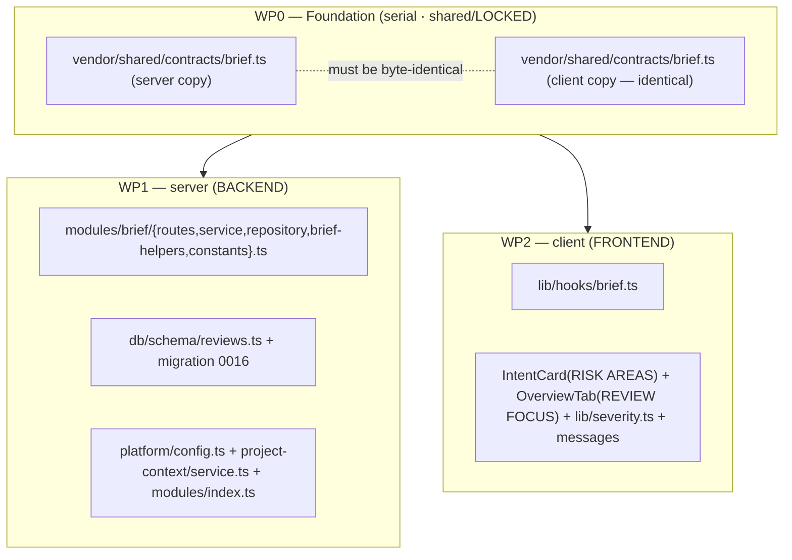

# Implementation Plan — Risk Areas (Why+Risk Brief)
Status: APPROVED · Mode: multi-agent · Plan ID: 2026-07-17-risk-brief · Author: implementation-planner agent

## 1. Context & goal
Reviewers must hand-reconstruct *what* a PR does, *why*, *how risky* it is, and *where to start
reading* — even though every ingredient is already computed by earlier features. This feature adds
a cheap, manual, one-model-call **Risk Brief** that reassembles already-built facts (persisted
intent + blast-radius summary + smart-diff group stats + linked issue + **all** Project-Context doc
bodies, budget-capped) — with **no diff bodies** — into a `RiskBrief { what, why, risk_level,
risks[], review_focus[] }`, caches it per PR in the scaffolded `pr_brief` table, and renders it by
**extending the existing Intent card's RISK AREAS section** plus a new **REVIEW FOCUS** section.
Driving spec: `/workspace/spec/SPEC-02-risk-brief.md` (4 user stories, 19 EARS ACs incl. AC-1a).
"Done" = every AC below is satisfied, `tsc` + both test suites green, and the manual click-path in
§9 shows the brief generating and rendering.

## 1a. Spec coverage
| Spec AC | Covered by | Note |
|---------|-----------|------|
| AC-1  | WP1 | assemble from computed facts; exactly one `completeStructured`; no `+`/`-` hunk lines |
| AC-1a | WP1 | whole-doc-drop budget cap (`riskBriefContextTokenBudget`, default 8000) |
| AC-2  | WP1 | upsert `pr_brief` keyed by `pr_id`; head_sha + receipt columns |
| AC-3  | WP1 | GET returns cached brief with `is_stale` (or null); never generates |
| AC-4  | WP1 | `resolveFeatureModel('risk_brief')`, default `openai/gpt-4.1`, no literal |
| AC-5  | WP1 | model failure surfaces reason; prior `pr_brief` row left byte-unchanged |
| AC-6  | WP1 | one call per generation; zero on GET/render; never background |
| AC-7  | WP1 | degrade on missing intent/issue/docs; `derived_from` provenance names present inputs |
| AC-8  | WP1 | degraded/unindexed blast → still 200, carries blast `summary` degraded marker |
| AC-9  | WP1 | grounding intersect vs known file set; `unresolved_refs[]` on record |
| AC-10 | WP2 | RISK AREAS (risk_level color + collapsible risks) + REVIEW FOCUS ordered links |
| AC-11 | WP2 | high→`var(--crit)`, medium→`var(--warn)`, low→`var(--ok)` via new `riskLevelToken()` |
| AC-12 | WP2 | changed-file `file:line` link → `onOpenFile` reveal in Files-changed |
| AC-13 | WP2 | unresolved / not-in-diff ref → non-clickable text, no `onOpenFile` call |
| AC-14 | WP2 | no brief → RISK AREAS empty state + "Generate brief" CTA; intent chips remain fallback |
| AC-15 | WP2 | in-flight → generating state, control disabled |
| AC-16 | WP2 | `is_stale=true` → "stale — regenerate" badge over cached content |
| AC-17 | WP1 | all author text `wrapUntrusted`-fenced (PR body/title, commits, issue, doc bodies) |
| AC-18 | WP1 | brief routes workspace-scoped; foreign PR id → 404 |

Contract additions (`ReviewFocusItem`, `RiskBrief`, `PrRiskBriefRecord`) are the WP0 enabler that
every AC above depends on; they are not an AC themselves.

## 2. Non-goals
- **Does NOT own** the INTENT card body, the BLAST RADIUS card, or the top PR BRIEF banner (the
  existing agent-review verdict). It only **consumes** intent/blast/smart-diff/issue/project-context
  and **renders into** the Intent card's RISK AREAS block + a new REVIEW FOCUS section.
- No new standalone brief card; no background/auto generation (manual button only; GET null until
  pressed; staleness is a badge, never a trigger).
- No re-computation of intent, blast, smart-diff, or project-context discovery; no new grounding
  engine (does not touch `reviewer-core` `groundFindings()`); no `findings` rows.
- No diff/change bodies in the model input.
- **No migration of an existing shared table** — `pr_brief` is an empty scaffold; new columns are
  additive via a NEW migration only.
- **This plan writes no spec** and edits nothing under any `specs/**` — the spec is input only.
- `PrBrief` (the scaffolded composed contract) is left untouched.

## 3. Architecture impact
- **Packages:** `server` (@devdigest/api), `client` (@devdigest/web), shared Zod contracts
  (`vendor/shared`, both vendored copies). **`reviewer-core` is NOT modified** — `wrapUntrusted`
  already exists and is imported from `@devdigest/reviewer-core`; the brief assembles its own prompt
  in the server exactly as `IntentService` does.
- **Onion layers (server):** new `modules/brief/` with `routes.ts` (HTTP), `service.ts`
  (application), `repository.ts` (infra/Drizzle on `pr_brief`), `brief-helpers.ts` + `constants.ts`
  (pure domain). The service depends inward on ports/`container` and reuses pure mappers/helpers from
  sibling modules (`pulls/blast.ts`, `pulls/smart-diff.ts`, `reviews/intent-helpers.ts`) and the
  `ReviewRepository` + `ProjectContextService`. No adapter is `new`-ed in a module.
- **New vs extended:** new server module `brief`; extended: `db/schema/reviews.ts` (`pr_brief`
  columns), `platform/config.ts` (one budget field), `project-context/service.ts` (one read method),
  `modules/index.ts` (register). Client: new hooks + two new sub-components + extended `IntentCard`
  and `OverviewTab`.



Generation seam (adapted from the spec):

```mermaid
sequenceDiagram
  participant C as Overview (Intent card · RISK AREAS + REVIEW FOCUS)
  participant R as brief routes (server · HTTP)
  participant S as BriefService (server · app ring)
  participant F as intent/blast/smart-diff/issue/project-context facades
  participant L as container.llm (risk_brief model)
  participant DB as pr_brief (cache)
  C->>R: POST /pulls/:id/brief  (regenerate button)
  R->>S: generate(workspaceId, prId)
  S->>F: intent + blast summary + smart-diff stats + issue + context-doc bodies (budget-capped)
  F-->>S: assembled inputs (best-effort; missing → skipped, recorded in derived_from)
  S->>L: 1 completeStructured({ schema: RiskBrief, untrusted-fenced inputs, NO diff bodies })
  L-->>S: RiskBrief + receipt
  S->>S: constrain file_refs / review_focus.file to known file set → unresolved_refs (AC-9)
  S->>DB: upsert pr_brief{ json, head_sha, receipt } (AC-2) · on model error, DO NOT upsert (AC-5)
  S-->>R: PrRiskBriefRecord (is_stale=false)
  R-->>C: RISK AREAS (risk_level color + risks) + REVIEW FOCUS links
```

## 4. Contract changes — SHARED / LOCKED (owned by WP0)
Add to **both** `server/src/vendor/shared/contracts/brief.ts` **and**
`client/src/vendor/shared/contracts/brief.ts` (byte-identical). Reuse the existing `Risk` and
`RiskSeverity` primitives in the same file. **Leave `PrBrief` untouched.** The barrel uses
`export * from './contracts/brief.js'`, so no functional barrel edit is required — only update the
doc-comment enumerations in both `vendor/shared/index.ts` copies to add the three new names (keep
both copies identical).

```ts
/**
 * ReviewFocusItem — the ordered "read this first" unit: a `file:line` plus a one-line reason.
 * `line` is nullish (a whole-file focus is legitimate). NEW.
 */
export const ReviewFocusItem = z.object({
  file: z.string(),
  line: z.number().int().nullish(),
  reason: z.string(),
});
export type ReviewFocusItem = z.infer<typeof ReviewFocusItem>;

/**
 * RiskBrief — the model's structured output, enforced out of band by `completeStructured`.
 * Reuses the existing `Risk` and `RiskSeverity`. Named `RiskBrief` to avoid clashing with the
 * scaffolded composed `PrBrief`. NEW.
 */
export const RiskBrief = z.object({
  what: z.string(),
  why: z.string(),
  risk_level: RiskSeverity,
  risks: z.array(Risk),
  review_focus: z.array(ReviewFocusItem),
});
export type RiskBrief = z.infer<typeof RiskBrief>;

/**
 * PrRiskBriefRecord — the persisted/transport shape, mirroring `PrIntentRecord`. All additions
 * are nullish so the shape stays additive. NEW.
 *   · head_sha + receipt + computed_at come from the row's columns (see §5).
 *   · derived_from names only inputs that were actually present (AC-7 provenance).
 *   · unresolved_refs lists every model-emitted path outside the known file set (AC-9); the client
 *     renders any ref in this list as non-clickable (AC-13).
 *   · is_stale is computed on read against the PR's current head (AC-3).
 */
export const PrRiskBriefRecord = RiskBrief.extend({
  pr_id: z.string(),
  head_sha: z.string().nullish(),
  provider: z.string().nullish(),
  model: z.string().nullish(),
  tokens_in: z.number().int().nullish(),
  tokens_out: z.number().int().nullish(),
  cost_usd: z.number().nullish(),
  computed_at: z.string().nullish(),
  is_stale: z.boolean().nullish(),
  derived_from: z.array(z.string()).nullish(),
  unresolved_refs: z.array(z.string()).nullish(),
});
export type PrRiskBriefRecord = z.infer<typeof PrRiskBriefRecord>;
```

**Marker resolution (head_sha/receipt storage):** new **additive columns** (not inside `json`),
mirroring `pr_intent`. Rationale: consistency with the explicit template, trivial `is_stale`
comparison against a top-level column, uniform cost/observability receipt columns, and a clean
`json` payload holding only the derived content + `derived_from` + `unresolved_refs`.

## 5. Database changes — SHARED / LOCKED (owned by WP1; additive only)
Extend the existing empty `pr_brief` scaffold in `server/src/db/schema/reviews.ts` — the table
currently is `{ prId uuid PK → pull_requests.id ON DELETE cascade, json jsonb NOT NULL }`. Add,
mirroring `pr_intent` (types verified against `pr_intent`):

```
headSha    text('head_sha')
provider   text('provider')
model      text('model')
tokensIn   integer('tokens_in')
tokensOut  integer('tokens_out')
costUsd    real('cost_usd')
computedAt timestamp('computed_at', { withTimezone: true }).defaultNow().notNull()
```

- All new columns except `computed_at` are nullable (no volatile-default table rewrite; the
  `defaultNow()` on a fresh/empty scaffold is safe). No index added — `pr_brief` is read by PK
  (`pr_id`) only, never filtered on these columns.
- `json` stores the derived payload: `{ what, why, risk_level, risks, review_focus, derived_from,
  unresolved_refs }`. `is_stale` is NOT stored (derived on read).
- Generate the migration with `cd server && pnpm db:generate` → produces `0016_<slug>.sql` (a clean
  `ALTER TABLE pr_brief ADD COLUMN …` set) plus its `meta/` snapshot + `_journal.json` entry. **Do
  NOT hand-edit any existing migration.** The schema barrel `db/schema.ts` already re-exports
  `reviews.ts` and `prBrief`, so the barrel is untouched.

## 6. Work packages

### WP0 — Foundation (SERIAL — must complete before WP1 & WP2 start)
- **Surface:** shared → **Skill set:** BACKEND
  - always: onion-architecture (contracts are the ports ring), typescript-expert, security, zod
  - by artifact: fastify-best-practices — N/A (no route); drizzle-orm-patterns — N/A (no query);
    postgresql-table-design — N/A (no schema in this WP)
- **Owns:** `server/src/vendor/shared/contracts/brief.ts`,
  `client/src/vendor/shared/contracts/brief.ts`, `server/src/vendor/shared/index.ts`,
  `client/src/vendor/shared/index.ts` (doc-comment only).
- **Steps:** add `ReviewFocusItem`, `RiskBrief`, `PrRiskBriefRecord` (verbatim §4) to **both**
  brief.ts copies, byte-identical; update the two barrel doc comments. Run `tsc --noEmit` in both
  packages to confirm the new exports resolve.
- **Skill-driven design notes:** reuse `Risk`/`RiskSeverity` (do not re-declare); all record
  additions nullish (`schema-avoid-optional-abuse` weighed — nullish here is deliberate additive
  evolution matching `PrIntentRecord`); `z.infer` for every exported type (`type-use-z-infer`).
- **Acceptance criteria:** both copies identical (`diff` shows no difference); `tsc --noEmit` green
  in server and client. `[new]` (contract enabler).
- **After this lands, all four files above are LOCKED.**

### WP1 — Server: brief module, persistence, assembly, grounding
- **Surface:** server ← selects **BACKEND** skill set.
- **Skill set the implementer must fully cover:**
  - always: onion-architecture, typescript-expert, security, zod → **APPLIED**
  - by artifact: fastify-best-practices (adds two routes) → APPLIED; drizzle-orm-patterns (new
    `pr_brief` upsert/read) → APPLIED; postgresql-table-design (additive columns + migration) →
    APPLIED
- **Owns (globs — disjoint from WP2):**
  - `server/src/modules/brief/**` (new: `routes.ts`, `service.ts`, `repository.ts`,
    `brief-helpers.ts`, `constants.ts`, `brief-helpers.test.ts`, `brief.it.test.ts`)
  - `server/src/modules/index.ts` (register the brief plugin)
  - `server/src/db/schema/reviews.ts` (add `pr_brief` columns)
  - `server/src/db/migrations/0016_*.sql` + `server/src/db/migrations/meta/**` (generated)
  - `server/src/platform/config.ts` (add `riskBriefContextTokenBudget`)
  - `server/src/modules/project-context/service.ts` (+ `service.test.ts`) — add one read method
- **Must NOT touch:** the LOCKED contract/barrel set (WP0); anything under `client/**`;
  `reviewer-core/**`; any existing migration; any `specs/**`.
- **Reuse (existing code, with paths):**
  - `ReviewRepository` (`modules/reviews/repository.ts`): `getPull`, `getPrFiles`, `getPrCommits`,
    `getIntent`/`getIntentRow`, `reviewsForPull`, `getRepo`.
  - `buildBlastRadius` (`modules/pulls/blast.ts`) over `container.repoIntel.getBlastRadius(repoId,
    paths)` — the facade never throws; degraded/unindexed comes back tagged (AC-8).
  - `buildSmartDiff` (`modules/pulls/smart-diff.ts`) over `getPrFiles` + latest review's
    non-dismissed findings (same shaping as `pulls/routes.ts` smart-diff handler).
  - `parseLinkedIssue` + `wrapUntrusted` + `isStale` (`modules/reviews/intent-helpers.ts`);
    `container.github().getIssue(...)` best-effort (mirror `IntentService.readIssue`).
  - `resolveFeatureModel(container, workspaceId, 'risk_brief')` (`modules/settings/feature-models.ts`).
  - `formatIntentReceipt` pattern for the info-level receipt log (write a `formatBriefReceipt` twin).
  - `getContext(container, req)` for workspace scoping (as in `reviews`/`pulls` routes).
  - New `ProjectContextService.collectContextDocBodies(workspaceId, repoId)` (below) — reuses
    `getClonePath` + `walkDocs` (whose `WalkedDoc` already carries `.body`) + `container.tokenizer`;
    returns `{ path, tokens, body }[]` in listing order, uncapped (the brief applies the cap).
- **Steps:**
  1. `constants.ts` — `SYSTEM_PROMPT` (the brief's task: produce what/why/risk_level/risks/
     review_focus from metadata + summaries + context docs, never diff bodies; `<untrusted>` = DATA,
     mirror `IntentService` wording), input caps, `RISK_BRIEF_BUDGET_FALLBACK = 8000`.
  2. `brief-helpers.ts` (PURE — no container/db/fs/network): `assembleBriefInput(sources)` (renders
     each author-controlled rung `wrapUntrusted`-fenced + capped; blast summary, smart-diff group
     stats, intent as fenced text; **asserts no `+`/`-` hunk-body lines are ever emitted**);
     `capContextDocsByBudget(docs, budget)` implementing the whole-doc-drop (include in listing order
     until the next doc would cross `budget`, then drop it and all after — never head-truncate,
     AC-1a); `knownFileSet(prFilePaths, blast)` (PR changed files ∪ blast `changed_symbols[].file` ∪
     endpoints); `groundRefs(brief, knownSet)` → `unresolved_refs[]` (every `risks[].file_refs` and
     `review_focus[].file` not in the set); `deriveBriefProvenance(sources)` (AC-7 `derived_from`);
     `toRecord(row, prHeadSha)` (json + columns → `PrRiskBriefRecord`, `is_stale = isStale(...)`).
  3. `repository.ts` — `BriefRepository(db)`: `getBriefRow(prId)`; `upsertBrief(prId, payload,
     receipt)` via `insert(...).onConflictDoUpdate({ target: prBrief.prId, set: {...} })` (single
     upsert keyed by PK — last-write-wins, no duplicate row per the accepted concurrency posture).
  4. `service.ts` — `BriefService(container)` constructs `BriefRepository` + `ReviewRepository`:
     - `get(workspaceId, prId)`: `getPull` → `undefined` (PR not in ws) vs `null` (no row) vs record.
     - `generate(workspaceId, prId, onProgress?, logger?)`: gather (best-effort, missing→skipped),
       cap docs, assemble, `resolveFeatureModel('risk_brief')`, **exactly one**
       `llm.completeStructured({ schema: RiskBrief, schemaName: 'RiskBrief', temperature: 0 })`,
       ground refs, log receipt, **then** `upsertBrief`. On model error: surface the reason and
       return without upserting (AC-5) — the prior row stays byte-unchanged.
  5. `routes.ts` — default Fastify plugin, schema-first Zod (`fastify-type-provider-zod`):
     `GET /pulls/:id/brief` → `PrRiskBriefRecord.nullable()` (404 when `get` is `undefined`); zero
     model calls. `POST /pulls/:id/brief` → optional `{ scan_id? }` body, `config.rateLimit { max:10,
     timeWindow:'1 minute' }` (same as intent), optional SSE progress via `container.runBus` mirroring
     the intent POST's try/catch/finally. Both call `getContext` for workspace scope (AC-18).
  6. `modules/index.ts` — import + register `briefRoutes` (static registry; no container wiring —
     `BriefService` is `new`-ed in the route like `IntentService`).
  7. `db/schema/reviews.ts` columns (§5) → `pnpm db:generate` → migration 0016 (+meta).
  8. `platform/config.ts` — add `riskBriefContextTokenBudget: number` to `AppConfig` and its builder
     (default 8000, independent of `projectContextTokenBudget`). **Marker resolution (AC-1a budget):**
     a dedicated knob — the project-context budget is an editor affordance for the attachment set;
     the brief's is a model-input cap. Same starting value (8000), separate so tuning one never
     silently moves the other.
  9. `project-context/service.ts` — add `collectContextDocBodies(...)` (above) + a unit test.
- **Skill-driven design notes:**
  - onion: `service.ts` never imports Drizzle/postgres/SDKs directly (goes through repositories +
    `container` ports); `routes.ts` touches no DB/SDK; fs stays in project-context's infra ring. The
    dependency-cruiser ruleset is ring-based, not module-boundary-based (verified in
    `assets/onion.dependency-cruiser.cjs`) — cross-module imports of pure mappers/helpers are
    already precedented (`project-context/service.ts` imports `reviews/intent-helpers`), so importing
    `buildBlastRadius`/`buildSmartDiff` is legal.
  - drizzle: upsert via `onConflictDoUpdate` on the PK; set only changed columns; use `$inferSelect`
    row types; no raw SQL.
  - postgresql-table-design: `timestamptz` (not `timestamp`), `text`/`integer`/`real` matching
    `pr_intent`; nullable additions avoid a table rewrite; no index (PK-only access path).
  - zod/security: the `RiskBrief` schema is the out-of-band structured-output contract (never
    described in prose); every author-controllable rung is `wrapUntrusted`-fenced (AC-17); the model
    input carries **no diff bodies** (AC-1); the issue read is best-effort and never fetches an
    attacker URL (reuse `parseLinkedIssue`, not URL fetching). `cost_usd` is the provider-reported
    value only (never re-derived).
- **Tests to add:**
  - `brief-helpers.test.ts` (unit, no DB): whole-doc-drop budget boundary (docs 1..k-1 present,
    k..n absent, none truncated — AC-1a); grounding intersect marks `C` unresolved given `{A,B}`
    (AC-9); provenance names only present inputs (AC-7); assembled input contains no `+`/`-` line and
    shows `<untrusted…>` fences (AC-1/AC-17).
  - `brief.it.test.ts` (**DB-backed** — MUST use `.it.test.ts`): POST generates + upserts one row
    with non-null `head_sha` + receipt; two POSTs keep row count 1 (AC-2); GET null→record→
    `is_stale` flips after head move (AC-3); forced mock-LLM error keeps the prior row byte-unchanged
    (AC-5); a PR with no intent/issue/docs still returns a brief with a truthful `derived_from`
    (AC-7); unindexed repo returns 200 (AC-8); foreign-workspace PR id → 404 (AC-18). Inject the mock
    LLM via `ContainerOverrides` (`src/adapters/mocks.ts`).
- **Acceptance criteria (each independently checkable):** AC-1, AC-1a, AC-2, AC-3, AC-4, AC-5, AC-6,
  AC-7, AC-8, AC-9, AC-17, AC-18 (tags as in §1a).
- **Depends on:** WP0.

### WP2 — Client: RISK AREAS extension + REVIEW FOCUS section + hooks
- **Surface:** client ← selects **FRONTEND** skill set.
- **Skill set the implementer must fully cover:**
  - always: frontend-ui-architecture, react-best-practices, typescript-expert, security,
    react-testing-library → **APPLIED**
  - by artifact: next-best-practices → N/A (no new route/page/metadata; extends existing colocated
    components); zod → N/A (consumes the WP0 contract, declares no schema)
- **Owns (globs — disjoint from WP1):**
  - `client/src/lib/hooks/brief.ts` (new)
  - `client/src/app/repos/[repoId]/pulls/[number]/_components/IntentCard/**` (extend RISK AREAS; add
    nested `_components/RiskAreas/`)
  - `client/src/app/repos/[repoId]/pulls/[number]/_components/OverviewTab/**` (wire hooks; add nested
    `_components/ReviewFocus/`)
  - `client/src/lib/severity.ts` (add `riskLevelToken`)
  - `client/messages/en/brief.json` (add keys)
- **Must NOT touch:** the LOCKED contract/barrel set (WP0); anything under `server/**`; any other
  route's `_components/`; `vendor/ui/**` (import from the `@devdigest/ui` barrel only).
- **Reuse (existing code, with paths):**
  - `useIntent`/`useComputeIntent` (`lib/hooks/intent.ts`) as the exact template for
    `useBrief`/`useGenerateBrief` (`api.get`/`api.post`, `setQueryData` on success).
  - `onOpenFile` threaded through `OverviewTab` (already a prop; reveals a CHANGED file in the
    Files-changed tab) — reuse for AC-12 links.
  - `IntentCard` presentational split + `useTranslations("brief")` + `@devdigest/ui` primitives
    (`Badge`, `Button`, `Icon`, `SectionLabel`, `EmptyState`, `Card`) + `styles.ts` idiom.
  - `sevToken()` pattern in `lib/severity.ts` (guarded own-property lookup) as the template for the
    new `riskLevelToken`.
  - `PrIntentRecord`/`PrRiskBriefRecord`/`RiskSeverity` from `@devdigest/shared`.
- **Steps:**
  1. `lib/hooks/brief.ts` — `useBrief(prId)` (`GET /pulls/:id/brief` → `PrRiskBriefRecord | null`,
     `enabled: !!prId`) and `useGenerateBrief(prId)` (`POST`, `onSuccess: qc.setQueryData`). Zero
     model calls on view (AC-6 client side).
  2. `lib/severity.ts` — add `riskLevelToken(level: RiskSeverity)` mapping **high→`var(--crit)`,
     medium→`var(--warn)`, low→`var(--ok)`**, own-property-guarded like `sevToken`, with a muted
     fallback. **Marker resolution (AC-11 tokens):** these are the existing design-system CSS-var
     tokens already used in the app (`--crit`, `--warn`, `--ok`); do NOT route through `sevToken()`
     — its key domain is the UI `Severity` (CRITICAL/WARNING/SUGGESTION/INFO), not RiskSeverity
     (high/medium/low). The implementer verifies these three token names exist in
     `vendor/ui/primitives/tokens.ts` and adjusts to the nearest defined token if any is absent.
  3. `IntentCard/_components/RiskAreas/RiskAreas.tsx` — the RISK AREAS section body (presentational):
     - brief present → `risk_level` color indicator (`riskLevelToken`) + `risks[]` as collapsible
       rows (severity icon + title + `file:line` link); a stale badge over content when
       `is_stale` (AC-16).
     - a `file:line` renders as a real link → `onOpenFile(file)` only when `file` is NOT in
       `record.unresolved_refs`; otherwise plain text with a subtle "not in this diff" affordance and
       **no** `onOpenFile` call (AC-13).
     - no brief → `EmptyState` + "Generate brief" CTA (AC-14), with the existing intent
       `risk_areas` chips kept as fallback content; while generating → disabled control + progress
       (AC-15).
  4. `IntentCard.tsx` — thread new optional props (`brief`, `onGenerateBrief`, `generatingBrief`,
     `onOpenFile`) and render `<RiskAreas/>` in place of the current chip-only RISK AREAS block; keep
     the intent sentence + in/out-scope untouched (feature does not own them).
  5. `OverviewTab/_components/ReviewFocus/ReviewFocus.tsx` — full-width section below the grid,
     `SectionLabel` "REVIEW FOCUS — READ THESE FIRST" + count, ordered list of `review_focus[]`
     `file:line` links each with its one-line reason; same clickable/unresolved logic as (3)
     (AC-10, AC-12, AC-13).
  6. `OverviewTab.tsx` — call `useBrief`/`useGenerateBrief`; pass brief props + `onOpenFile` into
     `IntentCard`; render `<ReviewFocus/>` when a brief exists.
  7. `messages/en/brief.json` — add keys under a `riskBrief` (or extend `intent`) namespace:
     RISK AREAS empty/CTA (`generate`, `generating`), REVIEW FOCUS title, stale badge + hint,
     "not in this diff" affordance, risk-level labels. (Only the `en` locale exists.)
- **Skill-driven design notes:**
  - frontend-ui-architecture: every fetch is a `lib/hooks/*` TanStack hook; components stay
    presentational (`OverviewTab` owns the hooks); new logic is colocated in nested `_components/`
    folders (anatomy: `Component.tsx` + `Component.test.tsx` + `styles.ts`/`helpers.ts` only when
    non-trivial); `riskLevelToken` promoted to `lib/severity.ts` (a second severity-color consumer)
    rather than copied — the client INSIGHTS "never copy a severity map" lesson.
  - react-best-practices: derive `stale`/`risks`/clickability during render (never mirror into
    state); stable list keys; the collapsible risk row is `useState`-local, not lifted.
  - security: brief text (`what`/`why`/risk titles/reasons) is LLM-authored from untrusted input —
    render as escaped JSX text, never `dangerouslySetInnerHTML`; never turn an `unresolved_ref` into
    a live link (A05/XSS + dead-link avoidance).
- **Tests to add (colocated `*.test.tsx`, jsdom + RTL, `fetch` mocked — the house convention; these
  sub-components are presentational, tested via props):**
  - `RiskAreas.test.tsx`: brief with `risk_level=high` + 3 risks renders the high color + 3
    collapsible rows; a changed-file link calls `onOpenFile` (AC-12); an `unresolved_refs` entry
    renders as plain text and does NOT call `onOpenFile` (AC-13); no brief → "Generate brief" CTA and
    intent chips still shown (AC-14); generating → control disabled (AC-15); `is_stale` → stale badge
    (AC-16). Query by role/label/text (never test IDs).
  - `ReviewFocus.test.tsx`: 4 focus items → 4 ordered links with reasons (AC-10); changed vs
    unresolved link behavior (AC-12/AC-13).
  - Extend `IntentCard.test.tsx`/`OverviewTab` coverage for the new wiring if the existing tests
    assert card structure.
- **Acceptance criteria:** AC-10, AC-11, AC-12, AC-13, AC-14, AC-15, AC-16 (tags as in §1a).
- **Depends on:** WP0.

## 7. Contention files — each assigned to exactly ONE WP
| File | Owner |
|------|-------|
| `server/src/vendor/shared/contracts/brief.ts` | WP0 |
| `client/src/vendor/shared/contracts/brief.ts` | WP0 |
| `server/src/vendor/shared/index.ts` | WP0 |
| `client/src/vendor/shared/index.ts` | WP0 |
| `server/src/modules/index.ts` | WP1 |
| `server/src/db/schema/reviews.ts` | WP1 |
| `server/src/db/migrations/**` (0016 + meta) | WP1 |
| `server/src/platform/config.ts` | WP1 |
| `server/src/modules/project-context/service.ts` | WP1 |
| `client/src/lib/severity.ts` | WP2 |
| `client/messages/en/brief.json` | WP2 |

`platform/container.ts`, `client/src/lib/api.ts`, and `vendor/ui/index.ts` are **not** touched
(`BriefService` is `new`-ed in the route like `IntentService`; `api.get`/`api.post` already exist;
UI primitives come from the existing `@devdigest/ui` barrel). `modules/index.ts`, the schema, the
migration, and `config.ts` are server-only → assigned to WP1 (no client contention), so WP0 stays
purely the cross-copy contract.

## 8. Sequencing
`WP0 (serial)` → `{ WP1 ∥ WP2 }` → manual smoke (§9). WP1 and WP2 share no owned path and depend
only on the WP0 contract, so they run fully in parallel.

## 9. Verification (end-to-end, runnable)
```
# after WP1 lands the schema + migration:
cd server && pnpm db:migrate
cd server && node_modules/.bin/tsc --noEmit
cd server && node_modules/.bin/vitest run --exclude '**/*.it.test.ts'   # unit
cd server && node_modules/.bin/vitest run .it.test                      # DB-backed (real Postgres)
# arch boundary check (advisory — read the brief module's diff, not just the baseline count):
cd server && pnpm exec depcruise --config ../.claude/skills/onion-architecture/assets/onion.dependency-cruiser.cjs src

cd client && node_modules/.bin/tsc --noEmit
cd client && node_modules/.bin/vitest run

# manual click-path (proves the feature):
./scripts/dev.sh
#  1. open a PR Overview → RISK AREAS shows the empty state + "Generate brief" CTA; intent chips
#     still render (AC-14). No model call fires on load (AC-6).
#  2. click Generate → control disables + progress (AC-15); after it resolves, RISK AREAS shows the
#     risk_level color + collapsible risks, and REVIEW FOCUS lists ordered file:line links (AC-10).
#  3. click a changed-file focus link → Files-changed tab reveals that file at the line (AC-12);
#     an unresolved ref is plain text and does nothing (AC-13).
#  4. move the PR head (or simulate) → reload → "stale — regenerate" badge over cached content
#     (AC-3/AC-16); regenerate updates it.
```

## 10. Risks & open questions
**Module INSIGHTS — top relevant points (read before building):**
- server: *"NEVER dedupe a billable job against the RESULT table alone."* The brief is **manual-only**
  (no auto-fill job), which sidesteps the check-then-act billing trap — keep it manual; do not add a
  background enqueue. (server/INSIGHTS 2026-07-13)
- server: *"A dependency-cruiser baseline is an ALIBI, not evidence"* — depcruise reasons at
  module-edge granularity and stayed green when Smart Diff queried another module's table from
  `routes.ts`. Have a human read the brief module's diff for onion violations, not just the
  green-vs-baseline count. (server/INSIGHTS 2026-07-13)
- server: *"THE CLONE IS SHALLOW (`CLONE_DEPTH=1`)."* The brief reads **project-context doc bodies off
  the clone**, which is fine (working tree exists), but it must NOT rely on `git log`/history — it
  doesn't, and shouldn't start. (server/INSIGHTS 2026-07-14)
- client: *"DO NOT deep-link a blast-radius CALLER into Files-changed — its file is not in the diff."*
  The brief's links are to the PR's **changed** files (grounded to the known set), so `onOpenFile` is
  correct here — but any ref outside the changed set must be non-clickable (AC-13), never wired to
  `onOpenFile`. (client/INSIGHTS 2026-07-14)
- client: *"Duplicating a severity constant to dodge an import buys time, not safety."* Put
  `riskLevelToken` in `lib/severity.ts`, never a copied inline map. (client/INSIGHTS 2026-07-13)

**What could go wrong / watch-list:**
- **Grounding source of truth:** the client trusts `record.unresolved_refs` (server-authoritative) so
  it needs no changed-file list of its own; if that list is empty/absent, treat all refs as
  resolvable-by-name only if present in the record — keep the server the single grounding authority.
- **`buildSmartDiff` input:** feed only group/role/path/additions/deletions stats — do not pass
  `pseudocode_summary`/patch text if it risks smuggling hunk bodies into the model input (AC-1). The
  helper test asserts no `+`/`-` lines.
- **Feature-model default drift:** `risk_brief` default is `openai/gpt-4.1` (confirmed in
  `contracts/platform.ts`); the frontier model means p95 latency is parked (spec) — surface progress,
  don't tighten a timeout that the model controls.

**Open questions (judgment calls I locked; what would change them):**
- **what/why on-screen placement (AC marker):** locked **data-only** for v1 — `what`/`why` are
  produced, persisted, and returned on the record but NOT rendered as a distinct line, because the
  target screenshot shows only the intent sentence + RISK AREAS + REVIEW FOCUS and a second paraphrase
  would duplicate the intent sentence. No contract or server-AC impact. Change trigger: if design
  wants `why` surfaced (e.g. as a tooltip on the risk_level indicator or a one-liner above the risks),
  that is an additive WP2 render with the data already present.
- **Budget value (AC-1a):** locked **dedicated `riskBriefContextTokenBudget`, default 8000**. Change
  trigger: if the team prefers one knob, point it at `projectContextTokenBudget` instead — the
  whole-drop behavior is identical.
- **Color tokens (AC-11):** locked **high→`--crit`, medium→`--warn`, low→`--ok`**. Change trigger:
  design pins different token names — swap the three values in `riskLevelToken`.
