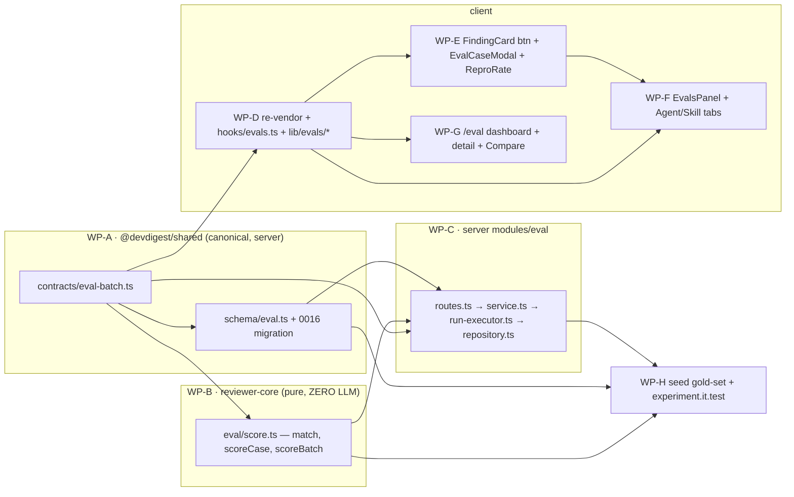

# Implementation Plan — Eval Pipeline (regression protection for reviewer agents, L06)
Status: DRAFT · Mode: multi-agent · Plan ID: 2026-07-19-eval-pipeline · Author: implementation-planner agent

Drives: `spec/SPEC-03-eval-pipeline.md` (AC-1…AC-29) · grounded in the approved architecture
plan `wild-sleeping-marshmallow`. This plan **plans against** the spec — it does not write,
edit, or extend any file under `spec/**` or a module `specs/**`.

## 1. Context & goal

Make review quality **regression-testable**. Today, editing an agent's system prompt gives no
signal of better/worse, and the LLM is non-deterministic so one run proves nothing. This feature
turns an accepted/dismissed finding into a saved **eval case**, runs it repeatedly, and reports a
**reproduction rate** plus recall/precision/citation_accuracy from a **deterministic, zero-LLM
scorer** living in pure `reviewer-core`. It ships a **Skills → Evals** tab, an **agents-only Eval
Dashboard** with run-vs-run Compare + Promote, and a **synthetic gold-set seed** whose metrics are
real scorer output computed at seed time — so the whole demo runs on a **fresh DB with no API key**.
"Done" = the reviewer's 5-step demo script (spec §Diagrams) runs green with no key, and the
live-provider experiment (gated on `OPENROUTER_API_KEY`) shows recall/precision moving when a prompt
is ruined.

## 1a. Spec coverage

Every AC-N is placed on a WP. `†` = covered but observable **only with a live provider key**
(demo path exercises the degraded/seeded branch instead — see Non-goals + §10).

| Spec AC | Covered by | Note |
|---------|-----------|------|
| AC-1 | WP-E (+WP-D hooks) | modal seeded from `usePullDetail`; accepted→`must_find`, dismissed→`must_not_flag` |
| AC-2 | WP-C (+WP-E caller) | `POST /eval/cases` persists `owner_id = review.agent_id`, `expected_output` |
| AC-3 | WP-E (+WP-C guard) | button disabled/hidden when `ReviewRecord.agent_id` is null |
| AC-4 | WP-E | invalid-JSON badge + Save disabled + "+ Finding skeleton" |
| AC-5 | WP-E (+WP-C run) | "Run on save" runs once; positive run-result appears `†` (toggle-off + disabled paths demo-safe) |
| AC-6 | WP-B (+WP-C it.test) | scorer zero-LLM; `mock.calls(completeStructured).length === K` |
| AC-7 | WP-B | `match(f,e)`: same file + closed-range overlap; full-file kinds match on file alone |
| AC-8 | WP-B | recall = matched must_find / total must_find (1 when none) |
| AC-9 | WP-B | precision = TP/(TP+FP) per must_find / must_not_flag semantics |
| AC-10 | WP-B (+WP-C wiring) | citation_accuracy = grounded / (grounded + `ReviewOutcome.dropped`) |
| AC-11 | WP-B | pass iff no must_find missing AND nothing on a forbidden region |
| AC-12 | WP-H | `†` live experiment: silence→recall↓, over-flag→precision↓ |
| AC-13 | WP-C | `POST /eval/cases/:id/run {times}` → N `eval_runs`, `batch_id` null, `agent_version` pinned |
| AC-14 | WP-D (+WP-C endpoint, +WP-E/F badge) | `reproRate(runs,5)` reliable iff ratio ≥ 0.8 |
| AC-15 | WP-C | repro window filtered to the pinned `agent_version` only |
| AC-16 | WP-H | ≥8 cases, both expectation kinds present |
| AC-17 | WP-H | ≥1 stable (5/5) + ≥1 flaky (~2/5) via seeded runs |
| AC-18 | WP-F | SkillEditor Evals tab renders shared `EvalsPanel` (`allowFromFinding=false`, no dashboard link) |
| AC-19 | WP-C | skill case → `EVAL_SKILL_HOST_PROMPT` + workspace-default provider/model, only skill body, pin `skill.version` |
| AC-20 | WP-C (+WP-G) | `GET /eval/dashboard` agents-only; `/eval` shows no skill rows |
| AC-21 | WP-C (+WP-G) | all-agents dashboard + per-agent detail trend from `eval_batches` |
| AC-22 | WP-C | run-all → exactly one `eval_batches` row (one trend point) per agent |
| AC-23 | WP-G (+WP-C compare) | select exactly 2 → Compare; deltas + `PromptDiffPanel` via `lineDiff` |
| AC-24 | WP-C (+WP-G) | Promote → `container.agentsRepo.update` (single version-snapshot path) |
| AC-25 | WP-C | eval `ReviewInput` carries no callers/repoMap/intent (repo_intel OFF) |
| AC-26 | WP-H | fresh DB no key: ≥8 cases, ≥3 batches, 3–7 versions; metrics = `scoreBatch()` at seed time |
| AC-27 | WP-E, WP-F, WP-G | each client surface renders seeded data + degrades live affordances, non-throwing |
| AC-28 | WP-D | client re-vendor: add `eval-batch.ts`, refresh stale `knowledge.ts` + `eval-ci.ts`; copies byte-agree |
| AC-29 | WP-C (+WP-G chip) | `?from&to` filter on per-agent dashboard/batches, default last 30 days |

No AC is deferred. Distributed ACs (AC-27 across three client WPs) name a primary owner per surface
in that WP's acceptance criteria.

## 2. Non-goals

- **The scorer never calls an LLM.** The only model call in the pipeline is the one review per case
  by the existing `reviewPullRequest`. This is a hard invariant with a call-count observable (AC-6).
- **No change to shared/pre-existing DB tables or their migrations.** Only a **new** `eval_batches`
  table + **additive nullable** `eval_runs.batch_id` / `eval_runs.agent_version`, via a **new**
  `0016_*` migration. `0000_init.sql` and every prior migration stay byte-untouched.
- **No new review engine.** Eval reuses `reviewPullRequest` unchanged.
- **Eval Dashboard never lists skills** (AC-20). Skill evals live only in the SkillEditor Evals tab.
- **Not CI/gate** (that is `eval-ci.ts`, out of scope). This is interactive eval-authoring +
  reproducibility + dashboard.
- **Live-provider correctness/latency is out of demo scope** — wired (AC-12/AC-5 `†`), not required.
- **This plan writes no spec.** It does not create or edit anything under `spec/**` or `*/specs/**`.

## 3. Architecture impact

Packages touched: **server** (`@devdigest/api`), **reviewer-core** (pure), **client**
(`@devdigest/web`). Onion layers: a new pure core module (`reviewer-core/src/eval/`), a new server
module `modules/eval/` (routes→service→run-executor→repository), and the client surfaces. New server
module + registry entry; extended DB schema (new table + additive columns); new shared contract file
re-vendored to the client. `reviewer-core` stays pure (scorer takes no LLM/DB). Promote and
version-config loading go through the sanctioned `container.agentsRepo` facade — **no** module→module
import (verified: `reviews/run-executor.ts` and `reviews/service.ts` already consume
`container.agentsRepo`; `container.ts:95`).



## 4. Contract changes — SHARED / LOCKED  (owned by WP-A)

New file **`server/src/vendor/shared/contracts/eval-batch.ts`** (extend; do **not** edit
`eval-ci.ts` or `knowledge.ts`). Exported from the server barrel
`server/src/vendor/shared/index.ts`. **No other WP edits these server files.** The **client** copy is
produced by WP-D (§AC-28) and must end byte-identical. Verbatim shape (grounded on existing
`EvalCase`, `EvalRun`, `EvalRunRecord`, `EvalRunResult`, `EvalOwnerKind` in `knowledge.ts`/`eval-ci.ts`,
and `Severity`/`FindingCategory` in `findings.ts`):

```ts
import { z } from 'zod';
import { Severity, FindingCategory } from './findings.js';
import { EvalCase, EvalOwnerKind, EvalRun } from './knowledge.js';
import { EvalRunRecord, EvalRunResult } from './eval-ci.js';

/** One expected finding the scorer matches a produced finding against. */
export const EvalExpectedFinding = z.object({
  kind: z.enum(['must_find', 'must_not_flag']),
  file: z.string(),
  start_line: z.number().int(),
  end_line: z.number().int(),
  severity: Severity.nullish(),
  category: FindingCategory.nullish(),
  note: z.string().nullish(),
});
export type EvalExpectedFinding = z.infer<typeof EvalExpectedFinding>;

/** Stored in eval_cases.expected_output (was z.unknown()); written by the modal, read by the scorer. */
export const EvalExpectedOutput = z.object({
  expectations: z.array(EvalExpectedFinding),
});
export type EvalExpectedOutput = z.infer<typeof EvalExpectedOutput>;

/** Mirrors the NEW eval_batches row; one per run-all = one trend point. */
export const EvalBatch = z.object({
  id: z.string(),
  workspace_id: z.string(),
  owner_kind: EvalOwnerKind,
  owner_id: z.string(),
  agent_version: z.number().int().nullable(),
  ran_at: z.string(),
  recall: z.number(),
  precision: z.number(),
  citation_accuracy: z.number(),
  pass_rate: z.number(),
  traces_passed: z.number().int(),
  traces_total: z.number().int(),
  cases_total: z.number().int(),
  cost_usd: z.number().nullable(),
  duration_ms: z.number().int().nullable(),
});
export type EvalBatch = z.infer<typeof EvalBatch>;

/** Reproduction rate over the last N runs of the pinned version. Reliable iff ratio >= 0.8. */
export const EvalReproducibility = z.object({
  passed: z.number().int(),
  total: z.number().int(),
  ratio: z.number(),
  reliable: z.boolean(),
});
export type EvalReproducibility = z.infer<typeof EvalReproducibility>;

/** A case-list row: the case + its last run + repro summary, so rows render without N extra fetches. */
export const EvalCaseWithRuns = EvalCase.extend({
  last_run: EvalRunRecord.nullish(),
  repro: EvalReproducibility.nullish(),
});
export type EvalCaseWithRuns = z.infer<typeof EvalCaseWithRuns>;

/** Run-vs-run compare: two batches + deltas + each version's resolved system prompt. */
export const EvalCompare = z.object({
  base: EvalBatch,
  head: EvalBatch,
  delta: z.object({
    recall: z.number(),
    precision: z.number(),
    citation_accuracy: z.number(),
    pass_rate: z.number(),
  }),
  base_prompt: z.string(),
  head_prompt: z.string(),
});
export type EvalCompare = z.infer<typeof EvalCompare>;

/** Per-owner run-all result (one batch + the per-case runs). */
export const EvalRunAllResult = z.object({
  batch: EvalBatch,
  runs: z.array(EvalRunResult),
});
export type EvalRunAllResult = z.infer<typeof EvalRunAllResult>;

/** Whole-dashboard run-all result. */
export const EvalDashboardRunAllResult = z.object({
  batches: z.array(EvalBatch),
});
export type EvalDashboardRunAllResult = z.infer<typeof EvalDashboardRunAllResult>;

/** One agent row on the all-agents dashboard. */
export const EvalDashboardRow = z.object({
  owner_id: z.string(),
  name: z.string(),
  model: z.string().nullable(),
  agent_version: z.number().int().nullable(),
  cases_total: z.number().int(),
  last_batch: EvalBatch.nullish(),
  sparkline: z.array(z.number()),
});
export type EvalDashboardRow = z.infer<typeof EvalDashboardRow>;

/** The whole-workspace (agents-only) dashboard aggregate. */
export const EvalAgentDashboard = z.object({
  agents: z.array(EvalDashboardRow),
  recent_batches: z.array(EvalBatch),
});
export type EvalAgentDashboard = z.infer<typeof EvalAgentDashboard>;
```

Reused unchanged (do not redefine): `EvalCase`, `EvalRun`, `EvalRunRecord`, `EvalRunResult`,
`EvalOwnerKind`, `EvalTrendPoint`, `EvalDashboard` (per-agent detail), `Finding`, `FindingRecord`,
`ReviewRecord` (`agent_id` nullable, `review-api.ts:26`), `Agent`, `AgentVersion` /
`AgentVersionConfig` (`knowledge.ts:255,267`).

Skill-host constant note: `EVAL_SKILL_HOST_PROMPT` (AC-19) is **not** a contract — it is a
server-side constant owned by WP-C (`modules/eval/constants.ts`). The single name is
`EVAL_SKILL_HOST_PROMPT`; the plan's old `EVAL_HOST_SYSTEM_PROMPT` is dropped (spec Open questions).

## 5. Database changes — SHARED / LOCKED  (owned by WP-A)

Edit `server/src/db/schema/eval.ts` (add the table + two columns) and the schema barrel
`server/src/db/schema.ts` (import + add to the `schema` object), then run `cd server && pnpm
db:generate` (drizzle-kit) to emit **`server/src/db/migrations/0016_*.sql`** + its
`meta/0016_snapshot.json` + `_journal.json` entry. **Do not hand-write the SQL** (server INSIGHTS
2026-07-12: a hand-written migration leaves the snapshot stale and the next generate double-ALTERs).
No existing migration is edited (verify additivity: `git diff -U0 -- server/src/db/schema/eval.ts`
shows only additions; the migration is `CREATE TABLE eval_batches` + two `ALTER TABLE eval_runs ADD
COLUMN`, zero drops/alters of existing columns).

- **New table `eval_batches`**: `id uuid pk default random`, `workspace_id uuid not null → workspaces
  (onDelete cascade)`, `owner_kind text {enum skill|agent} not null`, `owner_id uuid not null`,
  `agent_version integer` (nullable), `ran_at timestamptz not null default now`, `recall`, `precision`,
  `citation_accuracy`, `pass_rate`, `cost_usd` (`doublePrecision`, nullable as appropriate),
  `traces_passed integer`, `traces_total integer`, `cases_total integer`, `duration_ms integer`.
- **`eval_runs.batch_id`** `uuid` **nullable** `→ eval_batches(id)` (ad-hoc "Run N×" rows have none).
- **`eval_runs.agent_version`** `integer` **nullable** (the pinned version the run was measured on).

Skill-driven design notes (`postgresql-table-design` + `drizzle-orm-patterns`): follow the existing
`eval.ts` idioms exactly — `timestamp('ran_at', { withTimezone: true }).defaultNow().notNull()` (do
**not** use a `created_at`-hardcoding `now()` helper; server INSIGHTS 2026-07-12), `doublePrecision`
for metrics (mirrors `eval_runs`), `text('owner_kind', { enum: [...] })`. Add a composite index for
the reproducibility window read `(case_id, agent_version, ran_at desc)` on `eval_runs` and a
`(owner_kind, owner_id, ran_at)` index on `eval_batches` for the date-range/trend reads — both are
new-object additions, not edits to shared indexes.

## 6. Work packages

### WP-A — Foundation: contracts + schema + migration  (SERIAL — must complete before all others)
- **Surface**: shared → **BACKEND** skill set.
- **Skill set the implementer must fully cover**:
  - always: `onion-architecture`, `typescript-expert`, `security`, `zod`
  - by artifact: `postgresql-table-design` (new table + columns), `drizzle-orm-patterns` (schema +
    generated migration); `fastify-best-practices` **N/A** (no route here).
- **Owns** (globs, disjoint): `server/src/vendor/shared/contracts/eval-batch.ts` (new),
  `server/src/vendor/shared/index.ts` (barrel — add one `export *`), `server/src/db/schema/eval.ts`,
  `server/src/db/schema.ts` (barrel — import + `schema` object entry),
  `server/src/db/migrations/0016_*.sql` + `server/src/db/migrations/meta/**` (generated).
- **Must NOT touch**: `client/src/vendor/shared/**` (WP-D), `eval-ci.ts`/`knowledge.ts` (reuse-only),
  any prior migration, any other WP's Owns.
- Reuse: existing `eval.ts` column idioms; `EvalCase`/`EvalRun`/`EvalRunRecord`/`EvalRunResult`/
  `EvalOwnerKind` for the contract imports.
- Steps: (1) author `eval-batch.ts` exactly as §4; (2) add the barrel export; (3) extend
  `schema/eval.ts` + the schema barrel per §5; (4) `pnpm db:generate` → commit the 0016 SQL + meta;
  (5) re-run `pnpm db:generate` and confirm "No schema changes" (consistency check).
- Skill-driven design notes: `zod` — export schema **and** inferred type for every new contract
  (`type-export-schemas-and-types`); use `.nullish()` not bare `.optional()` for wire-nullable
  fields to match the codebase's serialization posture. `onion-architecture` — contracts are the
  ports ring; no I/O here.
- Tests to add: `server/test/contracts.test.ts` gains parse assertions for the new shapes if that
  file is a shared contract smoke (append only — do not restructure it); a pure
  `EvalExpectedOutput.safeParse` round-trip is enough. No `.it.test.ts` (no DB behaviour yet).
- Acceptance criteria: `cd server && pnpm typecheck` green; `pnpm db:generate` is idempotent (2nd run
  = no changes); the migration diff is CREATE-TABLE + two ADD-COLUMN only. Unblocks every WP. `[new]`
  (enabling; the AC-N coverage lands in the consuming WPs, esp. AC-28 client half in WP-D).
- Depends on: none.

### WP-B — Pure scorer  (reviewer-core, ZERO LLM)
- **Surface**: reviewer-core → **BACKEND (pure-core variant)**.
- **Skill set**: always `onion-architecture`, `typescript-expert`, `security`, `zod`;
  `fastify-best-practices` **N/A** (no HTTP), `drizzle-orm-patterns`/`postgresql-table-design`
  **N/A** (no DB). Purity is the contract.
- **Owns**: `reviewer-core/src/eval/score.ts` (new), `reviewer-core/src/eval/*.test.ts`,
  `reviewer-core/src/index.ts` (barrel — add the eval exports).
- **Must NOT touch**: anything under `server/**` or `client/**`; grounding.ts/run.ts (reuse-only).
- Reuse: `Finding` type (`@devdigest/shared`); `EvalExpectedFinding`/`EvalExpectedOutput` from WP-A;
  the full-file-kinds set concept + closed-range-overlap logic from `grounding.ts` (`rangeIntersects`,
  `FULL_FILE_KINDS = {secret_leak, lethal_trifecta, phantom, hook}`) — mirror it, do not import
  server code.
- Steps: implement (1) `match(f, e)` — `f.file === e.file` AND closed `[start_line,end_line]` overlap;
  full-file expectation kinds match on file alone; (2) `scoreCase(expectations, grounded,
  producedCount)` → `{ recall, precision, citationAccuracy, pass, counts }` per AC-8/9/10/11
  (recall defaults 1 when no `must_find`; must_not_flag FP = grounded finding on a forbidden region;
  must_find FP = grounded finding matching no expectation; `citationAccuracy = grounded.length /
  producedCount`, guard `producedCount === 0`); (3) `scoreBatch(cases[])` → micro-averaged
  `recall/precision/citation_accuracy` + `traces_passed/traces_total/pass_rate` + `per_trace`, mapping
  1:1 onto `EvalRun` and `eval_batches` columns (`cost_usd`/`duration_ms` summed by the service, NOT
  here); (4) export all three from the barrel.
- Skill-driven design notes: `onion-architecture` — the functions take **no provider argument**;
  zero-LLM is structural, not a runtime check. `security` — expectations are validated data
  (`EvalExpectedOutput`), never executed; the scorer reads only grounded survivors. `typescript-expert`
  — return a discriminated, cast-free shape; keep `counts` explicit for the tests.
- Tests to add: `reviewer-core/test/eval-score.test.ts` (module convention is `test/`, cf.
  `test/openrouter-reasoning.test.ts`) — a `match(f,e)` table (same file+overlap→true; same
  file+disjoint→false; different file→false; full-file kind+same file→true) (AC-7); recall 2/1→0.5 and
  pure must_not_flag→1 (AC-8); must_not_flag forbidden-region hit→precision<1, clean→1 (AC-9);
  kept-3-of-4→citation 0.75 (AC-10); pass truth table (AC-11). **Run with no provider in scope** —
  that absence is the AC-6 unit-level proof.
- Acceptance criteria: `cd reviewer-core && npm run typecheck` green; the score tests pass with no
  `LLMProvider` imported (AC-6, AC-7, AC-8, AC-9, AC-10, AC-11).
- Depends on: WP-A.

### WP-C — Eval backend module  (server, onion-clean)
- **Surface**: server → **BACKEND**.
- **Skill set**: always `onion-architecture`, `typescript-expert`, `security`, `zod`; by artifact
  `fastify-best-practices` (new routes), `drizzle-orm-patterns` (new repository);
  `postgresql-table-design` **N/A** (schema owned by WP-A).
- **Owns**: `server/src/modules/eval/**` (new: `routes.ts`, `service.ts`, `run-executor.ts`,
  `repository.ts`, `constants.ts`, `helpers.ts` + `*.test.ts` / `*.it.test.ts`),
  `server/src/modules/index.ts` (registry — one import + one entry).
- **Must NOT touch**: `modules/agents/**` (reach Promote/version-config via `container.agentsRepo`),
  `modules/reviews/**`, `db/schema/**` (WP-A), any client file.
- Reuse (with paths): `reviewPullRequest` + `ReviewInput`/`ReviewOutcome` (`@devdigest/reviewer-core`);
  the pure scorer `scoreCase`/`scoreBatch` (WP-B); `parseUnifiedDiff` (`server/src/adapters/git/
  diff-parser.ts:14`); `container.llm(id)`, `container.agentsRepo` (`getVersion`, `update`,
  `linkedSkills`) (`container.ts:95`); `MockLLMProvider` (`adapters/mocks.ts:58`, `.calls`) +
  `ContainerOverrides` for the it.test; the run-input assembly shape in `reviews/run-executor.ts:274`
  as the template for the hermetic eval `ReviewInput`.
- Steps: implement the API surface (all Zod schema-first; invalid input → 422 before handler):
  - `GET /eval/cases?owner_kind&owner_id` → `EvalCaseWithRuns[]` (case + last_run + repro per row).
  - `POST /eval/cases` · `GET/PUT/DELETE /eval/cases/:id` → `EvalCase` (persist `owner_kind:'agent'|
    'skill'`, `owner_id`, `expected_output` as `EvalExpectedOutput`) (AC-2).
  - `POST /eval/cases/:id/run { times?: number = 1 }` → `EvalRunResult[]`; persists `times`
    `eval_runs` with `batch_id = null`, `agent_version` = pinned (AC-13).
  - `GET /eval/cases/:id/runs?limit=5` → `EvalRunRecord[]` newest-first (drives the badge, AC-14).
  - `POST /agents/:id/eval/run-all { version? }` · `POST /skills/:id/eval/run-all` → `EvalRunAllResult`:
    pin `version ?? agent.version`, load `agent_versions.configJson` via `container.agentsRepo.
    getVersion`, run **each case once** with **repo_intel OFF**, `scoreCase` each, persist one
    `eval_runs` per case with `batch_id`, then `scoreBatch` → **one** `eval_batches` row (AC-22, AC-25).
  - `GET /agents/:id/eval/dashboard?from&to` · `GET /skills/:id/eval/dashboard` → `EvalDashboard`
    (date-filtered, default last 30 days) (AC-21, AC-29).
  - `GET /eval/dashboard` → `EvalAgentDashboard` (**agents only** — never a skill owner) (AC-20).
  - `POST /eval/dashboard/run-all` → `EvalDashboardRunAllResult`.
  - `GET /agents/:id/eval/batches?from&to` → `EvalBatch[]` (date-filtered, default 30 days) (AC-29).
  - `GET /eval/compare?base&head` → `EvalCompare` (load two batches, deltas, resolve each
    `agent_version` → `agent_versions.configJson.system_prompt`; degrade to "prompt unavailable" when
    a version's config is missing, still return metric deltas) (AC-23).
  - `POST /agents/:id/eval/promote { version }` → `Agent` via `container.agentsRepo.update(...)` with
    that version's `configJson` (single version-snapshot path) (AC-24).
  - `run-executor.ts` (app helper): `parseUnifiedDiff(input_diff)` → build a **hermetic** `ReviewInput`
    (systemPrompt, model, diff, llm, strategy, resolved skills; **NO** `callers`/`repoMap`/`intent`/
    `prDescription`) → `reviewPullRequest` → `scoreCase(expectations, outcome.review.findings,
    outcome.review.findings.length + outcome.dropped.length)`. For `owner_kind:'skill'`: systemPrompt
    = `EVAL_SKILL_HOST_PROMPT`, provider/model = workspace default, `skills:[skill.body]`, pin
    `skill.version` into the run's `agent_version` (AC-19).
  - Register `eval` in `modules/index.ts`.
- Skill-driven design notes: `onion-architecture` — routes(HTTP)→service(app)→run-executor(app
  helper)→repository(Drizzle only); reach agents data ONLY via `container.agentsRepo` (no
  module→module import — server INSIGHTS: importing another module's repo is forbidden, the facade is
  sanctioned). `fastify-best-practices`+`zod` — one contract per route drives validation **and**
  serialization; `from`/`to` are `z.string().datetime()`/coerced query params with a 30-day default
  computed in the handler (`fastify-type-provider-zod` **strips** any response key absent from the
  schema — every returned field must be in the contract). `security` — `expected_output` is parsed as
  `EvalExpectedOutput` (validated data, never executed); eval diffs/PR-meta are data fed to the engine,
  which already fences untrusted content (`INJECTION_GUARD`) and grounds findings — do not weaken it.
  `drizzle-orm-patterns` — the reproducibility read is `WHERE case_id=? AND agent_version=? ORDER BY
  ran_at DESC LIMIT N` (uses WP-A's composite index); the date filter is `ran_at BETWEEN from AND to`.
- Tests to add:
  - `server/src/modules/eval/run-executor.test.ts` (unit) — the hermetic `ReviewInput` carries no
    `callers`/`repoMap`/`intent` (AC-25), asserted structurally.
  - `server/src/modules/eval/service.it.test.ts` (**DB-backed**, `MockLLMProvider` via
    `ContainerOverrides`) — after run-all over K cases,
    `mock.calls.filter(c => c.method === 'completeStructured').length === K` (**the zero-LLM proof**,
    AC-6); run-all writes exactly one `eval_batches` row + one `eval_runs` per case (AC-22);
    `Run N× {times:5}` writes 5 `eval_runs` with `batch_id` null + pinned `agent_version` (AC-13);
    the repro window excludes a differently-versioned run (AC-15); date filter returns only in-range
    batches, default 30 days (AC-29); Promote round-trips config through `agentsRepo` (AC-24); a skill
    run pins `skill.version` and assembles exactly `EVAL_SKILL_HOST_PROMPT` + `[skill.body]` (AC-19).
  - `server/test/routes-smoke.test.ts` (append) — inject a non-uuid id → **422 not 404** on the new
    routes (proves registration + contract with no Docker; server INSIGHTS 2026-07-14).
- Acceptance criteria: `cd server && pnpm typecheck` green; unit lane green; the `.it.test.ts`
  passes against real PG when Docker is up (AC-2, AC-6, AC-13, AC-15, AC-19, AC-20, AC-21, AC-22,
  AC-24, AC-25, AC-29); `depcruise` reports no new `routes-no-db` edge for `modules/eval`.
- Depends on: WP-A, WP-B.

### WP-D — Re-vendor + client hooks & pure helpers  (client)
- **Surface**: client → **FRONTEND**.
- **Skill set**: always `frontend-ui-architecture`, `react-best-practices`, `typescript-expert`,
  `security`, `react-testing-library`; by artifact `zod` (contract copy), `next-best-practices`
  **N/A** (no route/RSC here).
- **Owns**: `client/src/vendor/shared/contracts/eval-batch.ts` (new — byte-copy of WP-A's),
  `client/src/vendor/shared/contracts/knowledge.ts` (**refresh stale copy**),
  `client/src/vendor/shared/contracts/eval-ci.ts` (**refresh stale copy**),
  `client/src/vendor/shared/index.ts` (barrel — add the `eval-batch` export),
  `client/src/lib/hooks/evals.ts` (new), `client/src/lib/evals/**` (new: `repro.ts` + test).
- **Must NOT touch**: any server file; any client component/page (WP-E/F/G); `lib/hooks/index.ts` only
  if it barrels hooks (add the one re-export if the pattern requires it — else leave it).
- Reuse: `api.get/post/put/del` (`client/src/lib/api.ts`, **no** AbortSignal param — client INSIGHTS
  2026-07-12); TanStack Query hook + query-key conventions from `lib/hooks/agents.ts` /
  `lib/hooks/reviews.ts`; `usePullDetail` (`lib/hooks/core.ts:114`).
- Steps: (1) copy WP-A's `eval-batch.ts` verbatim into the client vendor dir; (2) **refresh** the
  stale `knowledge.ts` + `eval-ci.ts` from the server canonical copies so the client gains
  `AgentVersion`/`AgentVersionConfig` and the `openrouter` provider + `AgentManifest`/`EvalDashboard`
  (confirmed drift — the client is currently missing these; AC-28); (3) add the barrel export; (4)
  write hooks in `lib/hooks/evals.ts`: `useEvalCases(owner)`, `useEvalCase`, `useCreate/Update/
  DeleteEvalCase`, `useRunCase`, `useCaseRuns(id, limit)`, `useRunAll(agentId)`, `useEvalDashboard`,
  `useAgentEvalDashboard(id, {from,to})`, `useAgentEvalBatches`, `useEvalCompare(base,head)`,
  `usePromoteVersion`; (5) pure `lib/evals/repro.ts`: `reproRate(runs, window = 5) → { passed, total,
  ratio, reliable: ratio >= 0.8 }` (AC-14).
- Skill-driven design notes: `frontend-ui-architecture` — data-fetching lives ONLY in
  `lib/hooks/evals.ts`; pure derivations in `lib/evals/*`; components (WP-E/F/G) call hooks, never
  `fetch`. `react-best-practices` — poll live runs with the response-driven `refetchInterval`
  function form when a run is in flight (client INSIGHTS 2026-07-15), not a caller flag. `zod`/
  `typescript-expert` — never redefine a response type locally; import from `@devdigest/shared`.
- Tests to add: `client/src/lib/evals/repro.test.ts` — 4/5 and 5/5 → reliable, 2/5 → not reliable
  (AC-14, pure).
- Acceptance criteria: `cd client && pnpm typecheck` green **after** the refresh (proves the copies
  agree — AC-28); `diff client/src/vendor/shared/contracts/eval-batch.ts server/src/vendor/shared/
  contracts/eval-batch.ts` is empty (byte-identical — AC-28); `repro.test.ts` green (AC-14).
- Depends on: WP-A.

### WP-E — FindingCard button + EvalCaseModal + ReproRate  (client, demo slice 1)
- **Surface**: client → **FRONTEND**.
- **Skill set**: always `frontend-ui-architecture`, `react-best-practices`, `typescript-expert`,
  `security`, `react-testing-library`; `next-best-practices`/`zod` by artifact (mostly N/A — no new
  route; consumes hooks).
- **Owns**: `client/src/components/evals/EvalCaseModal/**` (shared ring — reusable by the pulls flow
  AND WP-F's EvalsPanel), `client/src/components/evals/ReproRate/**` (`ReproRateBadge` +
  `ReproRateStrip`), `client/src/components/evals/ExpectationBadge/**`,
  `client/src/app/repos/[repoId]/pulls/[number]/_components/FindingCard/FindingCard.tsx` (add the
  ghost button + `onTurnIntoEval`), `client/src/app/repos/[repoId]/pulls/[number]/_components/
  FindingsPanel/FindingsPanel.tsx` (own modal state; pass `prId` + the review's `agentId`),
  `client/messages/en/eval.json` (new namespace — auto-loaded, no registration; client INSIGHTS
  2026-07-14).
- **Must NOT touch**: `components/evals/EvalsPanel/**` and the editor tabs (WP-F); `app/eval/**` and
  `nav.ts` (WP-G); `lib/hooks/evals.ts` (WP-D). **Reason the modal is in the shared `components/`
  ring, not route-scoped**: `frontend-ui-architecture` forbids a shared component (EvalsPanel)
  importing a route-scoped one, and WP-F's EvalsPanel must open this same modal in blank create-mode
  — so it lives in `components/evals/` and the pulls `FindingsPanel` imports it downward (route →
  components is legal).
- Reuse: `usePullDetail(prId)` (`lib/hooks/core.ts:114`) for diff (matching `PrFile.patch`)/files/
  PR-meta seeding; `FindingRecord` (`accepted_at`/`dismissed_at`/`review_id`); `useRunCase` +
  `reproRate` + `useCaseRuns` (WP-D); `@devdigest/ui` `Modal`, `Tabs`, `CodeEditor`, `Toggle`; the
  `FindingCard` active/disabled affordance pattern.
- Steps: (1) `FindingCard` gets a ghost **"Turn into eval case"** button that only calls
  `onTurnIntoEval()`, **disabled/hidden when the owning review's `agent_id` is null** (AC-3); (2)
  `FindingsPanel` owns modal open state + passes `prId` and the review `agentId`; (3) `EvalCaseModal`:
  seed from `usePullDetail` (Diff/Files/PR-meta tabs), derive the expectation from
  `accepted_at`→`must_find` / `dismissed_at`→`must_not_flag` (AC-1), pre-fill `expected_output`, a
  `JsonEditorField` (CodeEditor + "valid JSON" badge + "+ Finding skeleton" that inserts a valid
  `EvalExpectedFinding` stub) that disables Save while the JSON is not a valid `EvalExpectedOutput`
  (AC-4), a "Run on save" toggle that runs the case once and shows a `ReproRateStrip` (AC-5), Save →
  `POST /eval/cases` with `owner_id = agentId` (AC-2); (4) `ReproRateBadge` (N/5, green ≥ 80%) +
  `ReproRateStrip`; (5) `ExpectationBadge` (MUST FIND / MUST NOT FLAG).
- Skill-driven design notes: `security` — the modal renders finding/PR-authored content (untrusted):
  render as text, never `dangerouslySetInnerHTML`; the JSON editor parses, never `eval`s. `react-
  testing-library` — the button carries an `aria-label`, the validity badge is queryable by role/text,
  the expectation badge is text not colour-only (client INSIGHTS: a badge-as-control is a `<button>`
  with `aria-label`). `react-best-practices` — Modal focus-trap effect runs once on mount reading
  `onClose` via ref (client INSIGHTS 2026-07-10). `frontend-ui-architecture` — no `fetch` in the
  component; all data via WP-D hooks. `security`/AC-27 — with no key, "Run on save" surfaces a
  non-throwing disabled/error state, never a crash.
- Tests to add: `client/src/components/evals/EvalCaseModal/EvalCaseModal.test.tsx` — accepted finding
  seeds one `must_find` expectation, dismissed seeds `must_not_flag` (AC-1); malformed JSON flips the
  badge to invalid + disables Save, "+ Finding skeleton" inserts a valid stub (AC-4); the button is
  absent/disabled when the review `agent_id` is null (AC-3); with the toggle off no run fires, with a
  mocked run a `ReproRateStrip` appears (AC-5). `client/src/components/evals/ReproRate/
  ReproRateBadge.test.tsx` — 4/5 → reliable/green, 2/5 → not (AC-14 display). Stub
  `Element.prototype.scrollIntoView` (jsdom). Provide the `eval` **and** any second namespace the
  modal reads in the test provider (client INSIGHTS: next-intl throws on a missing key in a present
  namespace).
- Acceptance criteria: `cd client && pnpm typecheck` + `vitest run` green; AC-1, AC-2 (caller), AC-3,
  AC-4, AC-5 `†`, AC-14 (display), AC-27 (this surface degrades with no key).
- Depends on: WP-D.

### WP-F — Shared EvalsPanel + Agent & Skill editor tabs  (client, demo slice 2)
- **Surface**: client → **FRONTEND**.
- **Skill set**: always `frontend-ui-architecture`, `react-best-practices`, `typescript-expert`,
  `security`, `react-testing-library`; `zod` by artifact, `next-best-practices` N/A.
- **Owns**: `client/src/components/evals/EvalsPanel/**`, `client/src/components/evals/EvalCasesList/**`,
  `client/src/components/evals/EvalCaseRow/**`,
  `client/src/app/agents/[id]/_components/AgentEditor/constants.ts` (add the `evals` tab),
  `client/src/app/agents/[id]/_components/AgentEditor/AgentEditor.tsx` (render the tab body),
  `client/src/app/agents/[id]/_components/AgentDetailView/AgentDetailView.tsx` (add `"evals"` to
  `VALID_TABS` at line 16 — or the deep-link falls back to config),
  `client/src/app/skills/_components/SkillEditor/_components/EvalsTab/EvalsTab.tsx` (swap the
  `EmptyState` body for `EvalsPanel`), `client/messages/en/agents.json` (the `editor.tabs.evals`
  string). SkillEditor's `evals` tab key + switch already exist (`SkillEditor/constants.ts:` has
  `evals`); confirm `SkillsWorkbench` `VALID_TABS` already allows it (it renders the tab today).
- **Must NOT touch**: `EvalCaseModal`/`ReproRate`/`ExpectationBadge` (WP-E owns — **import** them);
  `app/eval/**`/`nav.ts` (WP-G); `FindingCard`/`FindingsPanel` (WP-E); `lib/hooks/evals.ts` (WP-D).
- Reuse: WP-E's `EvalCaseModal` (blank create-mode when `allowFromFinding=false`), `ReproRateBadge`,
  `ExpectationBadge`; WP-D hooks; `@devdigest/ui` `MetricCard`, `Tabs`, `EmptyState`; the master–detail
  tab pattern; `SectionLabel` `right` slot for header actions.
- Steps: (1) shared owner-agnostic `EvalsPanel owner={kind,id}` — metric cards + "scoring is
  mechanical" caption + `EvalCasesList`; each `EvalCaseRow` shows the `ExpectationBadge`,
  expected-vs-got, pass/fail, severity·category, and the prominent `ReproRateBadge`; props
  `allowFromFinding` + `showDashboardLink`; (2) mount it in the AgentEditor Evals tab
  (`allowFromFinding showDashboardLink`) — add the tab to `constants.ts`, render in `AgentEditor.tsx`,
  and **add `"evals"` to `AgentDetailView` `VALID_TABS`** (client INSIGHTS: a tab whose key is missing
  from the parent allowlist never mounts); (3) mount it in the SkillEditor Evals tab
  (`allowFromFinding={false}`, no dashboard link, "New eval case" opens `EvalCaseModal` blank) (AC-18);
  (4) empty state when the owner has zero cases (AC-27).
- Skill-driven design notes: `frontend-ui-architecture` — one shared `EvalsPanel` rendered by both
  editors (owner-parameterized), not two copies; the tab key, `VALID_TABS`, and any `activeKeyFor`
  string must be the identical literal. `react-testing-library` — pass/fail and the two owner
  affordances (finding-derived vs "New eval case") are queryable by role/text. `security`/AC-27 —
  zero-case + no-key states render, never throw.
- Tests to add: `client/src/components/evals/EvalsPanel/EvalsPanel.test.tsx` — renders pass/fail +
  `ReproRateBadge` from mocked cases; `allowFromFinding=false` shows "New eval case" and no dashboard
  link (skill mode), `showDashboardLink` shows the link (agent mode) (AC-18); zero cases → empty state,
  no throw (AC-27). If the AgentEditor tab-label resolves from a second i18n namespace, the test must
  provide it.
- Acceptance criteria: `pnpm typecheck` + `vitest run` green; AC-18, AC-27 (editor surfaces);
  `AgentEditor.test.tsx` still green (the new tab does not break existing tab assertions).
- Depends on: WP-D, WP-E.

### WP-G — Eval Dashboard page + per-agent detail + Compare  (client, demo slice 3 / last)
- **Surface**: client → **FRONTEND**.
- **Skill set**: always `frontend-ui-architecture`, `react-best-practices`, `typescript-expert`,
  `security`, `react-testing-library`; by artifact `next-best-practices` (new App Router routes +
  thin RSC pages), `zod` N/A (consumes hooks).
- **Owns**: `client/src/app/eval/**` (thin RSC `page.tsx` → `EvalDashboardView`; `eval/[agentId]/
  page.tsx` → `AgentEvalDetailView`; colocated route-scoped `_components/`:
  `EvalDashboardView`, `AgentEvalDetailView`, `RecentRunsTable`, `CompareModal`, `PromptDiffPanel`,
  `DateRangeChip`), `client/src/vendor/ui/nav.ts` (add the **Eval Dashboard** item to SKILLS LAB),
  `client/messages/en/shell.json` (the `nav.eval` label — required or the sidebar throws
  `MISSING_MESSAGE: shell.nav.eval`; client INSIGHTS 2026-07-17).
- **Must NOT touch**: `components/evals/**` (WP-E/F — import `ReproRateBadge`/`ExpectationBadge` if
  needed); editor tabs (WP-F); `lib/hooks/evals.ts` (WP-D). `activeKeyFor` already maps `/eval` →
  `"eval"` (`components/app-shell/helpers.ts:36`) — do **not** edit it.
- Reuse: WP-D hooks; `@devdigest/ui` `MetricCard`, `LineChart`, `Sparkline`, `BarRow`, `Checkbox`,
  `Modal`; `lineDiff`/`DiffView` (`app/skills/_components/SkillEditor/_components/VersionsTab/
  diff.ts`) for `PromptDiffPanel`; the thin-RSC-page + colocated `*View` pattern (client INSIGHTS
  2026-07-10) so each route can carry static `metadata`.
- Steps: (1) `/eval` (agents-only, AC-20): agent rows (model chip + "Last run vN · 17/20 pass" +
  `Sparkline` + recall/precision/citation), "Run all agents", recent-runs `BarRow`; (2) `/eval/
  [agentId]`: metric cards with deltas, multi-series `LineChart` trend from `eval_batches`,
  `RecentRunsTable` (Checkbox rows), a `DateRangeChip` that sets `?from&to` (ISO, default last 30 days)
  and re-filters the trend + table (AC-29); (3) selecting **exactly two** rows enables Compare;
  `CompareModal` shows delta cards + `PromptDiffPanel` (via `lineDiff`) + **Promote** (AC-23, AC-24
  UI); selecting ≠ 2 keeps Compare disabled; (4) `nav.ts` Eval Dashboard item + `shell.json` label.
- Skill-driven design notes: `next-best-practices` — `page.tsx` is a thin Server Component rendering a
  `"use client"` `*View`; `useSearchParams` reads `?from&to`; multi-key URL updates go through one
  `router.replace` (client INSIGHTS: two `setParam`s clobber). `frontend-ui-architecture` — the
  dashboard/detail/compare components are **route-scoped** under `app/eval/_components` (only `/eval`
  uses them), not the shared ring. `react-best-practices` — a `LineChart` fallback to three
  `Sparkline`s if recharts misbehaves (demo-fragile fallback). `react-testing-library` — Checkbox rows
  and the Compare enable/disable are queryable; assert Compare is enabled only at exactly 2 selected.
  `security`/AC-27 — with no key, live "Run all" degrades to a non-throwing disabled/error state and
  the page still renders seeded batches; `PromptDiffPanel` shows "prompt unavailable" when a version's
  config is missing rather than throwing.
- Tests to add: `client/src/app/eval/_components/RecentRunsTable/RecentRunsTable.test.tsx` — Compare
  enabled only when exactly two rows are selected (AC-23). `client/src/app/eval/_components/
  EvalDashboardView/EvalDashboardView.test.tsx` — renders agent rows from mocked `EvalAgentDashboard`,
  **no skill rows** (AC-20), empty/degraded states render without throwing (AC-27). Optional:
  `DateRangeChip` sets `?from&to` and the view refilters (AC-29 UI).
- Acceptance criteria: `pnpm typecheck` + `vitest run` green; AC-20 (UI), AC-21 (UI), AC-23 (UI),
  AC-24 (UI), AC-27 (dashboard/detail), AC-29 (UI). The nav item renders (no `MISSING_MESSAGE`).
- Depends on: WP-D.

### WP-H — Seed gold-set + live experiment  (server)
- **Surface**: server → **BACKEND**.
- **Skill set**: always `onion-architecture`, `typescript-expert`, `security`, `zod`; by artifact
  `drizzle-orm-patterns` (seed inserts); `postgresql-table-design` N/A (schema owned by WP-A),
  `fastify-best-practices` N/A (no route).
- **Owns**: `server/src/db/fixtures/eval-goldset.ts` (new), `server/src/db/seed.ts` (append an
  idempotent eval block — the eval seed lives here, keyed by name so re-seed is safe),
  `server/src/db/fixtures/eval-goldset.it.test.ts` (new),
  `server/src/modules/eval/experiment.it.test.ts` (new — the live-gated experiment; lives under the
  eval module dir but is authored by WP-H, disjoint filename from WP-C's tests).
- **Must NOT touch**: `modules/eval/{routes,service,run-executor,repository}.ts` (WP-C); schema/
  contracts (WP-A); any client file.
- Reuse: the pure `scoreBatch`/`scoreCase` (WP-B) run **at seed time, zero LLM**; the seed's
  insert-if-missing-by-name idiom + `AgentsRepository` snapshotting (server INSIGHTS 2026-07-11); WP-C's
  `EvalRepository` (via the container) OR raw drizzle inserts for `eval_runs`/`eval_batches`;
  `MockLLMProvider` + `ContainerOverrides` for the experiment when no key (fixture-driven), real
  `container.llm('openrouter')` when `OPENROUTER_API_KEY` is set.
- Steps: (1) `eval-goldset.ts`: one agent with a GOOD prompt + **≥8 cases** (mix of `must_find` and
  `must_not_flag`, real small `input_diff` strings, valid `EvalExpectedOutput`), plus for **3–7 agent
  versions** a synthetic `{ grounded, producedCount }` fixture per case; (2) seed runs `scoreCase` on
  each fixture and `scoreBatch` per version → inserts real `eval_runs` (with `batch_id`) +
  `eval_batches` spread over time (`ran_at` back-dated) — populating dashboard, trend, and Compare on a
  fresh DB **with no key** (AC-26); (3) include **≥1 stable case (5/5)** and **≥1 flaky case (~2/5)** by
  seeding the corresponding run outcomes so `Run 5×` reads them without a live run (AC-17); (4) make the
  block idempotent (insert-if-missing by case name / agent name).
- Skill-driven design notes: `security` — seeded diffs/expected-output are data; no secret ever enters
  the seed or DB (secrets live in `~/.devdigest/secrets.json`). `drizzle-orm-patterns` — back-date
  `ran_at` explicitly (do not rely on `defaultNow`) so the trend spreads over time; the seed is a
  transaction, insert-if-missing. `onion-architecture` — the seed calls the **pure** scorer, never an
  LLM; the only place a model is touched is the gated experiment.
- Tests to add:
  - `server/src/db/fixtures/eval-goldset.it.test.ts` — after `seed`, `SELECT count(*) FROM eval_cases
    >= 8` with both expectation kinds; `eval_batches >= 3` across 3–7 versions; seeded batch metrics
    equal `scoreBatch()` over the seeded fixtures (AC-16, AC-26); the stable case reads 5/5 and the
    flaky ~2/5 over its last-N pinned window (AC-17).
  - `server/src/modules/eval/experiment.it.test.ts` — **gated on `OPENROUTER_API_KEY`** (self-skip
    when absent): run-all on GOOD → batch A; `PUT /agents/:id` a silence prompt → run-all → B, assert
    `recall(B) < recall(A)`; an over-flag prompt → C, assert `precision(C) < precision(A)`;
    `GET /eval/compare` returns both prompts + non-zero deltas (AC-12).
- Acceptance criteria: `cd server && pnpm typecheck` green; `pnpm db:seed` is idempotent (re-run =
  no dupes); the goldset it.test passes against real PG (AC-16, AC-17, AC-26); the experiment passes
  when a key is present (AC-12 `†`).
- Depends on: WP-A, WP-B, WP-C.

## 7. Contention files — each assigned to exactly ONE WP

| File | Owner |
|------|-------|
| `server/src/vendor/shared/contracts/eval-batch.ts` (canonical) + server barrel `index.ts` | WP-A |
| `server/src/db/schema/eval.ts` + `db/schema.ts` barrel + `db/migrations/0016_*` + `meta/**` | WP-A |
| `reviewer-core/src/index.ts` (barrel) | WP-B |
| `server/src/modules/index.ts` (registry) | WP-C |
| `client/src/vendor/shared/**` (eval-batch copy + refreshed knowledge.ts/eval-ci.ts + barrel) | WP-D |
| `client/src/lib/hooks/evals.ts` + `client/src/lib/evals/**` | WP-D |
| `components/evals/EvalCaseModal/**` · `ReproRate/**` · `ExpectationBadge/**` | WP-E |
| `pulls/[number]/_components/FindingCard.tsx` + `FindingsPanel.tsx` · `messages/en/eval.json` | WP-E |
| `components/evals/EvalsPanel/**` · `EvalCasesList/**` · `EvalCaseRow/**` | WP-F |
| `AgentEditor/constants.ts` + `AgentEditor.tsx` · `AgentDetailView.tsx` (`VALID_TABS`) · SkillEditor `EvalsTab.tsx` · `messages/en/agents.json` | WP-F |
| `client/src/app/eval/**` · `vendor/ui/nav.ts` · `messages/en/shell.json` (`nav.eval`) | WP-G |
| `server/src/db/fixtures/eval-goldset.ts` + `db/seed.ts` · `eval-goldset.it.test.ts` · `modules/eval/experiment.it.test.ts` | WP-H |

Every serializing file from the approved plan has exactly one owner. `db/seed.ts`, `modules/index.ts`,
and the two vendored barrels are each single-owned; no two WPs write the same file.

## 8. Sequencing

```
WP-A (serial foundation)
  → { WP-B ∥ WP-D }
    → { WP-C (needs B) ∥ WP-E (needs D) ∥ WP-G (needs D) }
      → WP-F (needs E)
      → WP-H (needs C)
```

Runtime waves (each wave's WPs have disjoint Owns, so they run in parallel):
- Wave 1: **WP-A**.
- Wave 2: **WP-B ∥ WP-D** (reviewer-core vs client — disjoint).
- Wave 3: **WP-C ∥ WP-E ∥ WP-G** (server vs two disjoint client surfaces).
- Wave 4: **WP-F** (imports WP-E's modal/badges) **∥** (WP-H may start once WP-C lands).
- Wave 5: **WP-H** finalizes (seed + gated experiment), then the end-to-end demo smoke.

**Demo-stable ship order** (each surface degrades to an empty/seeded state, never throws): WP-D
hooks+repro → WP-E FindingCard+modal+ReproRate → WP-F EvalsPanel (Agent then Skill) → WP-G `/eval`
landing → WP-G `/eval/[agentId]`+Compare (last; depends on the `EvalBatch`/`EvalCompare` re-vendor).
**Demo-fragile fallbacks**: `JsonEditorField` → plain `Textarea` + `JSON.parse` badge; `PromptDiffPanel`
→ existing tested `lineDiff` rows; trend `LineChart` → three `Sparkline`s.

## 9. Verification (end-to-end, runnable)

```bash
# --- WP-A foundation ---
cd server && pnpm db:generate            # emits 0016_* + meta; re-run → "No schema changes"
cd server && git diff -U0 -- src/db/schema/eval.ts   # additions only, zero '-' on existing columns
cd server && pnpm db:migrate             # applies 0016 (NOT run on boot)

# --- reviewer-core scorer (AC-6 unit, AC-7..11) ---
cd reviewer-core && npm run typecheck && npm test    # score tests run with NO provider in scope

# --- server (AC-2,6,13,15,19..25,29) ---
cd server && node_modules/.bin/tsc --noEmit
cd server && node_modules/.bin/vitest run --exclude '**/*.it.test.ts'   # unit + routes-smoke (422-not-404)
cd server && node_modules/.bin/vitest run .it.test                     # real PG: service.it + goldset.it

# --- demo path, NO API KEY (AC-16,17,20,21,26,27) ---
cd server && pnpm db:seed                # idempotent; runs the PURE scorer at seed time
#   assert: eval_cases >= 8 (both kinds) · eval_batches >= 3 across 3–7 versions
#   GET /eval/dashboard → non-empty agents, NO skill rows
#   GET /agents/:id/eval/dashboard → non-empty trend + recent_batches
#   POST /eval/cases/:stableId/run {times:5} → 5/5 reliable ; :flakyId → ~2/5 not reliable

# --- client (AC-1,3,4,5,14,18,23,27,28) ---
cd client && node_modules/.bin/tsc --noEmit    # proves re-vendored copies agree (AC-28)
cd client && diff src/vendor/shared/contracts/eval-batch.ts \
                  ../server/src/vendor/shared/contracts/eval-batch.ts   # byte-identical (AC-28)
cd client && node_modules/.bin/vitest run

# --- zero-LLM proof (AC-6, hermetic) ---
#   in service.it.test.ts with MockLLMProvider injected via ContainerOverrides:
#   after run-all over K cases → mock.calls.filter(c=>c.method==='completeStructured').length === K

# --- live experiment (AC-12, gated) ---
export OPENROUTER_API_KEY=...            # else experiment.it.test self-skips
cd server && node_modules/.bin/vitest run modules/eval/experiment.it.test.ts
#   GOOD→A ; silence prompt→B recall(B)<recall(A) ; over-flag→C precision(C)<precision(A)

# --- manual demo click-path (no key) ---
./scripts/dev.sh                         # then: launch agent → finding card "Turn into eval case"
#   → modal (accepted→must_find) → Run 5× shows N/5 → Skills→Evals tab → /eval dashboard
#   → /eval/[agentId] → select 2 runs → Compare (prompt diff) → Promote
```

## 10. Risks & open questions

Top INSIGHTS points per touched module (read before building):

- **server/INSIGHTS** — (1) *Assert the zero-LLM guarantee on the MOCK ADAPTER's call count, not a
  return value* (`MockLLMProvider.calls`, `adapters/mocks.ts:60,90`): AC-6 must be
  `calls.filter(completeStructured).length === K`, not a token/return assertion. (2) *Generate
  migrations, never hand-write* — a hand SQL leaves `meta/*_snapshot.json` stale and the next generate
  double-ALTERs; re-run generate → "No schema changes" as the consistency check. (3) *Importing another
  module's service/repository is forbidden; the container facade is sanctioned* — Promote/version-config
  go through `container.agentsRepo` (already reused by `reviews/*`), never a `modules/agents` import.
  Also: `fastify-type-provider-zod` **strips** any response key absent from the schema — every field
  in §4 must be in the contract (bit the team on `degraded`, `refreshing`, `SmartDiff` before).
- **reviewer-core/INSIGHTS** — (1) *Purity is the contract*: the scorer takes no provider; zero-LLM is
  structural. (2) *A behavioural rule inside `<untrusted>` is dead on arrival* — irrelevant to scoring,
  but the eval relies on the engine's existing `INJECTION_GUARD`/grounding and must not restate or
  weaken it (spec §Untrusted inputs). (3) *Don't "prove" token savings against `MockLLMProvider`* (it
  hardcodes `tokensOut: 50`) — assert on structure/call-count.
- **client/INSIGHTS** — (1) *A tab is dead if the parent's `?tab=` `VALID_TABS` omits its key* — WP-F
  MUST add `"evals"` to `AgentDetailView` `VALID_TABS` (line 16). (2) *A nav item needs a `nav.ts`
  entry + a `shell.json` `nav.<key>` string + a matching `activeKeyFor` case* — `activeKeyFor` already
  has `/eval`; WP-G must add the `shell.json` `nav.eval` label or the sidebar throws. (3) *A new i18n
  namespace needs zero registration* (`messages/en/eval.json` auto-loads); but next-intl throws on a
  missing key within a **present** namespace — test providers must supply every namespace a component
  reads.

Open questions / judgment calls (each with what would change the plan):

- **Q. Skill-body resolution for a live agent-case run.** For an agent case, the hermetic
  `ReviewInput.skills` must be the resolved bodies of the pinned version's `configJson.skills` (ids).
  `container.agentsRepo.linkedSkills(agentId)` returns links, but the **bodies** come from the skills
  data-access, and there is no `container.skillsRepo` facade today (verified: `container.ts` exposes
  `agentsRepo`/`reviewRepo`/`repoIntel` only). *Decision taken*: WP-C resolves bodies the same way
  `reviews/run-executor.ts:283` (`skillBodies`) already does — the implementer reuses that exact path;
  if it turns out to require a skills query the module cannot legally reach, WP-C adds a `skillsRepo`
  getter to the container (a foundation-style change) rather than a module→module import. This only
  affects the **live** run path; the demo path scores seeded fixtures (no skill resolution). *Would
  change the plan*: if resolution needs a new container facade, that getter should move into WP-A's
  ownership (container.ts) to keep single-ownership — flag at build time.
- **Q. WP-count vs the "(A–G)" label.** The dispatch note said "8 WPs (A–G)" (A–G is 7). This plan
  formalizes the approved plan's **8** work packages as **WP-A…WP-H** (A=contracts, B=scorer,
  C=backend, D=re-vendor, E=modal, F=panel/tabs, G=dashboard, H=seed). The dashboard+detail+compare
  stay one WP (G) as in the approved plan; if the caller wants the demo-fragile `/eval/[agentId]`+
  Compare split from the `/eval` landing into a 9th WP, that is a clean cut (both are route-scoped
  under `app/eval/**`) — say so and I will split G.
- **AC-5 / AC-12 are live-gated (`†`).** On the no-key demo path, AC-5's positive "run result appears"
  and AC-12 entirely require a provider; the demo exercises the degraded/seeded branches (AC-27) and
  the seeded 5/5-vs-2/5 contrast (AC-17) instead. This is by design (spec Non-goals: live execution is
  wired, not required) — surfaced here so `plan-verifier` treats them as key-gated, not gaps.
- **Judgment call — `EvalCaseModal` placement.** Put in the shared `components/evals/` ring (WP-E), not
  route-scoped under `pulls/`, so WP-F's shared `EvalsPanel` can legally open it (a shared component
  cannot import a route-scoped one). The pulls `FindingsPanel` imports it downward. If the caller
  prefers a route-scoped finding-modal + a separate blank-create modal for the panel, that removes the
  E→F dependency but duplicates the modal — I chose reuse over duplication.
```