# Workflow retro — authoring spec/SPEC-01-project-context.md (spec-creator, 3 dispatches)

_Date: 2026-07-17 · Run: spec-creator authoring `spec/SPEC-01-project-context.md`, fully serial, 3 dispatches_

### Run shape

| # | Agent | Dispatch | Tokens | Tools | Duration | Outcome | Note |
|---|-------|----------|-------:|------:|---------:|---------|------|
| 1 | spec-creator (draft) | sync | 110.2k | 29 | 5m00s | clean | Wrote the 270-line spec, 21 ACs, left 5 open threads |
| 2 | spec-creator (tighten) | sync | 58.3k | 10 | 2m09s | re-dispatched | Fresh spawn — resolved the 5 threads; re-read the spec from zero |
| 3 | spec-creator (finalize) | sync | 51.1k | 4 | 1m13s | re-dispatched | Fresh spawn — applied the parked-perf decision, cleared last markers |

Plus, before #1: I hand-wrote a full SPEC-01 in the main loop, then deleted it at your request to run spec-creator instead — and 2 failed SendMessage resume attempts between #1→#2.

```mermaid
gantt
  title Launch order — fully serial, no concurrency
  dateFormat X
  axisFormat %Ss
  section main loop
  hand-written spec (discarded) :done, m1, 0, 60
  section spec-creator
  #1 draft            :a1, 60, 300
  #2 tighten (re-dispatch) :a2, after a1, 129
  #3 finalize (re-dispatch) :a3, after a2, 73
```

### Cost & parallelism

- Σ subagent tokens: 219.6k (observed: 110.2k + 58.3k + 51.1k) · Σ tool_uses: 43 · Σ agent-seconds: ~502s (8m22s)
- Orchestrator (main-loop) tokens: unknown (not self-observable) — includes my grounding sweep (~6 Bash/Read batches), the discarded hand-written spec, and 10 AskUserQuestion prompts
- Parallelism factor: ~1.0 — every agent ran sync/serially; zero concurrency
- Re-dispatches: 2 · Rework ratio: 0.67 (2 of 3 runs were forced re-spawns, not bad output) + 1 discarded hand-written draft

### What went well

- All three runs returned clean and self-checked — write-guard (`git status --short`), traceability line, and 9-point self-check each time; zero failures.
- Good context handoff. My dispatch prompts pointed at the existing `## Project context` slot, so #1 reused it (`assemblePrompt`, `PromptAssembly.specs`) instead of rebuilding — a real positive.
- Honest refusal to fabricate. #1 left the large-monorepo p95 as `[NEEDS CLARIFICATION]` rather than inventing a number — exactly the behavior this retro skill itself insists on.

### What was hard

- Synchronous agents aren't resumable. I twice offered to "relay answers to the same agent," and both SendMessage resume attempts failed (No transcript found / not reachable), forcing fresh spawns for #2 and #3.
- The agent re-surfaced questions I'd already raised. #1's 5 open threads overlapped the 3 I'd asked you before dispatch (threads 1, 2, 5), because #1 started from a blank context and couldn't see that conversation.

### Duplication & waste

- Grounding done ~twice. I read `prompt.ts`, `schema/*`, `trace.ts`, `config.ts` and the screenshots; spec-creator #1 then re-read the same files from zero (fresh context). The discarded hand-written spec means that whole grounding pass was thrown away.
- Re-grounding tax on #2 + #3 (~40–70k tokens, ~est). Each re-spawn re-read the 270-line spec and re-ran the self-check/write-guard that the prior run had already done — pure repetition a resumable agent would have skipped.
- Clarification asked in two waves (my 3 up-front, then the agent's 5, then your 6) instead of once.

### What was missed

- Nothing landed broken — the final spec is clean with zero markers. The "miss" was procedural: I didn't anticipate that sync agents can't be resumed, so I designed a relay flow that couldn't work and had to re-spawn twice.

### Recommendations (ranked by payoff)

1. **Front-load all clarifications before the first dispatch** (~100k + 2 round-trips saved). The two re-dispatches existed almost entirely to feed in decisions that surfaced after run #1. Had I asked you the full question set up front and put the answers in the first prompt, run #1 likely lands the finished spec alone. This is the single biggest lever.
2. **Use resumable agents for anything iterative** (~40–70k saved). Launch with `run_in_background: true` so SendMessage can continue the same agent with its context intact — no re-grounding, no re-reading the spec each pass. Synchronous is for one-shot work only.
3. **Don't hand-write-then-discard.** If spec-creator was always the intended author, dispatch it first and pass my grounding notes into its prompt as context, rather than doing the work in the main loop and throwing it away.
4. **Consolidate the decision relay.** One resolved decision set → one resumable agent avoids the overlapping-threads churn entirely.

---

The through-line: the outputs were high quality on every pass, but the shape was inefficient — fully serial, with two re-dispatches and a discarded draft that better sequencing (ask-then-dispatch, resumable agent) would have collapsed into roughly one run.
