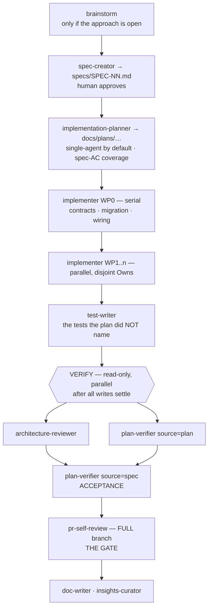

# The SDD pipeline — runbook

**Spec-driven development, end to end: a spec becomes working, verified code.** This is the
*procedure* the orchestrating session follows. The roster reference (who each agent is, what it
may write) lives in [`.claude/agents/README.md`](../.claude/agents/README.md); this file is how
you *run* them, in what order, and what to do when a phase comes back red.

You — the orchestrating session — are the only thing that can spawn subagents and relay their
`CLARIFICATION_NEEDED` / `REQUIREMENTS_NEEDED` blocks to the human. No subagent can ask a
question mid-run or start another subagent; that is your job.

---

## The phases

| Phase | Agent(s) | Reads/writes | Output you act on |
|---|---|---|---|
| **0. Explore** *(optional)* | `brainstorm` | read-only | N scored variants + one recommendation |
| **1. Specify** | `spec-creator` | writes `specs/**` | `SPEC-NN-<slug>.md` — EARS `AC-N` + observables. **Human approves before you plan.** |
| **2. Plan** | `implementation-planner` | writes `docs/plans/**` | a plan with a **`Spec coverage`** table (every `AC-N` → a WP/step) |
| **3. Build** | `implementer` × N, then `test-writer` | write source / tests | DONE / BLOCKED reports + insight candidates |
| **4. Verify** | `architecture-reviewer` ∥ `plan-verifier(source=plan)` | read-only | advisory findings + a plan PASS/FAIL |
| **5. Accept** | `plan-verifier(source=spec)` | read-only | the spec PASS/FAIL — the one that matters |
| **6. Gate** | `pr-self-review` (full branch) | read-only + deterministic | the only BLOCKing check |
| **7. Record** | `doc-writer`, `insights-curator` | write `docs/**` / propose INSIGHTS | design doc + curated learnings |

---

## Phase notes

### 0. Explore — only when the *approach* is open
Enter at `brainstorm` when the right shape of the change is genuinely undecided (which module,
which seam, new vs extend). When the approach is already settled and only the details are open,
skip it — go straight to `spec-creator`.

### 1. Specify
`spec-creator` is a fresh-context subagent: it cannot interview the human. Blocking unknowns
come back as a `CLARIFICATION_NEEDED` block — **you relay it, collect the answer, and re-invoke.**
Smaller unknowns stay in the file as `[NEEDS CLARIFICATION]` markers for the human to resolve
before planning. **Do not start Phase 2 until the human has approved the spec** and the open
threads are closed.

### 2. Plan — single-agent by default
`implementation-planner` will ask multi-agent vs single-agent (via `REQUIREMENTS_NEEDED`).
**Prefer single-agent.** Multi-agent's WP0 + fan-out machinery only pays off when the feature
genuinely spans ≥2 surfaces with parallelizable, disjoint work; below ~3 files or on a single
surface it is pure overhead. The planner recommends a mode — take the recommendation unless you
have a reason not to.

Every plan built from a spec must carry a **`Spec coverage`** table mapping each `AC-N` to the
WP/step that covers it (or an explicit `deferred (reason)`). If it doesn't, the plan lost the
thread — send it back before building.

### 3. Build — and this is where all writes happen
- **WP0 is serial** and lands first: contracts (both vendored copies), the migration, and the
  shared wiring (`modules/index.ts`, `platform/container.ts`, barrels). Those paths are then
  **LOCKED**.
- **WP1..n run in parallel** — spawn them in a single message, one `implementer` each, with a
  plan path and a WP id. Their disjoint `Owns` globs are the only thing keeping them from
  clobbering each other. (Single-agent mode: one implementer, one ordered task list, no WP0.)
- **`test-writer` runs here, last in the build phase** — after the implementers, because it
  *writes* test files. The implementers already wrote the plan-named AC tests; `test-writer`
  adds the coverage the plan didn't name (adversarial edge, seam, bug repros).

> ⚠️ **The read-only-vs-writer race.** The Phase-4 verifiers re-run `vitest`/`tsc` against the
> tree. **Never run them while `test-writer` (or any implementer) is still writing** — a moving
> tree makes their results meaningless. All writes settle, *then* Phase 4 begins. This is why
> `test-writer` is the tail of Build, not part of Verify.

### 4. Verify — read-only, parallel, on a settled tree
`architecture-reviewer` and `plan-verifier(source=plan)` are both read-only and independent —
**spawn them in one message to run concurrently.**
- `architecture-reviewer` judges structure (depcruise + placement); it is **advisory**, never a
  gate. **Skippable** when the change adds no new module, adapter, table, or client route — it
  has nothing structural to review.
- `plan-verifier(source=plan)` answers *did the implementers build the plan?* — cross-WP
  coverage a single implementer's self-review can't see.

### 5. Accept — verify against the *spec*, not just the plan
Run `plan-verifier` **a second time with `source=<spec>`**. This is the run that closes the
loop: the plan is a disposable intermediate, but the **spec is the contract the human approved.**
An `AC-N` dropped *during planning* survives the plan run (the plan was built faithfully) and is
caught only here. Not optional when a spec exists.

### 6. Gate — the only thing that can block
Run `pr-self-review` **over the full branch** before opening the PR. Each implementer already
ran it per-WP, but only over its own diff; cross-WP interactions (two WPs each fine, wrong
together) are visible only over the whole branch. A confirmed CRITICAL here means **do not open
the PR.**

### 7. Record
`doc-writer` captures the design (if the feature warrants a doc). `insights-curator` proposes
INSIGHTS changes. **You append `INSIGHTS.md` once, at the end** — the agents return *insight
candidates* rather than writing it, because concurrent siblings would race on the file.

---

## Failure loop-backs

A red phase is a normal outcome, not an exception — the agents are built to report `BLOCKED` /
`FAIL` / `request_changes` as first-class results. Route each back to the one agent that owns
the fix, then re-verify only what changed:

| Signal | From | Do this |
|---|---|---|
| `FAIL` with `MISSING`/`PARTIAL` rows | `plan-verifier` | Re-invoke the owning `implementer` on that WP with the missing criteria. Re-run `plan-verifier` after. |
| `MISSING` on a **spec** `AC-N` (Phase 5) | `plan-verifier(source=spec)` | The AC was lost in planning. Go back to **Phase 2** — the planner must place it (a new WP/step) — then rebuild that unit. |
| `BLOCKED_SOURCE_BUG` + a red test | `test-writer` | The red test stays. Re-invoke the `implementer` to fix the source; then re-run that lane. `test-writer` never fixes source. |
| in-scope CRITICAL | `architecture-reviewer` | Re-invoke the `implementer` (advisory, but fix real regressions before the gate). |
| confirmed CRITICAL / `request_changes` | `pr-self-review` | Fix inside the owning WP; do not open the PR until clean. |
| `BLOCKED` (LOCKED file / bad contract) | `implementer` | The plan is wrong. Go back to **Phase 2**; the planner amends the contract/ownership; re-run WP0 if the contract changed. |

Re-verification is targeted: after a single-WP fix, re-run `plan-verifier` and the gate — you do
not re-run the whole pipeline.

---

## Invocation quick-reference

- `implementer` needs **a plan path and a WP id** — nothing else; it refuses to start without
  both. Spawn WP1..n in one message for parallelism.
- `plan-verifier` takes `source=<plan|spec>` (`plan` is an accepted alias), optional `base`
  (default `main`), optional `scope=<WP id>`. Run it once per source.
- `architecture-reviewer` defaults to `scope: diff`; give it `package:` / `path:` / `repo` only
  when you mean it (`repo` dumps the whole baseline).
- Relay every `CLARIFICATION_NEEDED` / `REQUIREMENTS_NEEDED` block to the human verbatim and
  re-invoke with the answer — the subagent cannot ask you directly.
