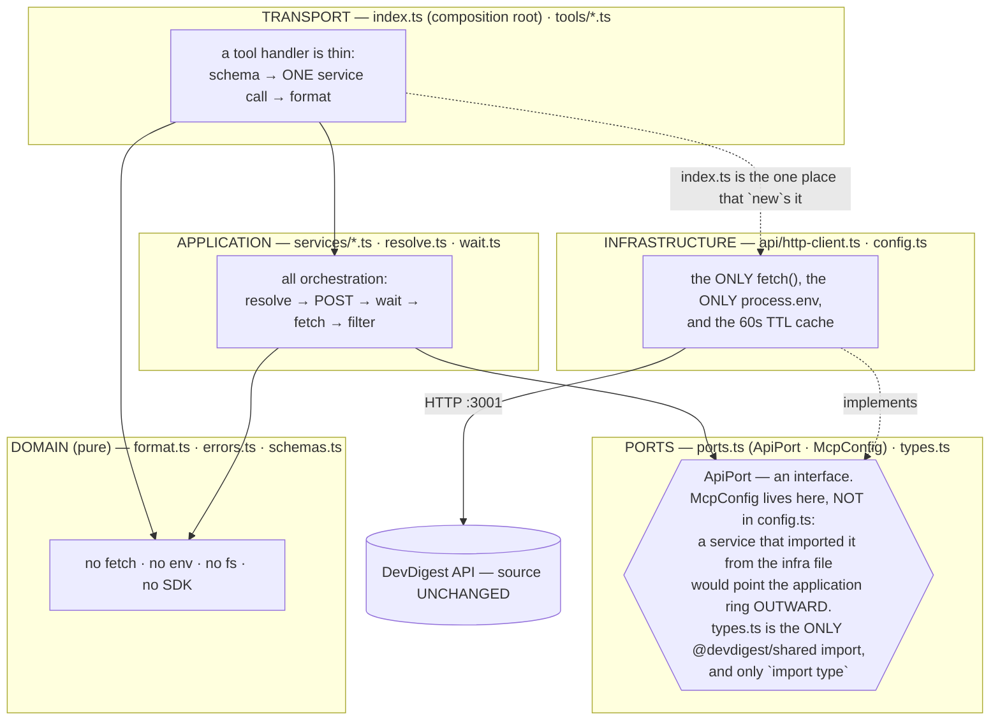
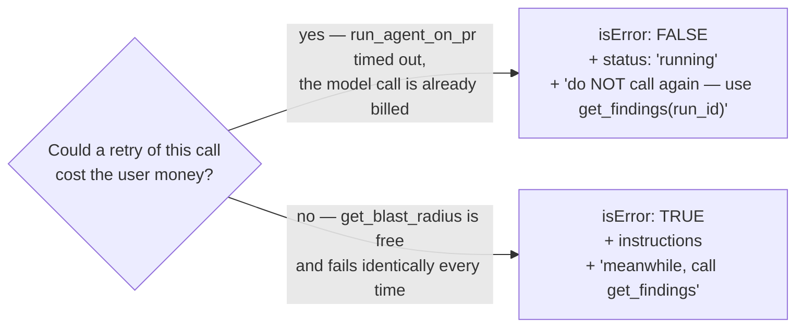
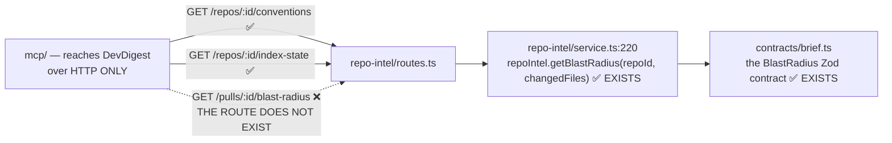

# `@devdigest/mcp` — design (the WHY)

The *what* is in [`../specs/tools.md`](../specs/tools.md) (the five tool contracts) and in
`../README.md` (how to run it). This file is the **why**: the five decisions that shape
this package, each with the alternative it beat.

Source of record for the original reasoning: `../../docs/plans/2026-07-13-mcp-server.md`.

---

## 1. The onion, applied to a transport

An MCP server *is* a transport. "It's all transport, so it can all be one file" is the
trap: the naive design has each tool handler call the HTTP client directly, which
collapses four rings into one — and reproduces, in a brand-new package, exactly the
deviation the onion skill flags as this repo's existing backlog (the `routes-no-db`
errors where `pulls` / `settings` / `workspace` query Drizzle straight from `routes.ts`).
We are not opening a new package with a fresh copy of the repo's known sin.

So `mcp/` gets the same rings the server has, one-to-one — **imports point inward only**:

**What the rings buy, concretely:**

1. **A tool handler is thin.** Orchestration lives in a service, so it is unit-testable
   **without the MCP SDK in the loop**. `run_agent_on_pr`'s five-step flow is tested by
   calling `ReviewService.runOnPr()` directly.
2. **Depend on the interface, not the implementation.** Services receive an `ApiPort`;
   `index.ts` is the only place that constructs `HttpApiClient`. Tests inject a **plain
   object** — no `fetch` stubbing, no HTTP, no ports to bind.
3. It is **mechanically enforced**. `.dependency-cruiser.cjs` encodes these edges
   (`tools/** ↛ api/**`, `services/** ↛ api/**` *and* `services/** ↛ config.ts`, domain ↛
   anything with I/O) and `npm run arch:check` fails the build on a breach. Per
   `server/INSIGHTS.md`, that baseline is *"an alibi, not evidence"* — it reasons at
   module-edge granularity. It is a floor, not the review.

   **And the floor has a hole, which is why there is a second check.** depcruise sees
   **import edges**. `fetch()` and `process.env` are **globals** — no edge, nothing to
   cruise — so a `fetch()` added to `format.ts` tomorrow passes `arch:check` green, and so
   does a `console.log` that corrupts the JSON-RPC frame. `npm run purity:check`
   (`scripts/purity-check.mjs`) greps for exactly those two, and CI runs it alongside
   `arch:check`. The strongest-sounding purity claim in this document is the one depcruise
   could not actually keep.

**The type-only boundary.** `mcp` pins `zod@^3.25` (the SDK v1 peer dep) while `server`
stays on `^3.24.1` — separate lockfiles make that free. It borrows `@devdigest/shared` as
**types only**, through a tsconfig path alias, in `src/types.ts` alone. A *value* import
would load a second zod instance into the process and break `instanceof` far from the
cause. And we deliberately **do not re-`.parse()` API responses**: the API already
validated them through `fastify-type-provider-zod` on the way out. Type them; don't
re-parse them.

---

## 2. The wait: POLL, not SSE

`run_agent_on_pr` is *outcome, not operation* (P1): it creates the run, **waits**, and
returns the verdict. Something has to do the waiting. The server offers two ways.

| | Poll `GET /pulls/:id/runs` | SSE `GET /runs/:id/events` |
|---|---|---|
| Terminal state | **Explicit** — `status ∈ running \| done \| failed \| cancelled` | Implicit — a *log line*; you must infer completion |
| Source of truth | The **DB row** | An **in-memory** bus, per API process |
| API restarts mid-run | The row is reaped to `failed` on boot; the poller sees it | The stream dies silently; the client hangs forever |
| Extra deps | none | an SSE parser |
| Latency | one poll interval | immediate |

**Decision: poll.** An MCP call has no streaming UX — the host sees one result, once — so
SSE's only advantage buys nothing here, while every one of its downsides is real for a
*separate process* that outlives an API restart.

Knobs (env-overridable): first delay 1500 ms · interval 2000 ms (`DEVDIGEST_MCP_POLL_MS`)
· timeout 180 000 ms (`DEVDIGEST_MCP_RUN_TIMEOUT_MS`). `waitForRun` takes `sleep` as an
**injected argument**, so the tests do not actually wait three minutes.

---

## 3. The money rule — why the timeout is `isError: false`

`run_agent_on_pr` is the only write tool and the only one that spends money. One
`POST /pulls/:id/review` per invocation, no retry loop, no cancel-and-restart.

When the wait times out, the run is **not cancelled**: the model call is already in
flight and already billed. Cancelling burns the spend and returns nothing. So the tool
returns **`isError: false`** with `status: 'running'` and a `next` that says *do not call
me again — call `get_findings` with this `run_id`*.

**`isError: true` would invite a retry, and a retry here is a second bill.** That is the
whole argument. (`server/INSIGHTS.md`: *"check-then-act on a billable job is a recurring
bill."*)

The mirror image is `get_blast_radius`, which returns **`isError: true`** — and that is
equally deliberate:

`idempotentHint: false` on `run_agent_on_pr` says the same thing in metadata; the
description says it in prose. Belt and braces, because the failure mode is a double
charge.

**The third case: a run that came back `failed` or `cancelled`.** There, the tool *does*
return `isError: true` (`tools/run-agent-on-pr.ts` — `isError = status === 'failed' ||
status === 'cancelled'`). The rule above still holds, because the question is always *"is
there an outcome to read?"*, not *"was money spent?"* — a timed-out run has findings
coming and a `run_id` to fetch them with, while a failed run produced **nothing**, so
there is nothing for `get_findings` to return and the model should be told plainly that
the call did not work. The spend is sunk either way. The cost of this honesty is that a
host which blindly retries on `isError` will re-bill; `idempotentHint: false` is what is
supposed to stop it, and it is the reason that hint is not decoration.

The same rule explains the **60s TTL cache in `api/http-client.ts`** (§4 below):
`GET /repos/:id/pulls` syncs from GitHub *and* enqueues a **billable intent job** for any
PR with no `pr_intent` row. Resolving a PR twice in one tool call would cost money. The
cache is in the **adapter**, not a service: caching is an infrastructure concern, and one
adapter fixes it for every caller.

---

## 4. Identifiers: accept both, resolve to a uuid, resolve once

A model does not know DevDigest's uuids — it knows what the human said: *"payments-api,
PR 482, the security agent"*. Rejecting that is a failed call plus a retry, so every
identifier accepts **both** forms, and `resolve.ts` (application ring, over `ApiPort`)
turns them into uuids before anything touches the API.

| Arg | Shape test | Resolution |
|---|---|---|
| `repo` | uuid → as-is; else `owner/name` | `GET /repos` → match `full_name`, case-insensitively |
| `pr` | number / all-digits → PR number; uuid → PR id | `GET /repos/:id/pulls` → match `number` or `id` |
| `agent` | uuid → as-is, **but still verify**; else match `name` case-insensitively | `GET /agents` |

**This is not a nicety — it is a 500-class guard.** `POST /pulls/:id/review` parses
`RunRequest` where `agentId` is a bare `z.string()` (no uuid check), and
`AgentsRepository.getById` compares it against a **`uuid` column**. An agent *name*
forwarded to the API reaches Postgres as `invalid input syntax for type uuid` — a **500,
not a clean 404**. So a non-uuid agent id must **never** be forwarded. `resolve.test.ts`
asserts exactly that.

`PrMeta.id` is `nullish` in the contract: a PR listed from GitHub but not yet persisted
has no local uuid and cannot be reviewed. That is a *message*, not a crash — *"open the
repo in the UI once to sync it, then retry."*

Which is the general rule: **errors lead onward** (P4). Never a bare 404. Every message
in `errors.ts` names the next tool to call or the next command to run, and `errors.test.ts`
asserts every one of them against
`/list_agents|get_findings|run_agent_on_pr|get_conventions|dev\.sh|DevDigest UI/`.

---

## 5. The token budget: definitions are rent, responses are the risk

Tool **definitions** load into the host's context at chat start — every token is rent,
paid on every conversation whether or not the tool is called. Tool **responses** are paid
per call, but they are unbounded.

- **Definitions: ~700–900 tokens all-in** for five tools. That is `SQLite`/`Gmail` MCP
  territory, and ~2% of what the GitHub MCP server costs. Definition bloat was never the
  risk here.
- **Responses are.** So nothing raw ever goes on the wire (`format.ts`): `system_prompt`
  is stripped (multi-KB — the single biggest sink in the surface), `evidence_snippet` is
  truncated to 200 chars, `start_line`/`end_line` fold into one `lines` string, and every
  list carries a `limit` (default 20, max 50) plus an explicit *"Showing 20 of 47 …"* hint.
- **The `content` text block is a markdown summary — never `JSON.stringify` of the
  `structuredContent`.** The spec says a structured tool SHOULD also emit text; emitting
  the same payload twice **doubles the token cost for zero gain**. `format.test.ts`
  asserts the text block contains no `{"`.

Two costs we chose to pay, named rather than hidden:

- **`run_agent_on_pr`'s description is the longest** (~40 words vs ~20). It is the only
  tool that spends money and the only one whose misuse is irreversible, so it buys ~20
  extra tokens of rent with a guardrail against a double charge. Worth it.
- **`get_blast_radius` costs ~30 tokens of rent for zero capability.** A tool that
  announces its own uselessness is, strictly, negative value in the window — see below.

---

## 6. The flag: `get_blast_radius` needs a **server** change, and that is the exercise

The stub is not laziness, and it is not a missing service method. It is a **missing HTTP
route**, and the boundary that makes it missing is the whole point of this package.

Both halves are already built. The engine works; the contract is defined. What is missing
is the wire between them — and since `mcp` talks to DevDigest over HTTP and nothing else,
a missing route is a **hard wall**, not an inconvenience. There is no clever import that
gets around it (and `.dependency-cruiser.cjs` forbids trying: `no-server-internals`).

So the tool registers with its **real** name, description and `inputSchema`
(`{ repo, pr }`, frozen), declares **no** `outputSchema`, takes **no** `ApiPort`, and its
handler returns instructions. Finishing it is three steps — a route, a port method, a
service method — and **only the third touches this package's tool file**. That is what
freezing the input contract buys, and it is why
`blast-radius.test.ts` asserts the schema keys are exactly `['repo', 'pr']`: that test
fails the day someone "helpfully" changes the arguments before the tool is wired.

**The alternative we rejected:** not registering it at all, and shipping four tools. That
is defensible — it stops paying the ~30 tokens of rent. We register it because the frozen
contract *is* the deliverable: it makes the homework a one-function change rather than a
design exercise, and an honest description (*"NOT IMPLEMENTED YET — calling it returns
instructions, not data"*) avoids the wasted call entirely, which beats failing gracefully.
