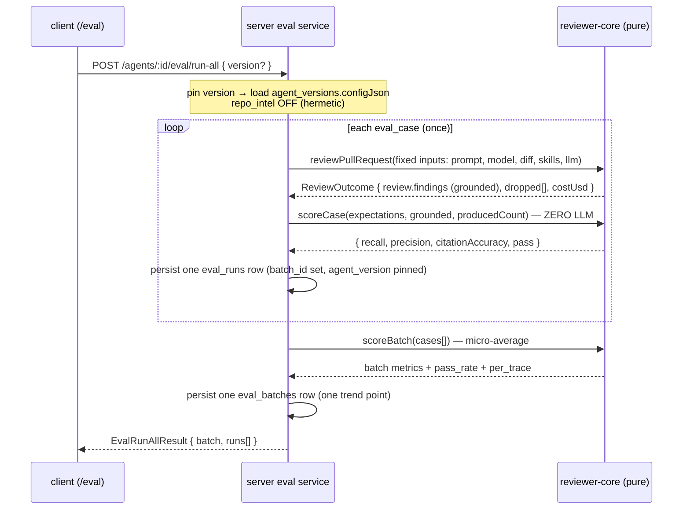
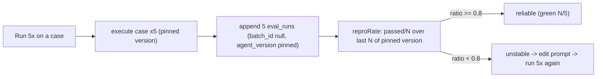
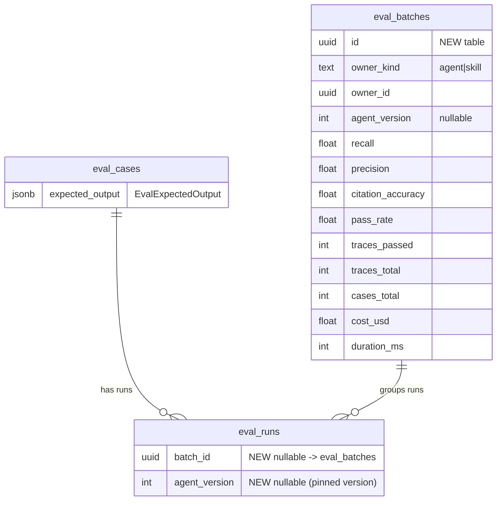

# Spec: Eval Pipeline (regression protection for reviewer agents, L06) | Spec ID: SPEC-03 | Status: draft
Supersedes: none
Surface: cross-module (server `@devdigest/api` · reviewer-core · client `@devdigest/web`)

## Problem and purpose

DevDigest reviews PRs with configurable **agents** (system prompt + model + skills) and
**skills** (rubric bodies). Today, after editing an agent's system prompt there is no way to
tell whether the change made reviews **better or worse** — and because the LLM is
non-deterministic, a single good-looking run proves nothing. This feature makes review quality
**regression-testable**: a real finding becomes a saved test case, the case is run repeatedly,
and a **mechanical (zero-LLM) scorer** reports whether the agent reliably reproduces the expected
outcome. The DB tables and most Zod contracts are already scaffolded for this lesson.

The demo must be **stable and self-contained**: every surface degrades to seeded data and never
throws mid-demo, and the whole flow must work on a **fresh DB with no API key** because the seed
data is *real scorer output*, not hand-typed. The real-provider run-all path stays wired but the
demo does not depend on it.

## Goals / Non-goals

- **Goals**
  - Turn an accepted/dismissed finding into a saved eval case with **one click**.
  - A **deterministic, zero-LLM scorer** (recall / precision / citation_accuracy / pass) living
    in pure `reviewer-core`.
  - A **reproduction rate** (the headline metric) over the last N runs of a *pinned* agent
    version; reliable iff ≥ 0.8.
  - A **Skills → Evals tab** for standalone (finding-independent) skill cases, sharing the panel
    with the AgentEditor Evals tab, parameterized by owner (`agent | skill`).
  - An **Eval Dashboard (agents only)**: all-agents view + per-agent trend + run-vs-run Compare
    (system-prompt diff) + Promote.
  - A **synthetic gold-set seed** whose metrics are real scorer output computed at seed time,
    demoable on a fresh DB with no API key.
- **Non-goals**
  - **The scorer never calls an LLM.** Scoring is deterministic code; the only model call in the
    pipeline is the one review per case executed by the existing engine.
  - **The Eval Dashboard never lists skills** — skill evals surface only in the SkillEditor Evals
    tab.
  - No change to the shared/pre-existing DB tables or their migrations — only a **new**
    `eval_batches` table and **additive** columns on `eval_runs`, via a new migration.
  - No new review engine — eval reuses the existing pure `reviewPullRequest` unchanged.
  - Not a CI/gate feature (that is a separate contract in `eval-ci.ts`); this spec is the
    interactive eval-authoring + reproducibility + dashboard experience.
  - Live provider execution correctness/latency is out of scope for the demo path (wired, not
    required).

## User stories

- **US-1** — As a reviewer, I turn an accepted or dismissed finding into a saved eval case with
  one click, so a real review outcome becomes a regression test for that agent.
- **US-2** — As a reviewer, I run a case ~5× and see a reproduction rate, so I know whether the
  agent reliably reproduces the outcome despite LLM non-determinism.
- **US-3** — As a reviewer, I edit an agent's system prompt and re-run the cases, and I see
  recall/precision move, so I can tell whether the edit improved or regressed the agent.
- **US-4** — As a skill author, I manage standalone eval cases for a skill in the Skills → Evals
  tab with the same 5-run reliability logic, so I can tell a skill is well-written.
- **US-5** — As a reviewer, I open an Eval Dashboard (agents only) with an all-agents view, a
  per-agent trend, and a run-vs-run Compare with a system-prompt diff and Promote, so I can
  compare an old prompt vs a new one and promote the winner.
- **US-6** — As a course user on a fresh DB with no API key, I can run the entire demo because the
  seed contains real scorer output across several agent versions.

## Acceptance criteria (EARS)

Each is one EARS pattern, atomic, with an observable check. Every AC maps to ≥1 user story.

### Turn a finding into an eval case (US-1)

- **AC-1** (US-1) — WHEN a reviewer clicks **"Turn into eval case"** on a finding card, the system
  shall open a modal pre-seeded from that finding's PR (the matching diff patch, the changed
  files, and the PR meta) and derive the expectation kind from the finding's action state — an
  **accepted** finding → `must_find`, a **dismissed** finding → `must_not_flag`.
  _(observable: with an accepted finding the modal's expected-output JSON contains one expectation
  with `kind:"must_find"`; with a dismissed finding, `kind:"must_not_flag"`; the Diff/Files/PR-meta
  tabs are populated from `usePullDetail(prId)`.)_
- **AC-2** (US-1) — WHEN the seeded case is saved, the system shall persist an `eval_case` with
  `owner_kind:"agent"`, `owner_id` = the finding's review `agent_id`, and
  `expected_output = { expectations: [ EvalExpectedFinding derived from the finding ] }`.
  _(observable: `POST /eval/cases` returns an `EvalCase` whose `expected_output` parses as
  `EvalExpectedOutput` with the derived `file`/`start_line`/`end_line`/`kind`.)_
- **AC-3** (US-1) — IF the finding's owning review has no `agent_id` (`ReviewRecord.agent_id` is
  null), THEN the system shall not offer case creation for that finding (the button is
  disabled/hidden), because an eval case must attribute to an agent.
  _(observable: a finding whose `review_id` resolves to a review with `agent_id:null` shows no
  enabled "Turn into eval case" affordance.)_ _(resolves plan open item: agent_id mapping.)_
- **AC-4** (US-1) — WHILE the expected-output JSON in the modal is not valid JSON (or not a valid
  `EvalExpectedOutput`), the system shall disable Save and show an invalid-JSON indicator.
  _(observable: typing malformed JSON flips the "valid JSON" badge to invalid and the Save button
  is disabled; the "+ Finding skeleton" action inserts a valid expectation stub.)_
- **AC-5** (US-1) — WHERE "Run on save" is enabled, WHEN the case is saved, the system shall run
  the case once immediately and surface the run result in the modal.
  _(observable: on save with the toggle on, a `ReproRateStrip`/run result appears; with the toggle
  off, no run is triggered.)_

### Deterministic, zero-LLM scoring (US-3, cross-cutting)

- **AC-6** (US-3) — The system shall compute a case's `recall`, `precision` and
  `citation_accuracy` with deterministic code and **zero LLM calls**; scoring shall add no model
  call beyond the single review executed per case.
  _(observable: hermetic test with `MockLLMProvider` — after run-all over K cases,
  `mock.calls(completeStructured).length === K`; `scoreCase`/`scoreBatch` unit tests run with no
  provider in scope.)_
- **AC-7** (US-3) — The system shall count a produced finding as **matching** an expectation WHEN
  `finding.file === expectation.file` AND their `[start_line, end_line]` closed ranges intersect;
  full-file kinds (`secret_leak`, `lethal_trifecta`, `phantom`, `hook`) shall match on file alone.
  _(observable: `match(f,e)` unit table — same file + overlapping lines → true; same file +
  disjoint lines → false; different file → false; full-file kind + same file → true.)_
- **AC-8** (US-3) — The system shall compute `recall = matched must_find expectations / total
  must_find expectations`, defaulting to `1` when the case has no `must_find` expectation.
  _(observable: a case with 2 must_find, 1 matched → recall 0.5; a pure `must_not_flag` case →
  recall 1.)_
- **AC-9** (US-3) — The system shall compute `precision = TP / (TP + FP)`, where on a
  `must_not_flag` case a grounded finding produced on a forbidden region is a **false positive**,
  and on a `must_find` case a grounded finding matching no expectation is a false positive.
  _(observable: a `must_not_flag` case whose run produces a finding on the forbidden region →
  precision < 1; a clean run → precision 1.)_
- **AC-10** (US-3) — The system shall compute `citation_accuracy = grounded / (grounded +
  dropped)`, using `ReviewOutcome.dropped` for the pre-grounding count, reconciling with the
  grounding gate's "kept/total".
  _(observable: a run where the engine kept 3 of 4 findings → citation_accuracy 0.75, matching
  `groundingSummary` "3/4 passed".)_
- **AC-11** (US-3) — The system shall mark a run `pass` iff **no** `must_find` expectation is
  missing AND **nothing** is flagged on a forbidden region.
  _(observable: `pass` true only when recall accounts for every must_find and no must_not_flag is
  violated.)_
- **AC-12** (US-3) — WHEN an agent's system prompt is edited so the agent goes silent and the case
  set is re-run, the system shall report **lower recall** than the prior run; WHEN edited so the
  agent over-flags, it shall report **lower precision**.
  _(observable, gated on a live provider: run-all on GOOD prompt → batch A; silence prompt → batch
  B with `recall(B) < recall(A)`; over-flag prompt → batch C with `precision(C) < precision(A)`.)_

### Reproducibility — the headline metric (US-2)

- **AC-13** (US-2) — WHEN a reviewer triggers **"Run N×"** (default N = 5) on a case, the system
  shall execute the case N times and persist N `eval_runs` rows tagged with the pinned agent
  version and `batch_id = null` (ad-hoc, not a batch).
  _(observable: `POST /eval/cases/:id/run { times: 5 }` returns 5 `EvalRunResult`s and creates 5
  `eval_runs` with `batch_id` null and `agent_version` = the pinned version.)_
- **AC-14** (US-2) — The system shall compute a case's **reproduction rate** as `passed / N` over
  the last N runs of the pinned agent version, and mark the case **reliable** iff `ratio ≥ 0.8`.
  _(observable: `reproRate(runs, 5)` → `{passed,total,ratio,reliable}`; 4/5 and 5/5 → reliable
  (green), 2/5 → not reliable; `GET /eval/cases/:id/runs?limit=5` drives the `ReproRateBadge`.)_
- **AC-15** (US-2) — The system shall measure the reproduction rate over the **pinned version
  only**, excluding runs recorded under a different `agent_version`, so a run from before a prompt
  edit never counts toward the current rate.
  _(observable: runs whose `agent_version` differs from the pinned one are not included in the
  N-run window.)_
- **AC-16** (US-2) — The system's eval case set shall contain **≥ 8** cases including at least one
  `must_find` and at least one `must_not_flag`.
  _(observable: after seed, `SELECT count(*) FROM eval_cases ≥ 8`; both expectation kinds present.)_
- **AC-17** (US-2) — The seed shall include **≥ 1 stable case** that reproduces 5/5 and **≥ 1 flaky
  case** that reproduces ~2/5.
  _(observable: `POST /eval/cases/:stableId/run { times:5 }` → 5/5 reliable; `:flakyId` → ~2/5 not
  reliable — using seeded runs on the demo path, no key.)_

### Skills → Evals tab (US-4)

- **AC-18** (US-4) — The system shall render standalone (not finding-derived) skill eval cases in
  the SkillEditor Evals tab using the **same shared panel** and 5-run reliability logic as the
  AgentEditor Evals tab, parameterized by `owner={kind:"skill", id}`, and shall offer a "New eval
  case" that opens the case modal in blank create-mode (no finding seed).
  _(observable: the SkillEditor `evals` tab body renders `EvalsPanel` with `allowFromFinding=false`
  and no dashboard link; the shared panel body is identical to the agent tab's.)_
- **AC-19** (US-4) — WHEN a skill eval case runs, the system shall execute `reviewPullRequest` with
  a **fixed host config** — the constant `EVAL_SKILL_HOST_PROMPT` (a minimal neutral reviewer
  system prompt, independent of which agents exist) plus the **workspace-default provider/model** —
  injecting **only that skill's body** as the sole skill, and pinning `skill.version` into the run's
  `agent_version`.
  _(observable: the run's `agent_version` equals the skill's version; the assembled system prompt is
  exactly `EVAL_SKILL_HOST_PROMPT` (no agent-specific prompt), the injected skill list is
  `[skill.body]`, and provider/model equal the workspace default.)_
- **AC-20** (US-4) — The Eval Dashboard shall list **agents only**; skill evals shall surface only
  in the SkillEditor Evals tab.
  _(observable: `GET /eval/dashboard` returns agent rows only; no skill owner appears; the `/eval`
  page shows no skill entries.)_

### Eval Dashboard, Compare, Promote (US-5)

- **AC-21** (US-5) — The system shall present an all-agents dashboard (per-agent last-run pass
  count, model chip, sparkline, recall/precision/citation) and a per-agent detail with a metric
  trend built from `eval_batches`.
  _(observable: `GET /eval/dashboard` returns non-empty `agents` + `recent_batches`;
  `GET /agents/:id/eval/dashboard` returns non-empty `trend` and `recent_batches`.)_
- **AC-22** (US-5) — WHEN "Run all agents" (or per-agent run-all) is triggered, the system shall
  run each case **once** and produce exactly **one** `eval_batches` row (one trend point) per
  agent.
  _(observable: `POST /agents/:id/eval/run-all` appends one `eval_batches` row and one `eval_runs`
  per case with that `batch_id`; the trend gains exactly one point.)_
- **AC-23** (US-5) — WHEN a reviewer selects **exactly two** runs/batches in the detail table, the
  system shall enable Compare and show metric deltas plus a system-prompt diff of the two versions;
  selecting a number other than two shall keep Compare disabled.
  _(observable: `RecentRunsTable` checkbox rows — Compare enabled only at 2 selected;
  `GET /eval/compare?base&head` returns both prompts and non-zero deltas; `PromptDiffPanel` renders
  the line diff via the existing `lineDiff`.)_
- **AC-24** (US-5) — WHEN a reviewer Promotes a version from Compare, the system shall update the
  agent to that version's config through the agents repository (single source of version
  snapshotting).
  _(observable: `POST /agents/:id/eval/promote { version }` returns the updated `Agent` whose
  current config matches the promoted `agent_versions.configJson`.)_

### Eval isolation, demo stability, cross-package seam (US-3, US-6)

- **AC-25** (US-3) — WHILE running any eval case, the system shall force **repo_intel OFF**
  regardless of the agent's `repo_intel` config, so only the prompt/skill and the fixed diff move
  the metrics.
  _(observable: the `ReviewInput` for an eval run carries no `callers`/`repoMap`/`intent`; two runs
  differing only in system prompt are the only variables affecting recall/precision.)_
- **AC-26** (US-6) — WHEN the seed runs on a fresh DB with **no API key**, the system shall
  populate ≥ 8 cases and ≥ 3 completed `eval_batches` spread over time across **3–7 agent
  versions**, whose metrics are computed by the pure scorer **at seed time** (not hand-typed).
  _(observable: after `db:migrate && db:seed`, `eval_cases ≥ 8`, `eval_batches ≥ 3`, and seeded
  batch metrics equal `scoreBatch()` output for the seeded `{grounded, producedCount}` fixtures.)_
- **AC-27** (US-6) — IF no provider API key is configured, THEN every eval surface shall render its
  seeded data and degrade its live-run affordances gracefully (empty/disabled, non-throwing).
  _(observable: with no key, `/eval`, the editors' Evals tabs, and the detail page render seeded
  data; a live "Run N×"/run-all surfaces a non-throwing error/disabled state instead of a crash.)_
- **AC-29** (US-5) — The per-agent detail **date-range chip** shall **filter** the returned trend
  and runs/batches: `GET /agents/:id/eval/dashboard` and `GET /agents/:id/eval/batches` accept
  optional `from`/`to` (ISO date) query params and return only batches with `ran_at` within the
  range; the default range is the last 30 days.
  _(observable: a request with `from`/`to` returns only in-range `eval_batches`; changing the chip
  changes the trend point count and the runs table rows; omitting the params defaults to 30 days.)_
- **AC-28** (US-6) — The client's vendored `@devdigest/shared` copy and the server's canonical copy
  shall agree for the eval contracts (the stale client copy is re-vendored).
  _(observable: after re-vendor, `client` `pnpm typecheck` passes and the client's
  `contracts/eval-batch.ts` is byte-identical to the server's.)_

## Edge cases

- Case with **no `must_find`** expectation → recall defaults to 1 → **AC-8**.
- Agent/skill with **zero cases** → EvalsPanel empty state (no throw) → **AC-27**.
- **Invalid JSON** in the expected-output editor → Save disabled → **AC-4**.
- **Full-file kind** expectation (`secret_leak` etc.) → file-only match → **AC-7**.
- **No API key** and a live "Run N×"/run-all is pressed → non-throwing disabled/error state → **AC-27**.
- Fewer/more than 2 runs selected for Compare → Compare disabled → **AC-23**.
- Reproducibility window would otherwise **mix a pre-edit run** → excluded by pinned version → **AC-15**.
- A batch's `agent_version` resolves to a **missing/null configJson** in Compare → prompt diff
  panel shows "prompt unavailable" and still renders metric deltas → `accepted` (degrade, not
  guard; the seed always writes resolvable versions).
- **Two concurrent "Run N×"** on the same case → both append rows; the rate reads the last N of the
  pinned version → `accepted` (append-only `eval_runs`; ordering by `ran_at`).
- **Empty/whitespace diff** on a case → the engine grounds nothing; a `must_find` case fails
  (recall 0), a `must_not_flag` case passes (precision 1) → covered by **AC-8/AC-9/AC-11**.

## Non-functional  (each measurable; else parked in Open questions)

- **Determinism**: scoring makes **0** LLM calls; run-all makes **exactly 1** review (one
  `completeStructured`) per case (AC-6).
- **Hermeticity**: eval runs use fixed inputs with **repo_intel OFF** — no clone/callers/repo-map/
  intent (AC-25).
- **Demo path**: the full demo requires **no network and no API key**; every list/detail/modal
  guards loading/error/empty and **never throws** mid-demo (AC-26, AC-27).
- **Reproducibility window**: default **N = 5**; reliability threshold **≥ 0.8** (4/5 or 5/5)
  (AC-14).
- **Case set size**: **≥ 8** cases, both expectation kinds, ≥1 stable (5/5) + ≥1 flaky (~2/5)
  (AC-16, AC-17).
- **Trend monotonicity**: run-all writes **one** batch = **one** trend point per invocation so the
  dashboard trend stays clean (AC-22).
- **Schema discipline**: only a **new** `eval_batches` table + **additive** `eval_runs` columns via
  a new migration; pre-existing shared tables/migrations are untouched.

## Inputs (provenance)  — what this feature actually pays for

- Per-case metrics (`recall`/`precision`/`citation_accuracy`/`pass`) — **[deterministic: zero-LLM
  scorer]** over the engine's grounded findings + `ReviewOutcome.dropped`.
- One review per case — **[reused: 1 LLM call]** via the existing `reviewPullRequest` (or 0 on the
  seeded demo path — seed uses synthetic `{grounded, producedCount}` fixtures, no model).
- Reproduction rate — **[deterministic: aggregate]** over the last N `eval_runs` of the pinned
  version; no new column.
- System-prompt diff in Compare — **[reused: L06 `lineDiff`/`DiffView`]** over the two versions'
  `agent_versions.configJson.system_prompt`.

## Untrusted inputs

A case's `input_diff`, `input_files`, `input_meta`, and the agent system prompt / skill bodies are
fed to `reviewPullRequest`, which already fences untrusted content (the reviewer-core
`INJECTION_GUARD` / `<untrusted>` wrapping) and drops ungrounded findings via the mandatory
grounding gate (`groundFindings`, `reviewer-core/src/grounding.ts`). This spec **relies on** those
guards and must not weaken or restate them: eval-authored diffs and PR meta are treated as **data**,
never instructions, and scoring is computed only over **grounded survivors**. The user-edited
`expected_output` JSON is parsed as `EvalExpectedOutput` (validated data), never executed.

## Diagrams / workflows

### Run-all: one review per case, deterministic scoring, one batch (AC-6, AC-22, AC-25)



### Reproducibility: ad-hoc "Run 5×" over the pinned version (AC-13, AC-14, AC-15)



### New batch/run model (additive only)



## Contracts touched  (shapes only — no code; the barrel re-exports; client copy re-vendored)

New file `contracts/eval-batch.ts` (extend, do **not** edit `eval-ci.ts`):

- **`EvalExpectedFinding`** — `{ kind: 'must_find' | 'must_not_flag', file, start_line, end_line,
  severity?, category?, note? }`. The unit the scorer matches against a produced finding.
- **`EvalExpectedOutput`** — `{ expectations: EvalExpectedFinding[] }`. Stored in
  `eval_cases.expected_output` (was `unknown`), written by the modal, read by the scorer.
- **`EvalBatch`** — `{ id, workspace_id, owner_kind, owner_id, agent_version (nullable), ran_at,
  recall, precision, citation_accuracy, pass_rate, traces_passed, traces_total, cases_total,
  cost_usd, duration_ms }`. Mirrors the new `eval_batches` row; one per run-all = one trend point.
- **`EvalReproducibility`** — `{ passed, total, ratio, reliable }` (window default 5; `reliable`
  iff `ratio ≥ 0.8`).
- **`EvalCaseWithRuns`** — `EvalCase` + `{ last_run?: EvalRunRecord, repro?: EvalReproducibility }`
  so case-list rows render without N extra fetches (drives the list endpoint). _(confirms plan open
  item: the new list-row shape lives here.)_
- **`EvalCompare`** — `{ base: EvalBatch, head: EvalBatch, delta: { recall, precision,
  citation_accuracy, pass_rate }, base_prompt: string, head_prompt: string }`. Prompts resolved
  from each batch's `agent_version` → `agent_versions.configJson.system_prompt`.
- **`EvalRunAllResult`** — `{ batch: EvalBatch, runs: EvalRunResult[] }` (per-owner run-all); the
  whole-dashboard run-all returns `{ batches: EvalBatch[] }`.
- **`EvalAgentDashboard`** / dashboard row aggregate — the whole-workspace dashboard shape is
  `{ agents: EvalDashboardRow[], recent_batches: EvalBatch[] }`; the existing per-owner
  `EvalDashboard` (in `eval-ci.ts`) is reused for the per-agent detail.

Reused unchanged: `EvalCase`, `EvalRun`, `EvalRunRecord`, `EvalRunResult`, `EvalOwnerKind`,
`EvalTrendPoint`, `EvalDashboard`, `Finding`, `FindingRecord`, `ReviewRecord` (`agent_id`,
nullable), `Agent`, `AgentVersion`/`AgentVersionConfig`.

Schema (behaviour only — SQL is the plan's job): `eval_cases.expected_output` now holds
`EvalExpectedOutput`; new **`eval_batches`** table; `eval_runs` gains **nullable** `batch_id` (→
`eval_batches`) and **nullable** `agent_version`. New migration only — never edit `0000_init.sql`
or migrate a shared table.

## Open questions

_Both prior clarifications are resolved (owner decision, 2026-07-18):_
- **Skill-host defaults — RESOLVED.** The host is the constant **`EVAL_SKILL_HOST_PROMPT`** (a fixed
  minimal neutral reviewer prompt) + the **workspace-default provider/model**. See AC-19. The
  duplicate name `EVAL_HOST_SYSTEM_PROMPT` from the plan is dropped in favour of the single
  `EVAL_SKILL_HOST_PROMPT`.
- **Date-range chip — RESOLVED: functional filter.** It filters the trend/runs via optional
  `from`/`to` query params on the per-agent dashboard/batches endpoints (default: last 30 days).
  See AC-29.

## Next step
implementation-planner(spec=spec/SPEC-03-eval-pipeline.md) — once the two open threads are resolved
and the human approves.
```
